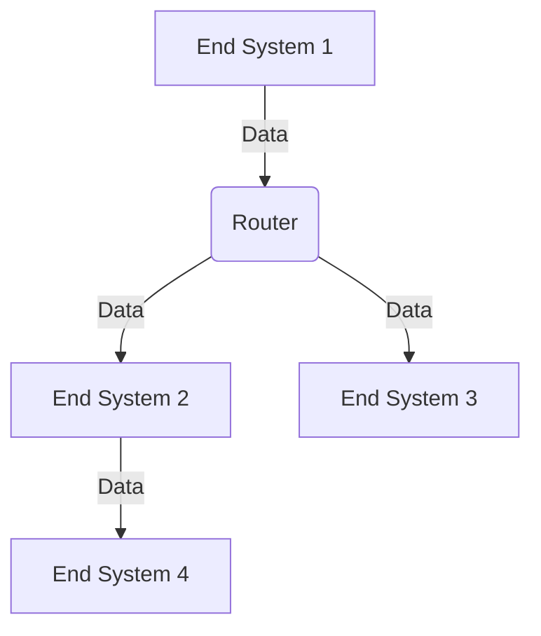
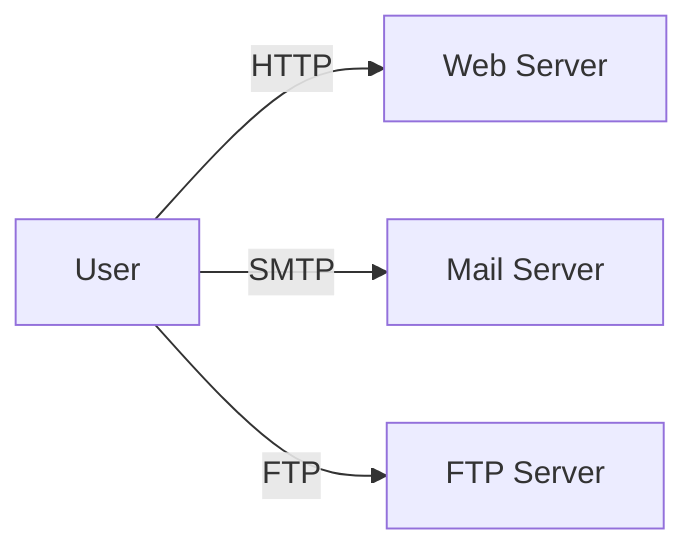

# 1.1 What Is the Internet?

The Internet is a global network of interconnected computers that communicate using standardized protocols. It enables the sharing of information and resources across the world.

---

## 1.1.1 A Nuts-and-Bolts Description

- **Definition:** The Internet is a network of networks, connecting millions of computing devices worldwide.
- **Components:**
  - **Hosts/End Systems:** Devices like PCs, smartphones, servers.
  - **Communication Links:** Physical media (copper wire, fiber optics, radio, satellite).
  - **Packet Switches:** Routers and switches that forward data.
- **Diagram:**

- **Key Point:** Data travels in small packets, routed independently.

---

## 1.1.2 A Services Description

- **Definition:** The Internet provides services to applications (e.g., web, email, file transfer).
- **Service Examples:**
  - Web browsing (HTTP)
  - Email (SMTP, IMAP)
  - File transfer (FTP)
- **Service Model:**
  - The Internet offers a set of services, not direct connections between devices.
- **Diagram:**

---

## 1.1.3 What Is a Protocol?

- **Definition:** A protocol is a set of rules governing the exchange of data between devices.
- **Examples:**
  - HTTP (HyperText Transfer Protocol)
  - TCP (Transmission Control Protocol)
  - IP (Internet Protocol)
- **Protocol Analogy:** Like a conversation with agreed-upon rules (e.g., saying "hello" before starting).
- **Key Point:** Protocols ensure reliable, standardized communication.

---

**Exam Tip:**
- Be able to define the Internet, describe its components, and explain what a protocol is with examples.
- Draw and explain simple network diagrams. 