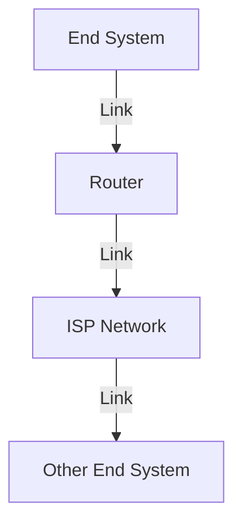

# 1.1 What Is the Internet?

- The Internet is a global network of interconnected computers and devices.
- Provides communication, resource sharing, and access to information.
- **Key components:** hosts (end systems), routers, links, protocols.
- **Internet standards:** Defined by IETF (RFCs).

---

## Real-World Analogy
- The Internet is like a postal system: computers (houses) send/receive messages (letters) via routers (post offices) using protocols (postal rules).

---

## Real-World Scenarios
- Sending an email from your phone to a friend in another country involves your device, your ISP, multiple routers, and the recipient's ISP and device.
- Streaming a video on YouTube involves DNS lookup, HTTP requests, and data transfer from servers across the globe.

---

## Internet vs. World Wide Web
- **Internet:** The physical network of networks (hardware, routers, links).
- **World Wide Web (WWW):** A service on the Internet that uses HTTP to access web pages.

---

## Diagram: Internet Structure

---

## Common Internet Protocols
| Protocol | Purpose                |
|----------|------------------------|
| HTTP     | Web browsing           |
| SMTP     | Email transfer         |
| FTP      | File transfer          |
| DNS      | Name resolution        |
| TCP      | Reliable transport     |
| UDP      | Unreliable transport   |
| IP       | Routing packets        |

---

## Summary Table
| Component   | Role                        |
|-------------|-----------------------------|
| Host        | Sends/receives data         |
| Router      | Forwards data               |
| Link        | Connects devices            |
| Protocol    | Rules for communication     |

---

## Practice Questions
1. **Define the Internet in your own words.**
2. **What is the role of a router?**
3. **Give a real-world analogy for the Internet.**
4. **Explain the difference between the Internet and the World Wide Web.**
5. **List three common Internet protocols and their purposes.**

---

**Exam Tips:**
- Use analogies to explain concepts.
- Know the main components and their functions.
- Be able to distinguish between the Internet and the WWW. 