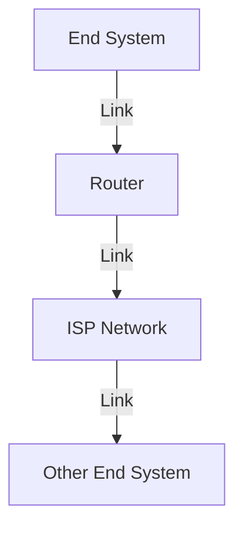
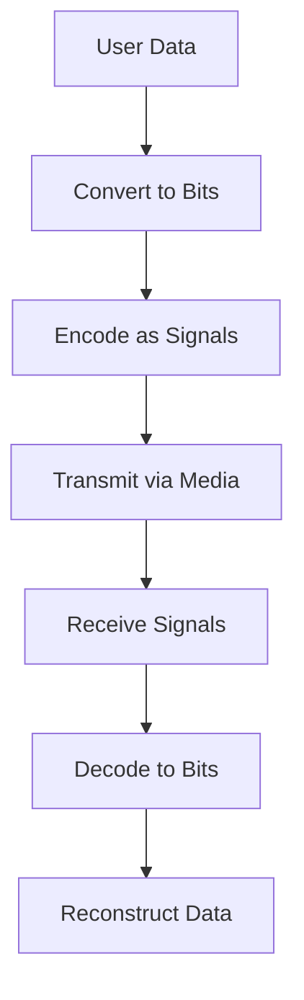
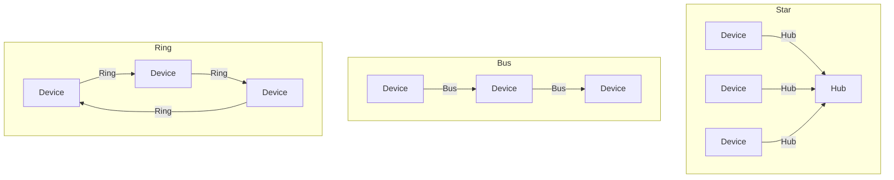

# 1.1 What Is the Internet?

- The Internet is a global network of interconnected computers and devices.
- Provides communication, resource sharing, and access to information.
- **Key components:** hosts (end systems), routers, links, protocols.
- **Internet standards:** Defined by IETF (RFCs).

---

## Real-World Analogy
- The Internet is like a postal system: computers (houses) send/receive messages (letters) via routers (post offices) using protocols (postal rules).

---

## Real-World Scenarios
- Sending an email from your phone to a friend in another country involves your device, your ISP, multiple routers, and the recipient's ISP and device.
- Streaming a video on YouTube involves DNS lookup, HTTP requests, and data transfer from servers across the globe.

---

## Internet vs. World Wide Web
- **Internet:** The physical network of networks (hardware, routers, links).
- **World Wide Web (WWW):** A service on the Internet that uses HTTP to access web pages.

---

## Diagram: Internet Structure

---

## Common Internet Protocols
| Protocol | Purpose                |
|----------|------------------------|
| HTTP     | Web browsing           |
| SMTP     | Email transfer         |
| FTP      | File transfer          |
| DNS      | Name resolution        |
| TCP      | Reliable transport     |
| UDP      | Unreliable transport   |
| IP       | Routing packets        |

---

## Summary Table
| Component   | Role                        |
|-------------|-----------------------------|
| Host        | Sends/receives data         |
| Router      | Forwards data               |
| Link        | Connects devices            |
| Protocol    | Rules for communication     |

---

## Practice Questions
1. **Define the Internet in your own words.**
2. **What is the role of a router?**
3. **Give a real-world analogy for the Internet.**
4. **Explain the difference between the Internet and the World Wide Web.**
5. **List three common Internet protocols and their purposes.**

---

**Exam Tips:**
- Use analogies to explain concepts.
- Know the main components and their functions.
- Be able to distinguish between the Internet and the WWW.

---

## Data Transmission and Network Data

### The Bit: Foundation of Digital Communication
- **Bit (Binary Digit):** Smallest unit of data in computing and networking
- **Values:** Can only be 0 or 1
- **Representation:** Electrical signals, light pulses, radio waves
- **ASCII Encoding:** Each character represented by 8 bits (1 byte)
  - **Example:** Capital 'A' = 01000001, Number '9' = 00111001, Symbol '#' = 00100011

### Data Types in Networks
- **Volunteered Data:** Created and explicitly shared by users
  - **Examples:** Social media profiles, uploaded photos, text messages
  - **Characteristics:** User-controlled, intentional sharing
- **Observed Data:** Captured by recording user actions
  - **Examples:** Location data from GPS, browsing history, app usage patterns
  - **Characteristics:** Collected automatically, often without explicit consent
- **Inferred Data:** Derived from analysis of other data
  - **Examples:** Credit scores, recommendation algorithms, behavioral predictions
  - **Characteristics:** Computed, may reveal patterns not obvious to users

### Signal Transmission Methods
- **Electrical Signals:** Data represented as electrical pulses on copper wire
  - **Use:** Ethernet cables, telephone lines
  - **Advantages:** Reliable, well-understood technology
  - **Disadvantages:** Susceptible to electromagnetic interference
- **Optical Signals:** Data converted to light pulses
  - **Use:** Fiber optic cables
  - **Advantages:** High speed, long distance, immune to EMI
  - **Disadvantages:** Expensive, requires special equipment
- **Wireless Signals:** Data transmitted via radio waves
  - **Use:** WiFi, cellular, Bluetooth, satellite
  - **Advantages:** No physical connection, mobility
  - **Disadvantages:** Interference, security concerns, limited range

### Data Transmission Process

---

## Bandwidth and Throughput

### Bandwidth: Network Capacity
- **Definition:** Maximum amount of data that can flow through a medium in a given time
- **Measurement:** Bits per second (bps)
- **Units:**
  - **bps:** 1 bit per second (fundamental unit)
  - **kbps:** 1,000 bps (kilobits per second)
  - **Mbps:** 1,000,000 bps (megabits per second)
  - **Gbps:** 1,000,000,000 bps (gigabits per second)
  - **Tbps:** 1,000,000,000,000 bps (terabits per second)

### Bandwidth Units Table
| Unit | Abbreviation | Equivalence | Example Use |
|------|-------------|-------------|-------------|
| Bits per second | bps | 1 bps = fundamental unit | Dial-up modems |
| Kilobits per second | kbps | 1 kbps = 1,000 bps | Basic Internet |
| Megabits per second | Mbps | 1 Mbps = 1,000,000 bps | Home broadband |
| Gigabits per second | Gbps | 1 Gbps = 1,000,000,000 bps | High-speed LAN |
| Terabits per second | Tbps | 1 Tbps = 1,000,000,000,000 bps | Internet backbone |

### Throughput: Actual Performance
- **Definition:** Actual rate of successful data delivery over time
- **Difference from Bandwidth:** Throughput is usually less than bandwidth due to:
  - Protocol overhead (headers, error checking)
  - Network congestion
  - Device processing limitations
  - Signal quality and interference

### Factors Affecting Throughput
- **Network Congestion:** Too many devices sharing bandwidth
- **Latency:** Time for data to travel from source to destination
- **Packet Loss:** Dropped packets requiring retransmission
- **Protocol Overhead:** Headers and control information
- **Device Performance:** CPU, memory, and processing capabilities

### Latency and Its Impact
- **Definition:** Time for data to travel from one point to another
- **Components:**
  - **Processing Delay:** Time to examine packet headers
  - **Queuing Delay:** Time waiting in router buffers
  - **Transmission Delay:** Time to push bits onto the link
  - **Propagation Delay:** Time for signal to travel through medium
- **Impact on Throughput:** Higher latency reduces effective throughput

### Real-World Bandwidth Examples
- **Dial-up Modem:** 56 kbps
- **DSL:** 1-100 Mbps
- **Cable Internet:** 10-1000 Mbps
- **Fiber Optic:** 100 Mbps - 10 Gbps
- **WiFi 6:** Up to 9.6 Gbps
- **5G Cellular:** 100 Mbps - 10 Gbps
- **Ethernet:** 10 Mbps - 100 Gbps

---

## Connected Devices and the Internet of Things

### Mobile Devices
- **Smartphones:** Combine phone, camera, GPS, media player, computer
  - **Network Connectivity:** Cellular (4G/5G), WiFi, Bluetooth
  - **Applications:** Communication, navigation, entertainment, productivity
- **Tablets:** Touch-screen computers with on-screen keyboards
  - **Use Cases:** Email, web browsing, media consumption, productivity
  - **Connectivity:** WiFi, cellular, Bluetooth
- **Smartwatches:** Wearable computers with health monitoring
  - **Features:** Heart rate monitoring, step counting, notifications
  - **Connectivity:** Bluetooth to smartphone, WiFi, cellular
- **Smart Glasses:** Wearable displays with augmented reality
  - **Examples:** Google Glass, Microsoft HoloLens
  - **Applications:** Navigation, information overlay, hands-free computing

### Connected Home Devices
- **Smart Security Systems:** Remote monitoring and control
  - **Features:** Video cameras, motion sensors, door locks
  - **Connectivity:** WiFi, cellular, Z-Wave, Zigbee
- **Smart Appliances:** Internet-connected household devices
  - **Examples:** Refrigerators, ovens, dishwashers, washing machines
  - **Benefits:** Remote control, energy efficiency, maintenance alerts
- **Smart TVs:** Internet-connected televisions
  - **Features:** Streaming services, web browsing, apps
  - **Connectivity:** WiFi, Ethernet, HDMI
- **Gaming Consoles:** Online gaming and entertainment
  - **Features:** Multiplayer gaming, streaming, social features
  - **Connectivity:** WiFi, Ethernet, Bluetooth

### Other Connected Devices
- **Smart Cars:** Internet-connected vehicles
  - **Features:** GPS navigation, entertainment, diagnostics
  - **Connectivity:** Cellular, WiFi, Bluetooth
  - **Applications:** Maps, music, vehicle monitoring, over-the-air updates
- **RFID Tags:** Radio frequency identification for tracking
  - **Uses:** Inventory management, access control, supply chain
  - **Connectivity:** RFID readers, wireless communication
- **Sensors and Actuators:** Environmental monitoring and control
  - **Sensors:** Temperature, humidity, pressure, motion, light
  - **Actuators:** Automated controls for lighting, climate, irrigation
  - **Applications:** Smart cities, agriculture, industrial automation
- **Medical Devices:** Healthcare monitoring and treatment
  - **Examples:** Pacemakers, insulin pumps, hospital monitors
  - **Features:** Real-time monitoring, alerts, remote adjustment
  - **Connectivity:** Cellular, WiFi, Bluetooth, dedicated medical networks

### IoT Network Characteristics
- **Scale:** Billions of connected devices
- **Diversity:** Wide range of device types and capabilities
- **Connectivity:** Multiple communication protocols
- **Power Constraints:** Many devices are battery-powered
- **Security:** Critical for privacy and safety
- **Data Volume:** Massive amounts of sensor data

### IoT Communication Protocols
- **Short Range:**
  - **Bluetooth:** Personal area networks, low power
  - **Zigbee:** Low-power, mesh networking
  - **Z-Wave:** Home automation, reliable
- **Medium Range:**
  - **WiFi:** High bandwidth, common in homes/offices
  - **LoRaWAN:** Long range, low power, wide area
- **Long Range:**
  - **Cellular (4G/5G):** Wide coverage, high bandwidth
  - **Satellite:** Global coverage, high latency

---

## Network Types: LAN, MAN, and WAN

### Local Area Network (LAN)
- **Definition:** Network covering a small geographic area (building, campus, home).
- **Characteristics:**
  - High speed (10 Mbps - 10 Gbps)
  - Low latency
  - Private ownership
  - Limited distance (up to 1 km)
- **Technologies:** Ethernet, WiFi, Token Ring
- **Real-world examples:** Home network, office network, university campus

### Metropolitan Area Network (MAN)
- **Definition:** Network covering a city or metropolitan area.
- **Characteristics:**
  - Medium speed (1 Mbps - 1 Gbps)
  - Medium latency
  - Public or private ownership
  - Distance: 1-50 km
- **Technologies:** Metro Ethernet, WiMAX, fiber optic rings
- **Real-world examples:** City-wide WiFi, cable TV networks, municipal networks

### Wide Area Network (WAN)
- **Definition:** Network covering large geographic areas (countries, continents).
- **Characteristics:**
  - Variable speed (56 Kbps - 100 Gbps)
  - Higher latency
  - Public ownership (ISPs)
  - Distance: 50+ km
- **Technologies:** MPLS, Frame Relay, ATM, leased lines, satellite
- **Real-world examples:** Internet backbone, intercontinental connections

### Comparison Table: Network Types
| Network Type | Distance Range | Speed Range | Ownership | Example Use |
|--------------|----------------|-------------|-----------|-------------|
| LAN          | Up to 1 km     | 10 Mbps-10 Gbps | Private | Home/Office |
| MAN          | 1-50 km        | 1 Mbps-1 Gbps | Public/Private | City Network |
| WAN          | 50+ km         | 56 Kbps-100 Gbps | Public | Internet |

---

## WAN Technologies

### Circuit-Switched WAN Technologies
- **Leased Lines:** Dedicated point-to-point connections
  - **T1/E1:** 1.544/2.048 Mbps, digital leased lines
  - **T3/E3:** 44.736/34.368 Mbps, high-speed leased lines
  - **OC-3/OC-12:** 155/622 Mbps, fiber optic leased lines
- **ISDN (Integrated Services Digital Network):**
  - **BRI (Basic Rate Interface):** 128 Kbps (2B+D channels)
  - **PRI (Primary Rate Interface):** 1.544 Mbps (23B+D channels)
- **Advantages:** Predictable performance, guaranteed bandwidth
- **Disadvantages:** Expensive, inefficient for bursty data

### Packet-Switched WAN Technologies
- **Frame Relay:** Connection-oriented packet switching
  - **Speed:** 56 Kbps - 1.544 Mbps
  - **Use:** Legacy enterprise WANs
- **ATM (Asynchronous Transfer Mode):**
  - **Speed:** 155 Mbps - 622 Mbps
  - **Fixed cell size:** 53 bytes
  - **Use:** High-speed backbone networks
- **MPLS (Multiprotocol Label Switching):**
  - **Speed:** Variable, up to 100 Gbps
  - **Use:** Modern enterprise WANs, ISP backbones

### Broadband Access Technologies
- **DSL (Digital Subscriber Line):**
  - **ADSL:** Asymmetric (faster download than upload)
  - **VDSL:** Very high-speed DSL
  - **Speed:** 1-100 Mbps
- **Cable Modem:**
  - **Technology:** Hybrid Fiber-Coaxial (HFC)
  - **Speed:** 10-1000 Mbps
  - **Shared bandwidth:** Multiple users share capacity
- **Fiber to the Home (FTTH):**
  - **Technology:** Direct fiber connection
  - **Speed:** 100 Mbps - 10 Gbps
  - **Advantages:** Highest speed, symmetrical, future-proof

### Wireless WAN Technologies
- **Cellular Networks:**
  - **4G LTE:** 10-100 Mbps
  - **5G:** 100 Mbps - 10 Gbps
- **Satellite:**
  - **Speed:** 10-100 Mbps
  - **Latency:** High (500-800 ms)
  - **Use:** Remote areas, maritime, aviation

---

## Network Topologies
- **Star Topology:** All devices connect to a central hub. Simple, easy to manage, but hub is a single point of failure.
- **Bus Topology:** All devices share a single communication line. Cheap, but collisions and difficult troubleshooting.
- **Ring Topology:** Devices form a closed loop. Data travels in one direction. Predictable performance, but break in ring affects all.
- **Mesh Topology:** Every device connects to every other. High redundancy, expensive, complex.
- **Tree Topology:** Hierarchical, combines star and bus. Scalable, but root failure affects network.
- **Hybrid Topology:** Mix of two or more topologies for flexibility.

| Topology | Pros | Cons |
|----------|------|------|
| Star     | Easy to manage, scalable | Hub failure = network down |
| Bus      | Cheap, simple            | Collisions, hard to troubleshoot |
| Ring     | Predictable, orderly     | Break = all down |
| Mesh     | Redundant, reliable      | Expensive, complex |
| Tree     | Scalable, flexible       | Root failure = network down |
| Hybrid   | Flexible, robust         | Complex design |

---

## Physical Media Types

### Twisted Pair Cable
- **Structure:** Two insulated copper wires twisted together
- **Types:**
  - **UTP (Unshielded Twisted Pair):** Most common, no shielding
  - **STP (Shielded Twisted Pair):** Has metal shielding for EMI protection
- **Categories:**
  - **Cat 5e:** 1 Gbps, 100m distance
  - **Cat 6:** 10 Gbps, 55m distance
  - **Cat 6a:** 10 Gbps, 100m distance
  - **Cat 7:** 10 Gbps, 100m distance, better shielding
- **Connectors:** RJ-45 (8-pin modular connector)
- **Advantages:** Cheap, flexible, easy to install
- **Disadvantages:** Limited distance, susceptible to EMI

### Coaxial Cable
- **Structure:** Central copper conductor, insulation, braided shield, outer jacket
- **Types:**
  - **Thicknet (10Base5):** 10 Mbps, 500m distance
  - **Thinnet (10Base2):** 10 Mbps, 185m distance
  - **RG-6:** Cable TV, broadband Internet
  - **RG-58:** Legacy Ethernet
- **Connectors:** BNC, F-type, N-type
- **Advantages:** Better EMI protection, longer distance than twisted pair
- **Disadvantages:** More expensive, less flexible, harder to install

### Fiber Optic Cable
- **Structure:** Glass or plastic core, cladding, protective coating
- **Types:**
  - **Single-mode:** Single light path, long distance (up to 100 km)
  - **Multi-mode:** Multiple light paths, shorter distance (up to 2 km)
- **Connectors:** SC, LC, ST, FC
- **Advantages:** High speed, long distance, immune to EMI, secure
- **Disadvantages:** Expensive, fragile, requires special tools

### Wireless Media
- **Radio Waves:**
  - **WiFi (802.11):** 2.4 GHz, 5 GHz, 6 GHz bands
  - **Bluetooth:** 2.4 GHz, short range
  - **Cellular:** Various bands (700 MHz - 6 GHz)
- **Microwave:**
  - **Point-to-point:** Long distance, high bandwidth
  - **Satellite:** Global coverage, high latency
- **Infrared:** Line-of-sight, short range
- **Advantages:** No cables, mobility, easy deployment
- **Disadvantages:** Interference, security concerns, limited range

### Physical Media Comparison
| Medium        | Speed      | Distance | Cost | EMI Immunity | Use Case         |
|---------------|------------|----------|------|--------------|-----------------|
| Twisted Pair  | 10 Mbps-10 Gbps | 100m | Low | Low | LAN, telephony |
| Coaxial       | 10 Mbps-1 Gbps  | 500m | Medium | Medium | Cable TV, legacy LAN |
| Fiber Optic   | 100 Mbps-100+ Gbps | 60km | High | High | Backbone, WAN |
| Wireless      | 1 Mbps-1 Gbps+ | 100m | Low | N/A | WiFi, mobile, IoT |

---

## ISP Hierarchy
- **Tier 1 ISPs:** Global, connect directly to Internet backbone (no transit fees).
- **Tier 2 ISPs:** Regional, buy access from Tier 1, sell to Tier 3.
- **Tier 3 ISPs:** Local, provide access to end users.
- **Peering:** ISPs exchange traffic without fees.
- **Transit:** ISPs pay for access to larger networks.

---

## Protocols and Standards Organizations
- **IETF:** Internet Engineering Task Force (defines Internet standards, RFCs).
- **IEEE:** Institute of Electrical and Electronics Engineers (Ethernet, WiFi).
- **ITU:** International Telecommunication Union (global telecom standards).
- **ISO:** International Organization for Standardization (OSI model).

---

## Cloud Computing and Data Centers
- **Cloud Computing:** On-demand resources/services over the Internet (AWS, Azure, Google Cloud).
- **Data Centers:** Facilities housing servers, storage, networking for cloud and large-scale services.
- **Role in Internet:** Enable scalable, reliable services and storage for users worldwide.

---

## Case Studies & Real-World Strategies

### 1. ISP Peering and Backbone Strategies
- **Tier 1 ISPs (e.g., AT&T, NTT, Level 3):** Peer with each other globally, forming the Internet backbone. They avoid paying transit fees by exchanging traffic directly.
- **Content Providers (e.g., Google, Facebook):** Build their own global networks and peer directly with ISPs to reduce latency and costs (bypassing traditional transit ISPs).

### 2. Access Network Deployment
- **Google Fiber:** Deploys FTTH (Fiber to the Home) in select cities for ultra-high-speed Internet, using a mix of underground and aerial fiber.
- **Comcast/Xfinity:** Uses hybrid fiber-coaxial (HFC) for cable Internet, balancing cost and speed.
- **Mobile Carriers (e.g., Verizon, T-Mobile):** Roll out 4G/5G using a mix of macro towers and small cells for dense urban coverage.

### 3. Protocol Adoption and Evolution
- **HTTP/3 and QUIC:** Google and Cloudflare were early adopters, improving web performance by reducing latency and connection setup time.
- **IPv6 Transition:** Facebook, Google, and ISPs like Comcast have led large-scale IPv6 deployments, using dual-stack and tunneling strategies.

### 4. Global Content Delivery
- **Netflix, YouTube, Amazon:** Deploy servers inside ISP networks (edge caching) to bring content closer to users, reducing backbone traffic and improving performance.

### 5. Security and DDoS Mitigation
- **Cloudflare, Akamai:** Provide DDoS protection and web security by acting as reverse proxies, absorbing attacks at the edge.
- **Banks and E-commerce:** Use multi-layered security (firewalls, IDS/IPS, TLS) and geo-redundant data centers for high availability.

### 6. Historical Milestones
- **ARPANET:** First packet-switched network, funded by the US DoD, evolved into today's Internet.
- **Commercialization:** The rise of ISPs and the World Wide Web in the 1990s led to explosive Internet growth. 