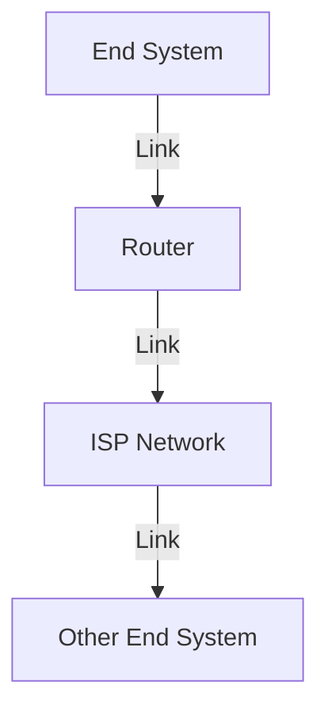
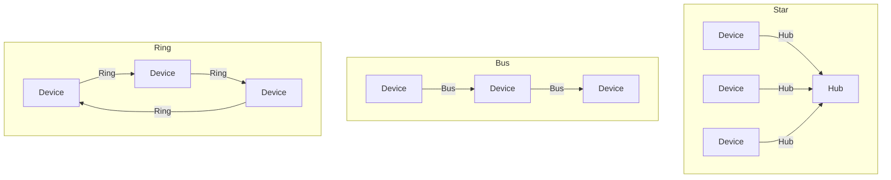

# 1.1 What Is the Internet?

- The Internet is a global network of interconnected computers and devices.
- Provides communication, resource sharing, and access to information.
- **Key components:** hosts (end systems), routers, links, protocols.
- **Internet standards:** Defined by IETF (RFCs).

---

## Real-World Analogy
- The Internet is like a postal system: computers (houses) send/receive messages (letters) via routers (post offices) using protocols (postal rules).

---

## Real-World Scenarios
- Sending an email from your phone to a friend in another country involves your device, your ISP, multiple routers, and the recipient's ISP and device.
- Streaming a video on YouTube involves DNS lookup, HTTP requests, and data transfer from servers across the globe.

---

## Internet vs. World Wide Web
- **Internet:** The physical network of networks (hardware, routers, links).
- **World Wide Web (WWW):** A service on the Internet that uses HTTP to access web pages.

---

## Diagram: Internet Structure

---

## Common Internet Protocols
| Protocol | Purpose                |
|----------|------------------------|
| HTTP     | Web browsing           |
| SMTP     | Email transfer         |
| FTP      | File transfer          |
| DNS      | Name resolution        |
| TCP      | Reliable transport     |
| UDP      | Unreliable transport   |
| IP       | Routing packets        |

---

## Summary Table
| Component   | Role                        |
|-------------|-----------------------------|
| Host        | Sends/receives data         |
| Router      | Forwards data               |
| Link        | Connects devices            |
| Protocol    | Rules for communication     |

---

## Practice Questions
1. **Define the Internet in your own words.**
2. **What is the role of a router?**
3. **Give a real-world analogy for the Internet.**
4. **Explain the difference between the Internet and the World Wide Web.**
5. **List three common Internet protocols and their purposes.**

---

**Exam Tips:**
- Use analogies to explain concepts.
- Know the main components and their functions.
- Be able to distinguish between the Internet and the WWW.

---

## Network Topologies
- **Star Topology:** All devices connect to a central hub. Simple, easy to manage, but hub is a single point of failure.
- **Bus Topology:** All devices share a single communication line. Cheap, but collisions and difficult troubleshooting.
- **Ring Topology:** Devices form a closed loop. Data travels in one direction. Predictable performance, but break in ring affects all.
- **Mesh Topology:** Every device connects to every other. High redundancy, expensive, complex.
- **Tree Topology:** Hierarchical, combines star and bus. Scalable, but root failure affects network.
- **Hybrid Topology:** Mix of two or more topologies for flexibility.

| Topology | Pros | Cons |
|----------|------|------|
| Star     | Easy to manage, scalable | Hub failure = network down |
| Bus      | Cheap, simple            | Collisions, hard to troubleshoot |
| Ring     | Predictable, orderly     | Break = all down |
| Mesh     | Redundant, reliable      | Expensive, complex |
| Tree     | Scalable, flexible       | Root failure = network down |
| Hybrid   | Flexible, robust         | Complex design |

---

## Physical Media
- **Twisted Pair:** Cheap, common (Ethernet cables).
- **Coaxial Cable:** Used for cable TV, older networks.
- **Fiber Optics:** High speed, long distance, immune to EMI.
- **Wireless:** WiFi, Bluetooth, cellular, satellite.

| Medium        | Speed      | Use Case         |
|---------------|------------|-----------------|
| Twisted Pair  | 10 Mbps-10 Gbps | LAN, telephony |
| Coaxial       | 10 Mbps-1 Gbps  | Cable TV, legacy LAN |
| Fiber Optic   | 100 Mbps-100+ Gbps | Backbone, WAN |
| Wireless      | 1 Mbps-1 Gbps+ | WiFi, mobile, IoT |

---

## ISP Hierarchy
- **Tier 1 ISPs:** Global, connect directly to Internet backbone (no transit fees).
- **Tier 2 ISPs:** Regional, buy access from Tier 1, sell to Tier 3.
- **Tier 3 ISPs:** Local, provide access to end users.
- **Peering:** ISPs exchange traffic without fees.
- **Transit:** ISPs pay for access to larger networks.

---

## Protocols and Standards Organizations
- **IETF:** Internet Engineering Task Force (defines Internet standards, RFCs).
- **IEEE:** Institute of Electrical and Electronics Engineers (Ethernet, WiFi).
- **ITU:** International Telecommunication Union (global telecom standards).
- **ISO:** International Organization for Standardization (OSI model).

---

## Cloud Computing and Data Centers
- **Cloud Computing:** On-demand resources/services over the Internet (AWS, Azure, Google Cloud).
- **Data Centers:** Facilities housing servers, storage, networking for cloud and large-scale services.
- **Role in Internet:** Enable scalable, reliable services and storage for users worldwide.

---

## Case Studies & Real-World Strategies

### 1. ISP Peering and Backbone Strategies
- **Tier 1 ISPs (e.g., AT&T, NTT, Level 3):** Peer with each other globally, forming the Internet backbone. They avoid paying transit fees by exchanging traffic directly.
- **Content Providers (e.g., Google, Facebook):** Build their own global networks and peer directly with ISPs to reduce latency and costs (bypassing traditional transit ISPs).

### 2. Access Network Deployment
- **Google Fiber:** Deploys FTTH (Fiber to the Home) in select cities for ultra-high-speed Internet, using a mix of underground and aerial fiber.
- **Comcast/Xfinity:** Uses hybrid fiber-coaxial (HFC) for cable Internet, balancing cost and speed.
- **Mobile Carriers (e.g., Verizon, T-Mobile):** Roll out 4G/5G using a mix of macro towers and small cells for dense urban coverage.

### 3. Protocol Adoption and Evolution
- **HTTP/3 and QUIC:** Google and Cloudflare were early adopters, improving web performance by reducing latency and connection setup time.
- **IPv6 Transition:** Facebook, Google, and ISPs like Comcast have led large-scale IPv6 deployments, using dual-stack and tunneling strategies.

### 4. Global Content Delivery
- **Netflix, YouTube, Amazon:** Deploy servers inside ISP networks (edge caching) to bring content closer to users, reducing backbone traffic and improving performance.

### 5. Security and DDoS Mitigation
- **Cloudflare, Akamai:** Provide DDoS protection and web security by acting as reverse proxies, absorbing attacks at the edge.
- **Banks and E-commerce:** Use multi-layered security (firewalls, IDS/IPS, TLS) and geo-redundant data centers for high availability.

### 6. Historical Milestones
- **ARPANET:** First packet-switched network, funded by the US DoD, evolved into today's Internet.
- **Commercialization:** The rise of ISPs and the World Wide Web in the 1990s led to explosive Internet growth. 