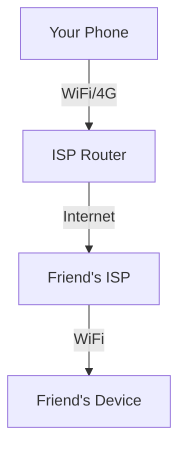

# 1.1 What Is the Internet?

- The Internet is a global network of networks, connecting millions of devices worldwide.
- Enables sharing of information, resources, and services.
- Uses standardized protocols for communication.
- Supports applications like web, email, file transfer, streaming, gaming, IoT, etc.

---

## 1.1.1 A Nuts-and-Bolts Description

- **Hosts/End Systems:** PCs, smartphones, servers, IoT devices.
- **Communication Links:** Copper wire, fiber optics, radio, satellite.
- **Packet Switches:** Routers and switches forward data.
- **ISP (Internet Service Provider):** Connects end users to the Internet.
- **Scenario:** Sending an email from your phone to a friend in another country involves your device, your ISP, multiple routers, and the recipient's ISP and device.
- **Diagram:**

---

## 1.1.2 A Services Description

- The Internet provides services to applications, not direct device-to-device connections.
- **Examples:**
  - Web browsing (HTTP/HTTPS)
  - Email (SMTP, IMAP, POP3)
  - File transfer (FTP, SFTP)
  - Video streaming (YouTube, Netflix)
- **Service Model:** Applications use the Internet as a platform for communication.
- **Scenario:** Watching a YouTube video involves your browser, DNS lookup, HTTP requests, and video streaming protocols.

---

## 1.1.3 What Is a Protocol?

- **Protocol:** Set of rules for data exchange between devices.
- **Examples:**
  - HTTP: Web browsing
  - TCP: Reliable data transfer
  - UDP: Fast, connectionless transfer (e.g., video calls)
  - IP: Routing packets
- **Protocol Analogy:** Like a language or etiquette for computers.
- **Scenario:** TCP ensures your file download is complete and in order, even if packets arrive out of sequence.

---

**Exam Tip:**
- Be able to define the Internet, describe its components, and explain protocols with real-world examples.
- Draw and explain simple network diagrams. 