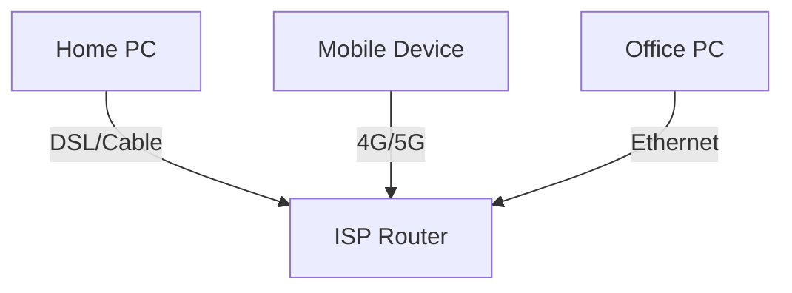
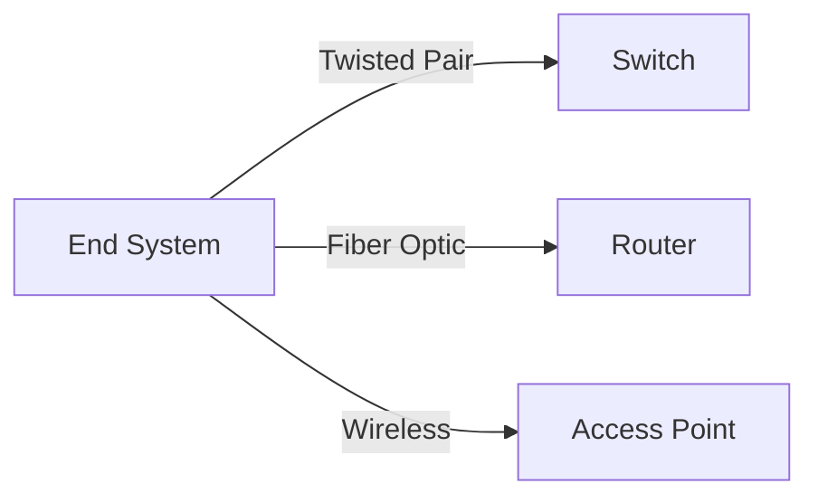

# 1.2 The Network Edge

The network edge consists of the devices and networks that connect end users to the Internet.

---

## 1.2.1 Access Networks

- **Definition:** Access networks connect end systems (users) to the first router (edge router) of the Internet.
- **Types of Access Networks:**
  - **Home Access:** DSL, Cable, Fiber-to-the-Home (FTTH), Dial-up
  - **Enterprise Access:** Ethernet, WiFi
  - **Wireless Access:** 4G/5G cellular, WiFi hotspots
- **Diagram:**

- **Key Point:** Access networks determine the speed and reliability of a user's Internet connection.

---

## 1.2.2 Physical Media

- **Definition:** Physical media are the actual materials that carry the network signals.
- **Types:**
  - **Twisted Pair Copper Wire:** Used in Ethernet and telephone lines
  - **Coaxial Cable:** Used in cable Internet
  - **Fiber Optics:** High-speed, long-distance
  - **Wireless:** Radio, microwave, satellite
- **Diagram:**

- **Key Point:** The choice of physical media affects bandwidth, cost, and distance.

---

**Exam Tip:**
- Be able to compare access network types and physical media, and draw simple diagrams. 