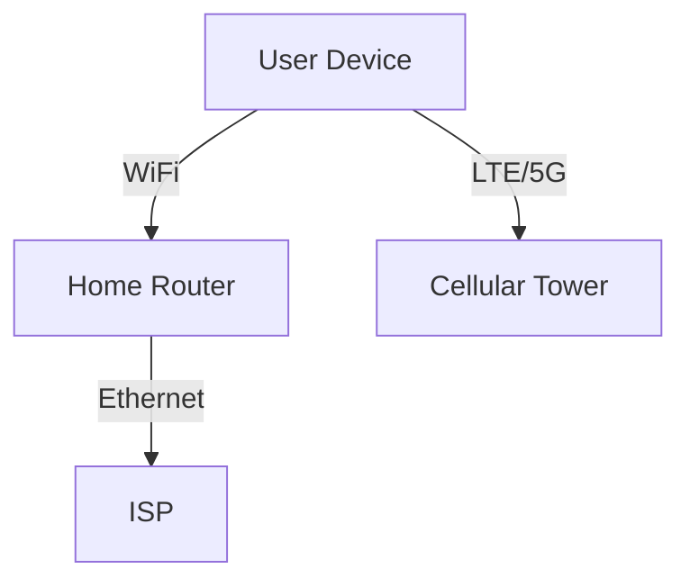

# 1.2 The Network Edge

- The network edge consists of devices directly interacting with users.
- **End systems:** Desktops, laptops, smartphones, IoT devices (smart thermostats, smartwatches, sensors).
- **Access networks:** Connect end systems to the Internet (wired, wireless, cellular).

---

## Types of Access Networks
- **Home networks:** DSL, cable, fiber, WiFi.
- **Enterprise networks:** Ethernet, WiFi.
- **Cellular networks:** 4G, 5G.
- **IoT networks:** Low-power wireless (Zigbee, LoRaWAN).

---

## Access Network Technologies
- **DSL (Digital Subscriber Line):** Uses telephone lines, moderate speed.
- **Cable:** Uses coaxial cable, higher speed, shared bandwidth.
- **Fiber:** Uses optical fiber, very high speed, expensive.
- **Wireless:** WiFi (local), LTE/5G (wide area), variable speed.

---

## Additional Access Network Types
- **Satellite:** Provides Internet to remote areas, higher latency.
- **FTTH (Fiber to the Home):** Direct fiber connection, very high speed.

| Technology | Speed         | Latency   | Use Case         |
|------------|--------------|-----------|-----------------|
| Satellite  | 10-100 Mbps  | High      | Rural/remote    |
| FTTH       | 100 Mbps-1Gb+| Low       | Urban, premium  |

---

## Cellular Generations
- **3G:** Mobile Internet, basic web/email.
- **4G (LTE):** High-speed mobile broadband, video streaming.
- **5G:** Ultra-fast, low latency, supports IoT, smart cities.

---

## IoT and Edge Computing
- **IoT (Internet of Things):** Billions of devices (sensors, appliances, vehicles) connected to the Internet.
- **Edge Computing:** Processing data near the source (at the edge) for low latency and efficiency (e.g., smart cameras, industrial sensors).

---

## Diagram: Network Edge

---

## Comparison Table: Access Technologies
| Technology | Speed         | Cost      | Reliability | Example Use      |
|------------|--------------|-----------|-------------|-----------------|
| DSL        | 1-100 Mbps   | Low       | Medium      | Home Internet   |
| Cable      | 10-1000 Mbps | Medium    | Medium      | Home Internet   |
| Fiber      | 100 Mbps-1Gb | High      | High        | High-speed Home |
| WiFi       | 10-1000 Mbps | Low       | Medium      | Home/Office     |
| 4G/5G      | 10-1000 Mbps | Medium    | Medium      | Mobile Internet |

---

## Summary Table
| Access Type | Example Device | Technology |
|-------------|---------------|------------|
| Wired       | PC            | Ethernet   |
| Wireless    | Smartphone    | WiFi       |
| Cellular    | Tablet        | 4G/5G      |
| IoT         | Sensor        | Zigbee     |

---

## Practice Questions
1. **List three types of access networks.**
2. **What is the network edge?**
3. **Give an example of a device at the network edge.**
4. **Compare DSL, cable, and fiber in terms of speed and reliability.**
5. **What is an IoT device? Give two examples.**

---

**Exam Tips:**
- Know access technologies and device examples.
- Be able to draw network edge diagrams.
- Compare access technologies for exam questions. 