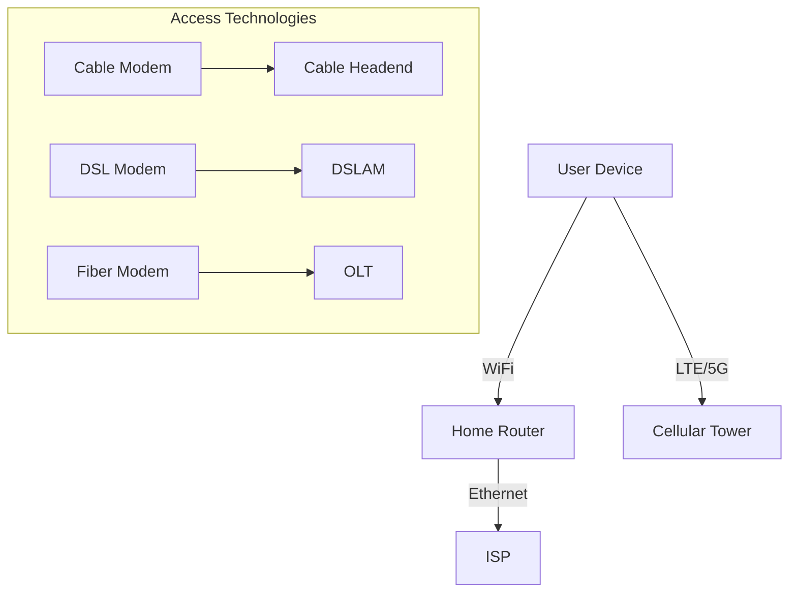

# 1.2 The Network Edge

- The network edge consists of devices directly interacting with users.
- **End systems:** Desktops, laptops, smartphones, IoT devices (smart thermostats, smartwatches, sensors).
- **Access networks:** Connect end systems to the Internet (wired, wireless, cellular).

---

## Types of Access Networks
- **Home networks:** DSL, cable, fiber, WiFi.
- **Enterprise networks:** Ethernet, WiFi.
- **Cellular networks:** 4G, 5G.
- **IoT networks:** Low-power wireless (Zigbee, LoRaWAN).

---

## Access Network Technologies

### Cable-Based Access (HFC - Hybrid Fiber Coax)
- **Technology:** Uses existing cable TV infrastructure
- **Components:** Cable modem, splitter, cable headend, CMTS (Cable Modem Termination System)
- **Frequency Division Multiplexing (FDM):** Different channels transmitted in different frequency bands
- **Characteristics:**
  - Asymmetric: 40 Mbps - 1.2 Gbps downstream, 30-100 Mbps upstream
  - Shared bandwidth among homes in neighborhood
  - Network of cable and fiber connects homes to ISP router
- **Real-world example:** Comcast Xfinity, Spectrum, Cox Communications

### Digital Subscriber Line (DSL)
- **Technology:** Uses existing telephone lines
- **Components:** DSL modem, splitter, DSLAM (DSL Access Multiplexer)
- **Characteristics:**
  - Voice and data transmitted at different frequencies
  - Dedicated line to central office
  - 24-52 Mbps downstream, 3.5-16 Mbps upstream
  - Data goes to Internet, voice goes to telephone network
- **Real-world example:** AT&T U-verse, Verizon DSL

### Home Networks
- **Components:** Cable/DSL modem, router/firewall/NAT, wired Ethernet, WiFi access point
- **Ethernet:** 1 Gbps wired connections
- **WiFi:** 54-450 Mbps wireless (802.11b/g/n)
- **Combined functionality:** Often single device provides modem, router, firewall, NAT, WiFi

### Enterprise Networks
- **Technology mix:** Wired and wireless link technologies
- **Ethernet:** 100 Mbps, 1 Gbps, 10 Gbps wired access
- **WiFi:** 11, 54, 450 Mbps wireless access points
- **Components:** Ethernet switches, institutional routers, mail/web servers
- **Connectivity:** Enterprise link to ISP (Internet)

### Data Center Networks
- **High-bandwidth links:** 10s to 100s Gbps
- **Scale:** Hundreds to thousands of servers
- **Purpose:** Cloud computing, content delivery, web services
- **Examples:** Amazon Web Services, Google Cloud, Microsoft Azure

---

## Additional Access Network Types
- **Satellite:** Provides Internet to remote areas, higher latency.
- **FTTH (Fiber to the Home):** Direct fiber connection, very high speed.

| Technology | Speed         | Latency   | Use Case         |
|------------|--------------|-----------|-----------------|
| Satellite  | 10-100 Mbps  | High      | Rural/remote    |
| FTTH       | 100 Mbps-1Gb+| Low       | Urban, premium  |

---

## Cellular Generations
- **3G:** Mobile Internet, basic web/email.
- **4G (LTE):** High-speed mobile broadband, video streaming.
- **5G:** Ultra-fast, low latency, supports IoT, smart cities.

---

## IoT and Edge Computing
- **IoT (Internet of Things):** Billions of devices (sensors, appliances, vehicles) connected to the Internet.
- **Edge Computing:** Processing data near the source (at the edge) for low latency and efficiency (e.g., smart cameras, industrial sensors).

---

## Diagram: Network Edge

---

## Comparison Table: Access Technologies
| Technology | Speed         | Cost      | Reliability | Example Use      | Characteristics |
|------------|--------------|-----------|-------------|-----------------|-----------------|
| DSL        | 1-100 Mbps   | Low       | Medium      | Home Internet   | Dedicated line, telephone infrastructure |
| Cable      | 10-1000 Mbps | Medium    | Medium      | Home Internet   | Shared bandwidth, cable TV infrastructure |
| Fiber      | 100 Mbps-1Gb | High      | High        | High-speed Home | Dedicated fiber, highest performance |
| WiFi       | 10-1000 Mbps | Low       | Medium      | Home/Office     | Wireless, limited range |
| 4G/5G      | 10-1000 Mbps | Medium    | Medium      | Mobile Internet | Wireless, wide coverage |
| Satellite  | 10-100 Mbps  | High      | Low         | Rural areas     | High latency, global coverage |

---

## Summary Table
| Access Type | Example Device | Technology | Key Feature |
|-------------|---------------|------------|-------------|
| Wired       | PC            | Ethernet   | High speed, reliable |
| Wireless    | Smartphone    | WiFi       | Convenient, mobile |
| Cellular    | Tablet        | 4G/5G      | Wide coverage |
| IoT         | Sensor        | Zigbee     | Low power |

---

## Practice Questions
1. **List three types of access networks.**
2. **What is the network edge?**
3. **Give an example of a device at the network edge.**
4. **Compare DSL, cable, and fiber in terms of speed and reliability.**
5. **What is an IoT device? Give two examples.**
6. **Explain the difference between HFC and DSL access technologies.**
7. **What are the components of a typical home network?**
8. **Compare enterprise networks with home networks.**

---

**Exam Tips:**
- Know access technologies and device examples.
- Be able to draw network edge diagrams.
- Compare access technologies for exam questions.
- **New:** Understand the technical details of cable and DSL access.
- **New:** Know the components and characteristics of different access networks. 