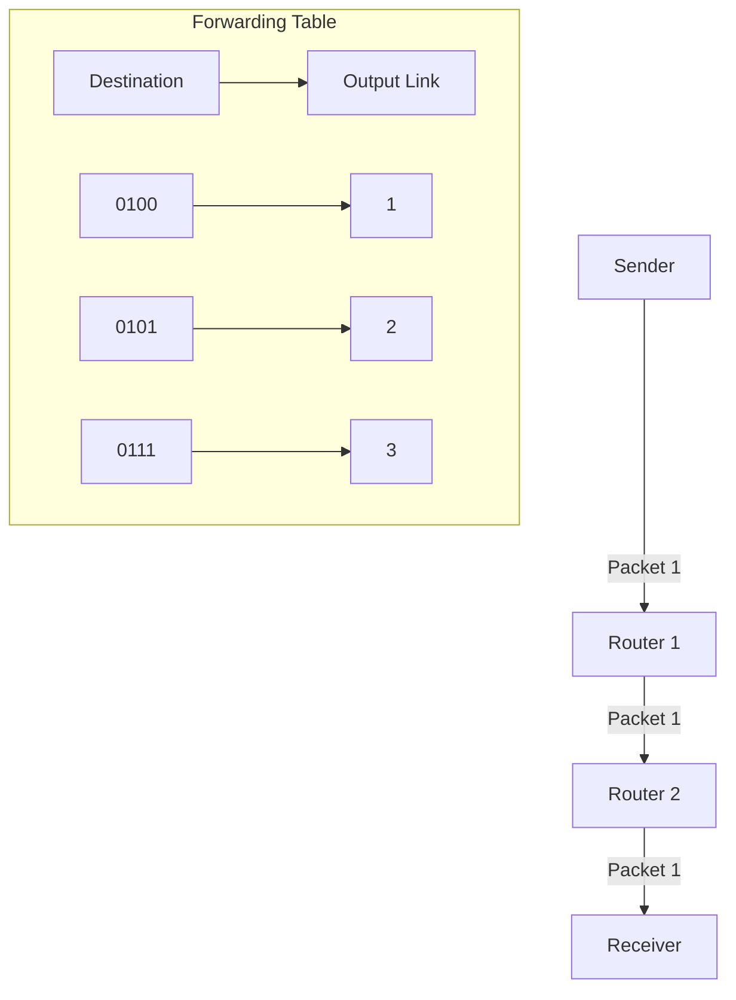
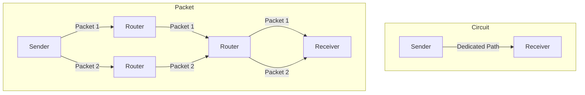
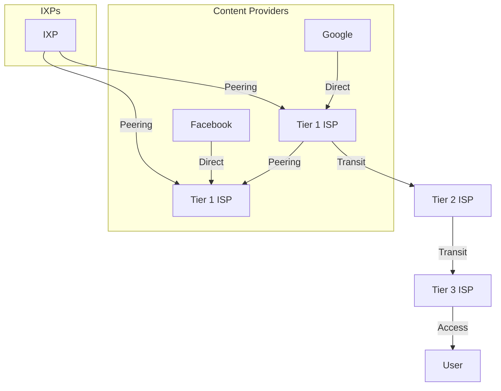

# 1.3 The Network Core

- The network core is the central part of the Internet that interconnects networks.
- **Switching:** Moves data through the core (circuit vs. packet switching).
- **Routing:** Determines the path data takes.
- **Core vs. Edge:** Core = backbone, Edge = user access.

---

## Two Key Network-Core Functions

### 1. Forwarding (Switching)
- **Local action:** Move arriving packets from router's input link to appropriate output link
- **Forwarding table:** Maps destination address to output link
- **Example:** Router receives packet with destination 0111, looks up in table, forwards to output link 3

### 2. Routing
- **Global action:** Determine source-destination paths taken by packets
- **Routing algorithms:** Calculate optimal paths through network
- **Routing protocols:** Exchange information between routers to build forwarding tables

---

## Switching Methods
- **Circuit switching:** Dedicated path, used in telephony. Guarantees bandwidth but inefficient for bursty data.
- **Packet switching:** Data split into packets, shared network, used in Internet. Efficient, but may introduce delay and loss.
- **Message switching:** (Historical) Entire message stored and forwarded, not used in modern Internet.

---

## Packet Switching: Store-and-Forward
- **Process:** Entire packet must arrive at router before it can be transmitted on next link
- **Transmission delay:** Time to transmit L-bit packet into link at R bps = L/R seconds
- **Example:** 10 Kbit packet on 100 Mbps link = 0.1 msec transmission delay

### Packet Switching: Queueing
- **Queueing occurs:** When work arrives faster than it can be serviced
- **Packet loss:** If arrival rate exceeds transmission rate, packets queue and may be dropped
- **Buffer overflow:** When router memory fills up, arriving packets are dropped

---

## Circuit Switching: FDM and TDM

### Frequency Division Multiplexing (FDM)
- **Method:** Optical, electromagnetic frequencies divided into narrow frequency bands
- **Allocation:** Each call gets its own band, can transmit at max rate of that narrow band
- **Example:** Radio stations use different frequencies to avoid interference

### Time Division Multiplexing (TDM)
- **Method:** Time divided into slots
- **Allocation:** Each call allocated periodic slot(s), can transmit at maximum rate during its time slot(s)
- **Example:** Traditional telephone networks

---

## Packet Switching vs Circuit Switching Comparison

### Numerical Example
- **Scenario:** 1 Gb/s link, each user needs 100 Mb/s when active, active 10% of time
- **Circuit switching:** 10 users maximum (1 Gb/s ÷ 100 Mb/s = 10)
- **Packet switching:** 35 users with probability > 10 active at same time < 0.0004

### Advantages and Disadvantages

| Feature | Packet Switching | Circuit Switching |
|---------|------------------|-------------------|
| **Resource sharing** | Yes | No |
| **Efficiency** | High (bursty data) | Low (idle waste) |
| **Delay** | Variable | Fixed |
| **Setup** | No call setup | Requires call setup |
| **Congestion** | Possible | No |
| **Reliability** | Protocols needed | Circuit-like performance |

---

## Internet Structure: "Network of Networks"

### Evolution of Internet Structure
1. **Direct connection:** Each access ISP connects to every other (O(N²) connections)
2. **Global transit ISP:** Single global ISP connects all access ISPs
3. **Competition:** Multiple global ISPs emerge
4. **Peering:** ISPs connect directly via Internet Exchange Points (IXPs)
5. **Regional networks:** Connect access nets to ISPs
6. **Content provider networks:** Google, Microsoft, Akamai run their own networks

### Current Internet Structure
- **Center:** Small number of well-connected large networks
- **Tier-1 ISPs:** Commercial ISPs with national/international coverage
- **Content provider networks:** Private networks connecting data centers
- **Regional ISPs:** Connect access networks to larger ISPs
- **IXPs:** Physical locations for ISP interconnection

---

## Scenario Example: Video Call
- In a video call, data is split into packets and routed independently through the network core. If one path is congested, packets may take alternate routes, arriving out of order but reassembled at the destination.

---

## Diagram: Packet Switching

---

## Diagram: Circuit vs. Packet Switching

---

## ISP Hierarchy and Peering
- The Internet is a network of networks, organized in a hierarchy:
  - **Tier 1 ISPs:** Connect to global backbone, peer with each other.
  - **Tier 2 ISPs:** Buy access from Tier 1, sell to smaller ISPs.
  - **Tier 3 ISPs:** Provide access to end users.
- **Peering:** ISPs exchange traffic directly, often without payment.
- **Transit:** ISPs pay larger ISPs for access to the rest of the Internet.

---

## Diagram: ISP Hierarchy

---

## Summary Table
| Method           | Dedicated Path | Efficiency | Example     | Resource Sharing |
|------------------|---------------|------------|-------------|------------------|
| Circuit Switching| Yes           | Low        | Telephone   | No               |
| Packet Switching | No            | High       | Internet    | Yes              |
| Message Switching| No            | Low        | Telegraph   | No               |

---

## Practice Questions
1. **What is the difference between circuit and packet switching?**
2. **What is the role of the network core?**
3. **How does routing work in the core?**
4. **Describe a real-world scenario where packet switching is beneficial.**
5. **Explain the difference between forwarding and routing.**
6. **What are FDM and TDM in circuit switching?**
7. **How does the Internet structure evolve from direct connections to the current hierarchy?**
8. **What is the purpose of Internet Exchange Points (IXPs)?**

---

**Exam Tips:**
- Compare core and edge functions.
- Know switching methods and their pros/cons.
- Use scenario-based examples in answers.
- **New:** Understand forwarding vs. routing distinction.
- **New:** Know FDM and TDM multiplexing techniques.
- **New:** Be familiar with Internet structure evolution and ISP hierarchy. 