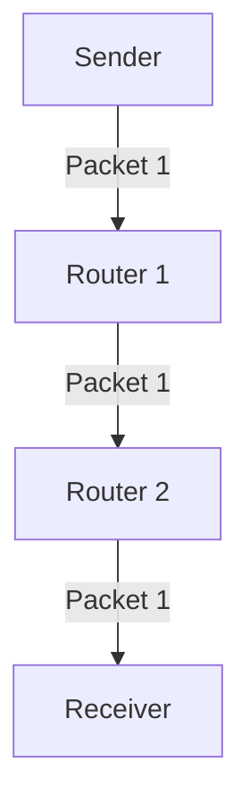

# 1.3 The Network Core

- The network core is the central part of the Internet that interconnects networks.
- **Switching:** Moves data through the core (circuit vs. packet switching).
- **Routing:** Determines the path data takes.
- **Core vs. Edge:** Core = backbone, Edge = user access.

---

## Switching Methods
- **Circuit switching:** Dedicated path, used in telephony. Guarantees bandwidth but inefficient for bursty data.
- **Packet switching:** Data split into packets, shared network, used in Internet. Efficient, but may introduce delay and loss.
- **Message switching:** (Historical) Entire message stored and forwarded, not used in modern Internet.

---

## Scenario Example: Video Call
- In a video call, data is split into packets and routed independently through the network core. If one path is congested, packets may take alternate routes, arriving out of order but reassembled at the destination.

---

## Diagram: Packet Switching

---

## Summary Table
| Method           | Dedicated Path | Efficiency | Example     |
|------------------|---------------|------------|-------------|
| Circuit Switching| Yes           | Low        | Telephone   |
| Packet Switching | No            | High       | Internet    |
| Message Switching| No            | Low        | Telegraph   |

---

## Practice Questions
1. **What is the difference between circuit and packet switching?**
2. **What is the role of the network core?**
3. **How does routing work in the core?**
4. **Describe a real-world scenario where packet switching is beneficial.**

---

**Exam Tips:**
- Compare core and edge functions.
- Know switching methods and their pros/cons.
- Use scenario-based examples in answers.

---

## 1.3.1 Packet Switching

- Data split into packets, each routed independently.
- Routers forward packets based on destination address.
- **Advantages:** Efficient, robust, scalable.
- **Disadvantages:** Variable delay, possible congestion.
- **Scenario:** Multiple users share the same link; packets from different sources interleave.

---

## 1.3.2 Circuit Switching

- Dedicated path for each session (e.g., phone call).
- **Advantages:** Predictable performance, constant bandwidth.
- **Disadvantages:** Inefficient if idle, not scalable for bursty data.
- **Scenario:** Traditional telephone network reserves a line for the entire call.

---

## 1.3.3 A Network of Networks

- The Internet is a hierarchy of interconnected networks (ISPs, enterprise, campus, etc.).
- **Example:** Your home network connects to a local ISP, which connects to a regional ISP, then to a global backbone.

---

## Comparison Table
| Feature           | Packet Switching      | Circuit Switching     |
|-------------------|----------------------|----------------------|
| Resource Sharing  | Yes                  | No                   |
| Delay             | Variable             | Fixed                |
| Efficiency        | High (bursty data)   | Low (idle waste)     |
| Example           | Internet             | Telephone network    |

---

## Practice Questions
1. **Explain the difference between packet switching and circuit switching.**
2. **Draw a diagram showing how packets from multiple users are routed through the network core.**
3. **Describe a real-world scenario where circuit switching is preferred over packet switching.**

---

**Exam Tips:**
- Compare packet and circuit switching with examples and tables.
- Draw hierarchical network diagrams. 