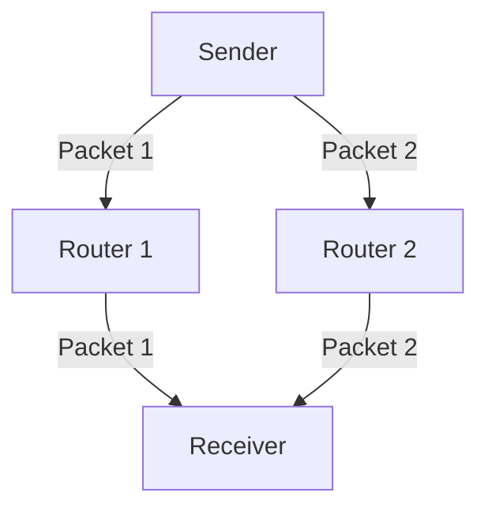
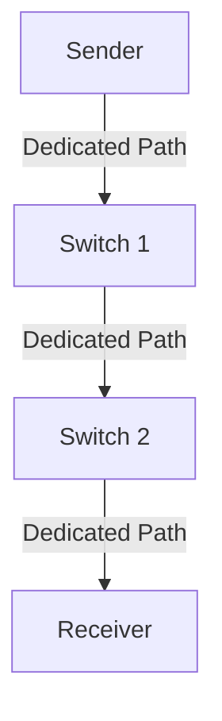
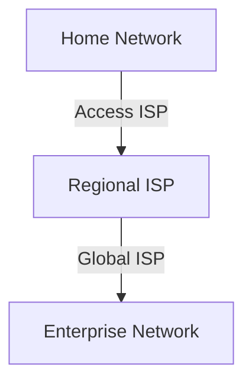

# 1.3 The Network Core

The network core is the central part of the Internet, consisting of interconnected routers and high-speed links that move data between edge networks.

---

## 1.3.1 Packet Switching

- **Definition:** Data is sent in small packets, each routed independently through the network.
- **How it works:**
  - Packets from different sources share the same network resources.
  - Routers forward packets based on destination address.
- **Advantages:**
  - Efficient resource sharing
  - Robust to failures
- **Disadvantages:**
  - Variable delay (congestion)
- **Diagram:**

---

## 1.3.2 Circuit Switching

- **Definition:** A dedicated communication path is established between sender and receiver for the duration of the session.
- **Examples:** Traditional telephone networks
- **Advantages:**
  - Predictable performance (fixed bandwidth)
- **Disadvantages:**
  - Inefficient resource use (idle during silence)
- **Diagram:**

---

## 1.3.3 A Network of Networks

- **Definition:** The Internet is a collection of interconnected networks (ISPs, enterprise networks, etc.).
- **Hierarchy:**
  - Access ISPs connect to regional ISPs, which connect to global ISPs.
- **Diagram:**

---

**Exam Tip:**
- Be able to compare packet switching and circuit switching, and explain the Internet's hierarchical structure with diagrams. 