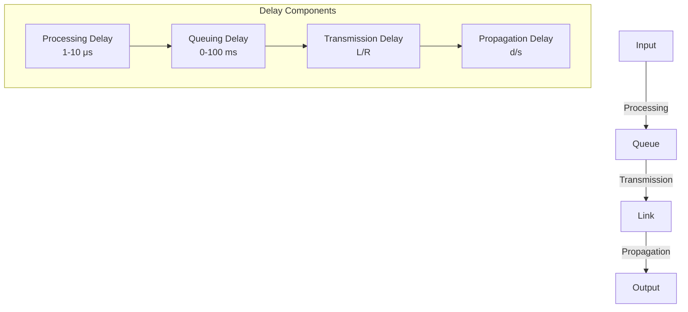

# 1.4 Delay, Loss, and Throughput in Packet-Switched Networks

- **Delay:** Time for data to travel from source to destination.
- **Loss:** Packets dropped due to congestion or errors.
- **Throughput:** Rate of successful data delivery.

---

## Types of Delay
- **Processing delay:** Time to examine packet header. (e.g., 1-10 microseconds)
- **Queuing delay:** Time in router queue. (e.g., varies from microseconds to milliseconds, depends on congestion)
- **Transmission delay:** Time to push bits onto link. (e.g., 1 ms for 1,000 bits at 1 Mbps)
- **Propagation delay:** Time for signal to travel. (e.g., 5 ms for 1,000 km at 2x10^8 m/s)

---

## Typical Delay Values Table
| Delay Type    | Typical Value         | Example Scenario           |
|---------------|----------------------|---------------------------|
| Processing    | 1-10 microseconds    | Router header check       |
| Queuing       | 0-100 ms (varies)    | Congested router          |
| Transmission  | 1-10 ms              | Sending 1,000 bits @ 1Mbps|
| Propagation   | 5-50 ms              | 1,000-10,000 km fiber     |

---

## Formulas
- **Transmission delay:** $d_{trans} = \frac{L}{R}$
  - $L$ = packet length (bits), $R$ = link bandwidth (bps)
- **Propagation delay:** $d_{prop} = \frac{d}{s}$
  - $d$ = distance, $s$ = propagation speed
- **End-to-end delay:** $d_{end-to-end} = d_{proc} + d_{queue} + d_{trans} + d_{prop}$

---

## Caravan Analogy
Think of packets as cars in a caravan traveling between toll booths (routers):

### Scenario 1: Standard Conditions
- **Caravan:** 10 cars (10-bit packet)
- **Toll booth service time:** 12 seconds per car (bit transmission time)
- **Travel speed:** 100 km/hr (propagation speed)
- **Distance:** 100 km between toll booths

**Question:** How long until caravan is lined up before 2nd toll booth?

**Answer:** 62 minutes
- Time to push entire caravan through 1st toll booth: 12 × 10 = 120 seconds
- Time for last car to propagate from 1st to 2nd toll booth: 100km ÷ 100km/hr = 1 hour
- Total: 120 seconds + 1 hour = 62 minutes

### Scenario 2: High-Speed Conditions
- **Travel speed:** 1000 km/hr
- **Toll booth service time:** 1 minute per car

**Question:** Will cars arrive at 2nd booth before all cars serviced at 1st booth?

**Answer:** Yes! After 7 minutes, first car arrives at second booth; three cars still at first booth.

---

## Diagram: Delays in a Router


---

## Packet Queueing Delay (Revisited)
- **Traffic intensity:** $La/R$ where:
  - $a$ = average packet arrival rate
  - $L$ = packet length (bits)
  - $R$ = link bandwidth (bit transmission rate)

### Queueing Behavior
- **$La/R \sim 0$:** Average queueing delay small
- **$La/R \rightarrow 1$:** Average queueing delay large
- **$La/R > 1$:** More "work" arriving than can be serviced - average delay infinite!

---

## Solved Numerical Example 1
**Q:** A 1,000-bit packet is sent over a 1 Mbps link. What is the transmission delay?
**A:** $d_{trans} = 1000/1,000,000 = 0.001$ s = 1 ms

---

## Solved Numerical Example 2
**Q:** If a router has a queue of 10 packets, each 1,000 bits, and the link is 1 Mbps, what is the total queuing + transmission delay for the last packet?
**A:**
- Queuing delay = 9 × 0.001 s = 0.009 s
- Transmission delay = 0.001 s
- Total = 0.01 s = 10 ms

---

## Real Internet Delays and Routes
- **Traceroute program:** Provides delay measurement from source to router along end-end Internet path
- **Method:** Sends three packets with increasing TTL values
- **Output:** Shows router IP addresses and round-trip times

### Example Traceroute Output
```
1 cs-gw (128.119.240.254) 1 ms 1 ms 2 ms
2 border1-rt-fa5-1-0.gw.umass.edu (128.119.3.145) 1 ms 1 ms 2 ms
3 cht-vbns.gw.umass.edu (128.119.3.130) 6 ms 5 ms 5 ms
...
16 194.214.211.25 (194.214.211.25) 126 ms 128 ms 126 ms
17 * * *
18 * * *
19 fantasia.eurecom.fr (193.55.113.142) 132 ms 128 ms 136 ms
```

**Note:** Asterisks (*) indicate no response (probe lost, router not replying)

---

## Packet Loss
- **Cause:** Queue (buffer) preceding link has finite capacity
- **Process:** Packet arriving to full buffer is dropped (lost)
- **Handling:** Lost packet may be retransmitted by previous node, by source end system, or not at all

### Loss Scenarios
- **Buffer overflow:** Too many packets arrive simultaneously
- **Network congestion:** Routers cannot process packets fast enough
- **Link failures:** Physical or logical connection problems

---

## Throughput
- **Definition:** Rate (bits/time unit) at which bits are being sent from sender to receiver
- **Types:**
  - **Instantaneous:** Rate at given point in time
  - **Average:** Rate over longer period of time

### Throughput Scenarios

#### Scenario 1: Bottleneck at Server
- **Server link capacity:** Rs bits/sec
- **Client link capacity:** Rc bits/sec
- **Condition:** Rs < Rc
- **Result:** Average end-end throughput = Rs

#### Scenario 2: Bottleneck at Client
- **Server link capacity:** Rs bits/sec
- **Client link capacity:** Rc bits/sec
- **Condition:** Rs > Rc
- **Result:** Average end-end throughput = Rc

#### Scenario 3: Shared Backbone
- **10 connections** share backbone bottleneck link R bits/sec
- **Per-connection end-end throughput:** min(Rc, Rs, R/10)
- **In practice:** Rc or Rs is often the bottleneck

---

## Summary Table
| Delay Type    | Cause                  | Formula           |
|---------------|------------------------|-------------------|
| Processing    | Header examination     | Variable          |
| Queuing       | Waiting in queue       | Variable          |
| Transmission  | Sending bits           | L/R               |
| Propagation   | Signal travel          | d/s               |

---

## Practice Questions
1. **List and define four types of delay.**
2. **Calculate transmission delay for a 2,000-bit packet on a 2 Mbps link.**
3. **What causes packet loss?**
4. **Give a real-world example of queuing delay.**
5. **Explain the caravan analogy for packet transmission.**
6. **What is traffic intensity and how does it affect queueing delay?**
7. **How does traceroute measure network delays?**
8. **Calculate throughput when server capacity is 100 Mbps and client capacity is 50 Mbps.**

---

**Exam Tips:**
- Memorize delay formulas and types.
- Practice numericals for throughput and delay.
- Use real-world examples in answers.
- **New:** Understand the caravan analogy for packet transmission.
- **New:** Know traffic intensity and its impact on queueing.
- **New:** Be familiar with traceroute and real Internet measurements.
- **New:** Understand throughput bottlenecks and shared resources.

---

## Additional Network Performance Metrics
- **Jitter:** Variation in packet delay (important for voice/video).
  - Example: If packets arrive at 10ms, 20ms, 15ms intervals, jitter = max-min = 10ms.
- **Bandwidth:** Maximum data rate of a link (bits per second, bps).
  - Example: 100 Mbps Ethernet link.
- **Goodput:** Application-level throughput (useful data delivered per second, excluding protocol overhead and retransmissions).
  - Example: If 1 MB file is sent in 10 seconds, goodput = 0.8 Mbps (if 20% is overhead).

| Metric     | Definition                        | Example Use Case         |
|------------|-----------------------------------|-------------------------|
| Jitter     | Delay variation                   | VoIP, video streaming   |
| Bandwidth  | Max data rate (bps)               | Link capacity           |
| Goodput    | Useful data delivered (bps)       | File transfer efficiency| 