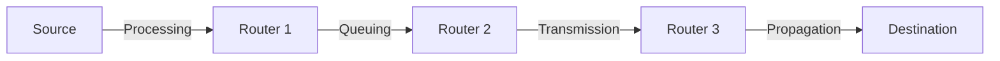
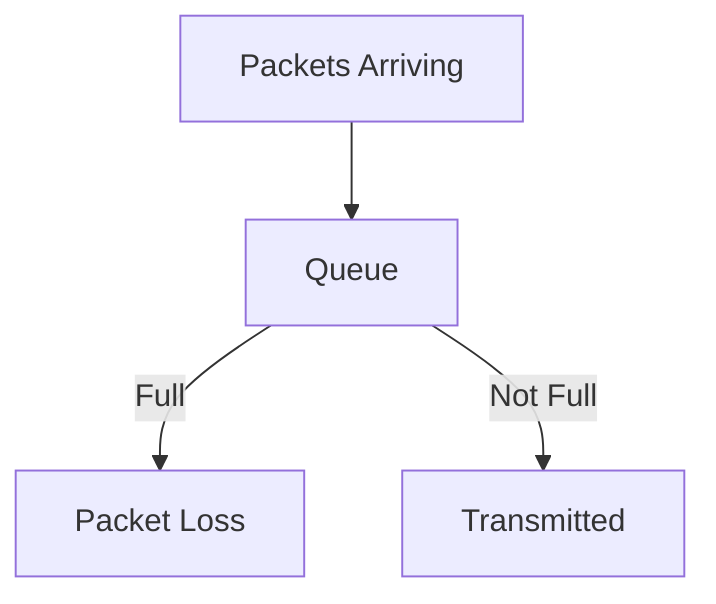

# 1.4 Delay, Loss, and Throughput in Packet-Switched Networks

Understanding delay, loss, and throughput is crucial for analyzing network performance.

---

## 1.4.1 Overview of Delay in Packet-Switched Networks

- **Types of Delay:**
  - **Processing Delay:** Time to examine packet header and determine where to direct the packet.
  - **Queuing Delay:** Time a packet waits in queue before being transmitted.
  - **Transmission Delay:** Time to push all packet bits onto the link.
    - Formula: Transmission Delay = Packet Length (bits) / Link Bandwidth (bps)
  - **Propagation Delay:** Time for a bit to propagate from one router to the next.
    - Formula: Propagation Delay = Link Length (meters) / Propagation Speed (m/s)
- **Diagram:**

---

## 1.4.2 Queuing Delay and Packet Loss

- **Queuing Delay:**
  - Increases as traffic load increases.
  - Can be highly variable.
- **Packet Loss:**
  - Occurs when queue is full and new packets are dropped.
- **Diagram:**

---

## 1.4.3 End-to-End Delay

- **Total Delay:**
  - Sum of all delays along the path.
  - Formula: End-to-End Delay = N*(d_proc + d_queue + d_trans + d_prop)
    - N = number of links
    - d_proc = processing delay
    - d_queue = queuing delay
    - d_trans = transmission delay
    - d_prop = propagation delay
- **Example:**
  - If a packet traverses 3 links, each with 1 ms processing, 2 ms queuing, 4 ms transmission, and 5 ms propagation:
    - End-to-End Delay = 3*(1+2+4+5) = 36 ms

---

## 1.4.4 Throughput in Computer Networks

- **Throughput:**
  - Rate at which bits are transferred between sender and receiver.
  - **Instantaneous Throughput:** Rate at a given instant.
  - **Average Throughput:** Rate over a longer period.
- **Bottleneck Link:**
  - The slowest link determines the end-to-end throughput.
- **Diagram:**

- **Key Point:** Throughput is limited by the bottleneck link.

---

**Exam Tip:**
- Be able to calculate all types of delays and throughput, and explain packet loss with diagrams and examples. 