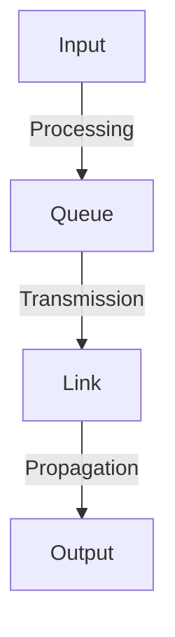

# 1.4 Delay, Loss, and Throughput in Packet-Switched Networks

- **Delay:** Time for data to travel from source to destination.
- **Loss:** Packets dropped due to congestion or errors.
- **Throughput:** Rate of successful data delivery.

---

## Types of Delay
- **Processing delay:** Time to examine packet header. (e.g., 1-10 microseconds)
- **Queuing delay:** Time in router queue. (e.g., varies from microseconds to milliseconds, depends on congestion)
- **Transmission delay:** Time to push bits onto link. (e.g., 1 ms for 1,000 bits at 1 Mbps)
- **Propagation delay:** Time for signal to travel. (e.g., 5 ms for 1,000 km at 2x10^8 m/s)

---

## Typical Delay Values Table
| Delay Type    | Typical Value         | Example Scenario           |
|---------------|----------------------|---------------------------|
| Processing    | 1-10 microseconds    | Router header check       |
| Queuing       | 0-100 ms (varies)    | Congested router          |
| Transmission  | 1-10 ms              | Sending 1,000 bits @ 1Mbps|
| Propagation   | 5-50 ms              | 1,000-10,000 km fiber     |

---

## Formulas
- **Transmission delay:** $d_{trans} = \frac{L}{R}$
  - $L$ = packet length (bits), $R$ = link bandwidth (bps)
- **Propagation delay:** $d_{prop} = \frac{d}{s}$
  - $d$ = distance, $s$ = propagation speed
- **End-to-end delay:** $d_{end-to-end} = d_{proc} + d_{queue} + d_{trans} + d_{prop}$

---

## Diagram: Delays in a Router

---

## Solved Numerical Example 1
**Q:** A 1,000-bit packet is sent over a 1 Mbps link. What is the transmission delay?
**A:** $d_{trans} = 1000/1,000,000 = 0.001$ s = 1 ms

---

## Solved Numerical Example 2
**Q:** If a router has a queue of 10 packets, each 1,000 bits, and the link is 1 Mbps, what is the total queuing + transmission delay for the last packet?
**A:**
- Queuing delay = 9 x 0.001 s = 0.009 s
- Transmission delay = 0.001 s
- Total = 0.01 s = 10 ms

---

## Summary Table
| Delay Type    | Cause                  |
|---------------|------------------------|
| Processing    | Header examination     |
| Queuing       | Waiting in queue       |
| Transmission  | Sending bits           |
| Propagation   | Signal travel          |

---

## Practice Questions
1. **List and define four types of delay.**
2. **Calculate transmission delay for a 2,000-bit packet on a 2 Mbps link.**
3. **What causes packet loss?**
4. **Give a real-world example of queuing delay.**

---

**Exam Tips:**
- Memorize delay formulas and types.
- Practice numericals for throughput and delay.
- Use real-world examples in answers. 