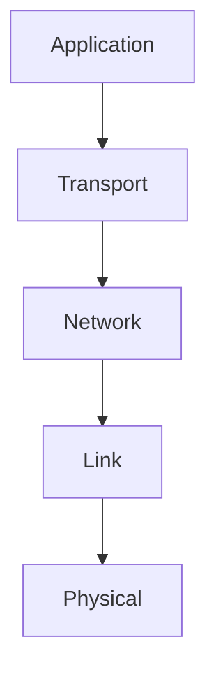
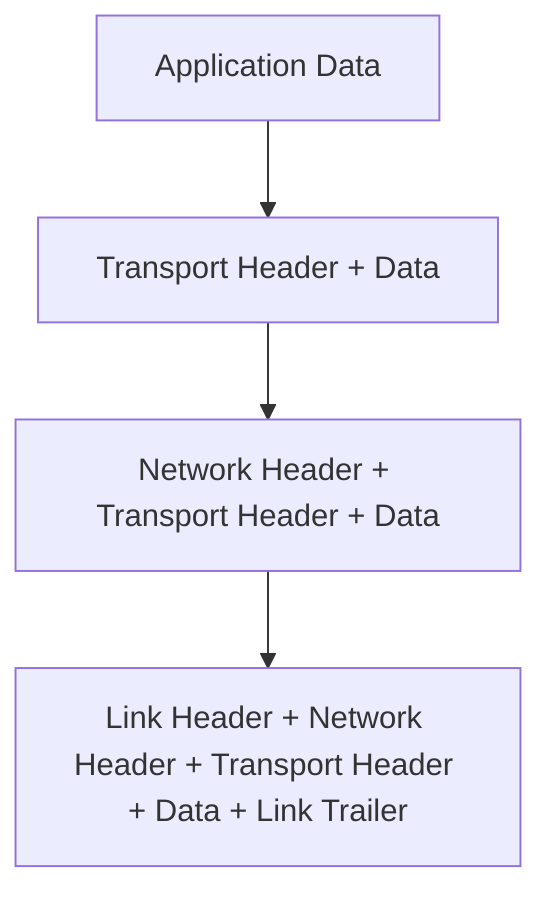

# 1.5 Protocol Layers and Their Service Models

The Internet uses a layered architecture to organize protocols and services.

---

## 1.5.1 Layered Architecture

- **Definition:** The network protocol stack is organized in layers, each providing services to the layer above and using services from the layer below.
- **Internet Protocol Stack:**
  1. Application Layer (HTTP, SMTP, FTP)
  2. Transport Layer (TCP, UDP)
  3. Network Layer (IP)
  4. Link Layer (Ethernet, WiFi)
  5. Physical Layer (cables, radio)
- **Diagram:**

- **OSI Model:**
  - 7 layers (adds Presentation and Session layers)
- **Key Point:** Layering simplifies design and troubleshooting.

---

## 1.5.2 Encapsulation

- **Definition:** Each layer adds its own header (and sometimes trailer) to the data as it passes down the stack.
- **Process:**
  - Application data → Transport header added → Network header added → Link header/trailer added
- **Diagram:**

- **Key Point:** Encapsulation allows each layer to operate independently.

---

**Exam Tip:**
- Be able to draw and explain the protocol stack and encapsulation process. 