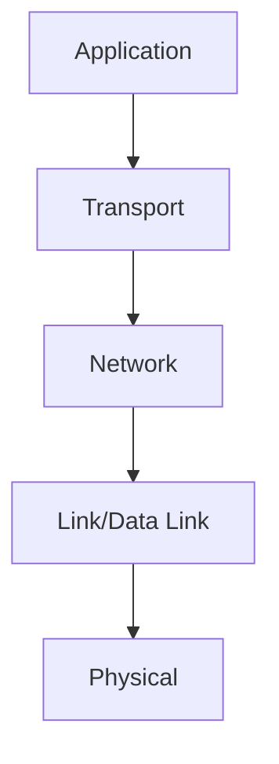
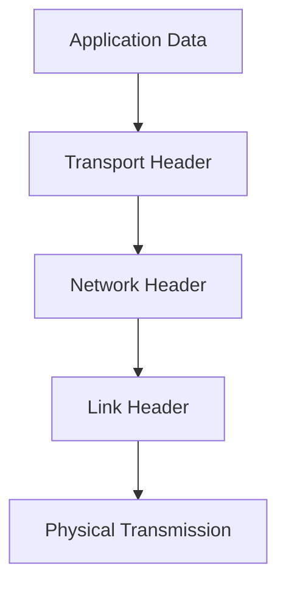
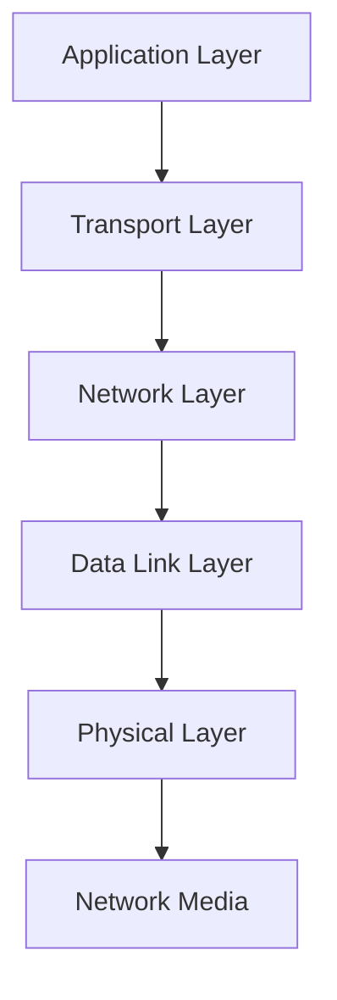

# 1.5 Protocol Layers and Service Models

- Protocol layering organizes network functions into layers.
- **OSI Model:** 7 layers (Physical, Data Link, Network, Transport, Session, Presentation, Application).
- **TCP/IP Model:** 5 layers (Physical, Link, Network, Transport, Application).
- **Encapsulation:** Data wrapped with headers as it moves down layers.
- **Decapsulation:** Headers removed as data moves up layers.
- **Communication protocols:** Define rules for network communication.
- **Standards:** Ensure interoperability between different devices and vendors.

---

## Encapsulation/Decapsulation Example
- Application data → Transport header added → Network header added → Link header added → Physical transmission
- At receiver: Physical → Link header removed → Network header removed → Transport header removed → Application data

---

## Diagram: OSI vs. TCP/IP Layers

---

## Service Models
- **Connection-oriented:** Reliable, ordered delivery (e.g., TCP).
- **Connectionless:** Unreliable, unordered delivery (e.g., UDP, IP).

---

## OSI vs. TCP/IP Layers with Protocols Table
| OSI Layer      | TCP/IP Layer | Example Protocols         |
|---------------|--------------|---------------------------|
| Application   | Application  | HTTP, SMTP, FTP, DNS      |
| Presentation  | -            | SSL, JPEG, MPEG           |
| Session       | -            | NetBIOS, RPC              |
| Transport     | Transport    | TCP, UDP                  |
| Network       | Network      | IP, ICMP, IGMP            |
| Data Link     | Link         | Ethernet, PPP, ARP        |
| Physical      | Physical     | Copper, Fiber, Wireless   |

---

## Summary Table
| OSI Layer      | TCP/IP Layer | Function                |
|---------------|--------------|-------------------------|
| Application   | Application  | Network services        |
| Presentation  | -            | Data format/crypto      |
| Session       | -            | Dialog control          |
| Transport     | Transport    | End-to-end delivery     |
| Network       | Network      | Routing                 |
| Data Link     | Link         | Framing, MAC            |
| Physical      | Physical     | Transmission medium     |

---

## Communication Protocols Summary
| Protocol Characteristic | Description | Examples |
|------------------------|-------------|----------|
| Message Format | Structure and headers | HTTP request/response, IP header |
| Message Size | MTU and fragmentation | Ethernet 1500 bytes, IP fragmentation |
| Timing | Transmission rate and flow control | TCP adaptive rate, UDP no flow control |
| Encoding | Bit representation | Manchester encoding, OFDM |
| Encapsulation | Header addition | TCP header, IP header, Ethernet frame |
| Message Pattern | Request-response, connection types | HTTP request-response, TCP connection |

---

## Standards Organizations Summary
| Organization | Focus | Examples | Process |
|--------------|-------|----------|---------|
| IETF | Internet standards | TCP/IP, HTTP, SMTP | RFC development |
| IEEE | LAN/MAN standards | Ethernet, WiFi | Working groups, balloting |
| ITU | Global telecom | Cellular, voice codecs | International coordination |
| ISO | General standards | OSI model, quality | International consensus |

---

## Protocol Stack Benefits Summary
| Benefit | Description | Example |
|---------|-------------|---------|
| Modularity | Independent development | HTTP can evolve without changing TCP |
| Interoperability | Vendor independence | Mix Cisco and Juniper equipment |
| Scalability | Easy to add features | Add IPv6 without changing applications |
| Troubleshooting | Layer isolation | Network problem vs. application problem |

---

## Practice Questions
1. **List the OSI layers and their functions.**
2. **What is encapsulation?**
3. **Compare OSI and TCP/IP models.**
4. **Give an example protocol at each OSI layer.**
5. **Explain the difference between connection-oriented and connectionless service models.**
6. **What are the three elements of communication?**
7. **Why do protocols matter in networking?**
8. **Name four standards organizations and their focus areas.**

---

**Exam Tips:**
- Memorize layer names and order.
- Be able to draw and explain encapsulation/decapsulation.
- Know protocol examples for each layer.
- **New:** Understand protocol characteristics and standards.
- **New:** Know standards organizations and their roles.
- **New:** Be familiar with protocol stack benefits and challenges.

---

## 1.5.1 Layered Architecture

- **TCP/IP Stack:**
  1. Application (HTTP, SMTP, FTP)
  2. Transport (TCP, UDP)
  3. Network (IP)
  4. Link (Ethernet, WiFi)
  5. Physical (cables, radio)
- **OSI Model:**
  1. Application
  2. Presentation
  3. Session
  4. Transport
  5. Network
  6. Data Link
  7. Physical
- **Comparison Table:**
| OSI Layer      | TCP/IP Layer      | Example Protocols      |
|---------------|-------------------|------------------------|
| Application   | Application       | HTTP, SMTP, FTP        |
| Presentation  | Application       | SSL, JPEG              |
| Session       | Application       | RPC                    |
| Transport     | Transport         | TCP, UDP               |
| Network       | Network           | IP                     |
| Data Link     | Link              | Ethernet, WiFi         |
| Physical      | Physical          | Copper, Fiber, Radio   |

---

## 1.5.2 Encapsulation

- Each layer adds its own header (and sometimes trailer) to the data.
- **Example:**
  - Application data → TCP header → IP header → Ethernet header/trailer
- **Scenario:** Sending an email: SMTP data is encapsulated in TCP, then IP, then Ethernet frames.

---

## Practice Questions
1. **Draw and label the TCP/IP and OSI protocol stacks.**
2. **Explain encapsulation with a real-world example.**
3. **Compare the OSI and TCP/IP models in a table.**

---

**Exam Tips:**
- Draw and explain the protocol stack and encapsulation process.
- Compare OSI and TCP/IP models.

---

## Standards Organizations
- **IETF:** Develops Internet standards (e.g., TCP/IP, HTTP) via RFCs.
- **IEEE:** Defines LAN/MAN standards (e.g., Ethernet, WiFi).
- **ITU:** Sets global telecom standards (e.g., phone networks).
- **ISO:** Developed the OSI model, general standards.

---

## More on Encapsulation/Decapsulation
- **Analogy:** Like mailing a letter: you put your message in an envelope (application), add an address (transport), put it in a bigger envelope (network), and so on. At the destination, each layer removes its envelope.

---

## Diagram: Encapsulation Process

---

## Communication Protocols and Standards

### The Three Elements of Communication
- **Message Source (Sender):** Person or electronic device that needs to communicate
- **Destination (Receiver):** Person or device that receives and interprets the message
- **Transmission Medium (Channel):** Pathway over which the message travels

### Why Protocols Matter
- **Standardization:** Ensures devices from different vendors can communicate
- **Reliability:** Defines how to handle errors and ensure delivery
- **Efficiency:** Optimizes resource usage and performance
- **Security:** Provides mechanisms for secure communication

### Protocol Characteristics

#### Message Format
- **Structure:** Specific format or structure for messages
- **Headers:** Control information (addresses, sequence numbers, flags)
- **Payload:** Actual data being transmitted
- **Trailers:** Error checking information (checksums, CRCs)
- **Examples:**
  - **HTTP:** Request/response format with headers and body
  - **IP:** Header with source/destination addresses, TTL, protocol
  - **Ethernet:** Frame with MAC addresses, type, data, CRC

#### Message Size
- **Maximum Transmission Unit (MTU):** Largest packet size allowed
- **Fragmentation:** Breaking large messages into smaller pieces
- **Reassembly:** Putting pieces back together at destination
- **Examples:**
  - **Ethernet:** 1500 bytes MTU
  - **WiFi:** 2304 bytes MTU
  - **IP:** Can fragment packets if needed

#### Timing
- **Transmission Rate:** Speed at which bits are sent
- **Flow Control:** Managing sender rate to match receiver capacity
- **Timeout:** Maximum time to wait for response
- **Examples:**
  - **TCP:** Adaptive rate based on network conditions
  - **UDP:** No flow control, sender determines rate
  - **HTTP:** Request-response with timeouts

#### Encoding
- **Bit Representation:** How data is converted to signals
- **Signal Types:** Electrical, optical, wireless
- **Modulation:** Varying signal properties to represent data
- **Examples:**
  - **Ethernet:** Manchester encoding for clock synchronization
  - **WiFi:** OFDM (Orthogonal Frequency Division Multiplexing)
  - **Fiber:** Light intensity or phase modulation

#### Encapsulation
- **Header Addition:** Each layer adds its own header
- **Addressing:** Source and destination identification
- **Protocol Identification:** Which protocol to use at next layer
- **Examples:**
  - **TCP Header:** Source/destination ports, sequence numbers
  - **IP Header:** Source/destination IP addresses, protocol field
  - **Ethernet Header:** Source/destination MAC addresses, type

#### Message Pattern
- **Request-Response:** Client sends request, server responds
- **Connection-Oriented:** Establish connection before data transfer
- **Connectionless:** Send data without prior setup
- **Examples:**
  - **HTTP:** Request-response pattern
  - **TCP:** Connection-oriented with handshake
  - **UDP:** Connectionless, no handshake

### Protocol Development Process

#### Standards Development
- **RFC (Request for Comments):** Document describing proposed standard
- **Review Process:** Community review and feedback
- **Implementation:** Multiple independent implementations
- **Testing:** Interoperability testing between implementations
- **Approval:** Official standard designation

#### Standards Organizations

##### Internet Engineering Task Force (IETF)
- **Focus:** Internet standards and protocols
- **Process:** RFC development and approval
- **Examples:** TCP/IP, HTTP, SMTP, DNS
- **Working Groups:** Specialized groups for different areas
- **Meetings:** Regular face-to-face and online meetings

##### Institute of Electrical and Electronics Engineers (IEEE)
- **Focus:** LAN/MAN standards, wireless communications
- **Process:** Working groups, balloting, approval
- **Examples:** Ethernet (802.3), WiFi (802.11), Bluetooth (802.15)
- **Standards:** 802 series for networking

##### International Telecommunication Union (ITU)
- **Focus:** Global telecommunications standards
- **Process:** International coordination and agreement
- **Examples:** Telephone networks, cellular standards
- **Membership:** Governments and private sector

##### International Organization for Standardization (ISO)
- **Focus:** General international standards
- **Process:** International consensus building
- **Examples:** OSI model, quality management
- **Membership:** National standards bodies

### Protocol Examples by Layer

#### Application Layer Protocols
- **HTTP (HyperText Transfer Protocol):**
  - **Purpose:** Web page transfer
  - **Port:** 80 (HTTP), 443 (HTTPS)
  - **Features:** Stateless, request-response, extensible
- **SMTP (Simple Mail Transfer Protocol):**
  - **Purpose:** Email sending
  - **Port:** 25
  - **Features:** Text-based, command-response
- **FTP (File Transfer Protocol):**
  - **Purpose:** File transfer
  - **Port:** 21 (control), 20 (data)
  - **Features:** Separate control and data connections

#### Transport Layer Protocols
- **TCP (Transmission Control Protocol):**
  - **Purpose:** Reliable data delivery
  - **Features:** Connection-oriented, flow control, congestion control
  - **Use Cases:** Web browsing, email, file transfer
- **UDP (User Datagram Protocol):**
  - **Purpose:** Fast, unreliable delivery
  - **Features:** Connectionless, no flow control
  - **Use Cases:** Video streaming, gaming, DNS

#### Network Layer Protocols
- **IP (Internet Protocol):**
  - **Purpose:** Packet routing and addressing
  - **Versions:** IPv4 (32-bit), IPv6 (128-bit)
  - **Features:** Connectionless, best-effort delivery
- **ICMP (Internet Control Message Protocol):**
  - **Purpose:** Network diagnostics and error reporting
  - **Examples:** Ping, traceroute, error messages

#### Data Link Layer Protocols
- **Ethernet:**
  - **Purpose:** Local area network communication
  - **Features:** CSMA/CD, MAC addressing, frame format
  - **Speeds:** 10 Mbps to 100 Gbps
- **WiFi (802.11):**
  - **Purpose:** Wireless local area network
  - **Features:** CSMA/CA, multiple frequency bands
  - **Security:** WPA2/WPA3 encryption

### Protocol Interoperability

#### Why Interoperability Matters
- **Vendor Independence:** Choose best equipment regardless of vendor
- **Technology Evolution:** Gradual upgrades without complete replacement
- **Global Communication:** Connect to any device worldwide
- **Cost Reduction:** Competition drives down prices

#### Interoperability Testing
- **Conformance Testing:** Verify protocol implementation matches standard
- **Interoperability Testing:** Test communication between different implementations
- **Performance Testing:** Measure throughput, latency, reliability
- **Security Testing:** Verify security features work correctly

### Modern Protocol Trends

#### Protocol Evolution
- **HTTP/2:** Multiplexing, header compression, server push
- **HTTP/3:** Based on QUIC, runs over UDP
- **IPv6:** Larger address space, improved features
- **WiFi 6/6E:** Higher speeds, better efficiency

#### Emerging Protocols
- **QUIC:** Transport protocol for HTTP/3
- **WebRTC:** Real-time communication in browsers
- **MQTT:** Lightweight messaging for IoT
- **CoAP:** Constrained Application Protocol for IoT

### Real-World Protocol Examples

#### Web Browsing
1. **DNS:** Convert domain name to IP address
2. **TCP:** Establish connection to web server
3. **HTTP:** Request web page
4. **TLS:** Encrypt communication (HTTPS)
5. **HTML/CSS/JS:** Render web page content

#### Email Sending
1. **SMTP:** Connect to mail server
2. **Authentication:** Verify sender identity
3. **Message Transfer:** Send email content
4. **Routing:** Server forwards to recipient's server
5. **Delivery:** Recipient's server stores message

#### File Transfer
1. **FTP Control:** Establish control connection
2. **Authentication:** Login with username/password
3. **File List:** Browse available files
4. **Data Connection:** Transfer file data
5. **Verification:** Check file integrity

---

## Communication Standards

### What Are Standards?
- **Definition:** Set of rules that determine how something must be done
- **Purpose:** Ensure compatibility and interoperability
- **Benefits:** Reduce complexity, enable competition, accelerate evolution

### Types of Standards

#### De Facto Standards
- **Definition:** Standards that become dominant through widespread adoption
- **Examples:** Ethernet, TCP/IP, Microsoft Office formats
- **Advantages:** Market-driven, practical solutions
- **Disadvantages:** May not be optimal, vendor lock-in possible

#### De Jure Standards
- **Definition:** Standards established by official organizations
- **Examples:** IEEE 802.11 (WiFi), ITU cellular standards
- **Advantages:** Well-defined, open process
- **Disadvantages:** Slower development, may lag behind technology

#### Open Standards
- **Definition:** Standards available to everyone without restrictions
- **Examples:** HTTP, HTML, TCP/IP
- **Advantages:** No licensing fees, vendor independence
- **Disadvantages:** May be less optimized than proprietary solutions

#### Proprietary Standards
- **Definition:** Standards owned by specific companies
- **Examples:** Apple's Lightning connector, Microsoft's Active Directory
- **Advantages:** Optimized for specific use cases
- **Disadvantages:** Vendor lock-in, licensing costs

### Standards Development Process

#### RFC Process (IETF)
1. **Internet Draft:** Initial proposal
2. **Working Group:** Discussion and refinement
3. **Last Call:** Final review period
4. **IESG Review:** Engineering Steering Group approval
5. **RFC Publication:** Official standard document

#### IEEE Process
1. **Project Authorization Request:** Define scope
2. **Working Group:** Technical development
3. **Balloting:** Member voting
4. **Standards Board Approval:** Final approval
5. **Publication:** Official standard

### Standards Organizations in Detail

#### Internet Engineering Task Force (IETF)
- **Mission:** Develop and promote Internet standards
- **Structure:** Working groups organized by topic
- **Process:** Rough consensus and running code
- **Output:** RFCs (Request for Comments)
- **Examples of Standards:**
  - **TCP/IP:** Internet protocol suite
  - **HTTP:** Web communication
  - **SMTP:** Email transfer
  - **DNS:** Name resolution
  - **TLS:** Secure communication

#### IEEE 802 Committee
- **Mission:** LAN/MAN standards
- **Working Groups:**
  - **802.3:** Ethernet
  - **802.11:** WiFi
  - **802.15:** Personal Area Networks
  - **802.16:** WiMAX
- **Process:** Technical development, balloting, approval
- **Examples of Standards:**
  - **802.3:** Ethernet (10 Mbps to 100 Gbps)
  - **802.11a/b/g/n/ac/ax:** WiFi standards
  - **802.15.1:** Bluetooth
  - **802.15.4:** Zigbee

#### International Telecommunication Union (ITU)
- **Mission:** Global telecommunications standards
- **Sectors:**
  - **ITU-T:** Telecommunications standardization
  - **ITU-R:** Radio communication
  - **ITU-D:** Development
- **Process:** International coordination and agreement
- **Examples of Standards:**
  - **G.711:** Voice codec
  - **H.264:** Video compression
  - **IMT-2020:** 5G standards

#### International Organization for Standardization (ISO)
- **Mission:** International standards development
- **Process:** International consensus building
- **Examples of Standards:**
  - **ISO 7498:** OSI Reference Model
  - **ISO 9001:** Quality management
  - **ISO 27001:** Information security

### Standards and Innovation

#### Balancing Standards and Innovation
- **Standards Benefits:**
  - Interoperability
  - Reduced costs
  - Market stability
  - Technology adoption
- **Innovation Benefits:**
  - New capabilities
  - Performance improvements
  - Competitive advantage
  - Market differentiation

#### Standards Evolution
- **Backward Compatibility:** New versions work with old
- **Forward Compatibility:** Old versions work with new
- **Migration Paths:** Gradual transition strategies
- **Deprecation:** Phasing out old standards

### Real-World Standards Examples

#### WiFi Standards Evolution
- **802.11 (1997):** 2 Mbps, 2.4 GHz
- **802.11b (1999):** 11 Mbps, 2.4 GHz
- **802.11a (1999):** 54 Mbps, 5 GHz
- **802.11g (2003):** 54 Mbps, 2.4 GHz
- **802.11n (2009):** 600 Mbps, MIMO
- **802.11ac (2013):** 6.9 Gbps, 5 GHz
- **802.11ax (2019):** 9.6 Gbps, WiFi 6

#### Cellular Standards Evolution
- **1G (1980s):** Analog voice
- **2G (1990s):** Digital voice, SMS
- **3G (2000s):** Mobile data, video calling
- **4G (2010s):** High-speed data, LTE
- **5G (2020s):** Ultra-high speed, IoT, low latency

#### Internet Protocol Evolution
- **IPv4 (1981):** 32-bit addresses, 4.3 billion addresses
- **IPv6 (1998):** 128-bit addresses, 340 undecillion addresses
- **Migration:** Dual-stack, tunneling, translation

### Standards Compliance

#### Why Compliance Matters
- **Interoperability:** Devices work together
- **Quality:** Standards ensure minimum quality
- **Security:** Standards include security requirements
- **Regulatory:** Some standards are legally required

#### Compliance Testing
- **Conformance Testing:** Verify standard implementation
- **Interoperability Testing:** Test with other implementations
- **Certification Programs:** Official compliance verification
- **Self-Certification:** Vendor declares compliance

### Future of Standards

#### Emerging Areas
- **IoT Standards:** Lightweight protocols for constrained devices
- **5G Standards:** High-speed, low-latency mobile networks
- **AI/ML Standards:** Interoperable artificial intelligence
- **Blockchain Standards:** Distributed ledger technologies

#### Standards Challenges
- **Rapid Technology Change:** Standards may lag behind innovation
- **Global Coordination:** Different regions have different needs
- **Security:** Standards must address evolving threats
- **Privacy:** Standards must protect user privacy

---

## Network Communication Models

### The Protocol Stack Concept
- **Definition:** Layered hierarchy of protocols working together
- **Benefits:**
  - Modularity: Each layer can be developed independently
  - Interoperability: Standard interfaces between layers
  - Flexibility: Changes in one layer don't affect others
  - Scalability: Easy to add new protocols or features

### Protocol Stack Operation

### TCP/IP Model in Detail

#### Application Layer
- **Purpose:** Provide network services to applications
- **Protocols:** HTTP, SMTP, FTP, DNS, SSH
- **Functions:**
  - User interface
  - Application-specific protocols
  - Data formatting
  - Session management
- **Examples:**
  - **Web Browser:** Uses HTTP to request web pages
  - **Email Client:** Uses SMTP to send email
  - **File Transfer:** Uses FTP to transfer files

#### Transport Layer
- **Purpose:** Provide end-to-end communication between applications
- **Protocols:** TCP, UDP, SCTP
- **Functions:**
  - Process-to-process communication
  - Reliability (TCP)
  - Flow control
  - Congestion control
- **Examples:**
  - **TCP:** Reliable file transfer, web browsing
  - **UDP:** Real-time video, DNS queries
  - **SCTP:** Multi-stream applications

#### Network Layer
- **Purpose:** Route packets across multiple networks
- **Protocols:** IP, ICMP, IGMP, OSPF, BGP
- **Functions:**
  - Logical addressing (IP addresses)
  - Routing
  - Fragmentation
  - Quality of Service
- **Examples:**
  - **IP:** Packet routing across Internet
  - **ICMP:** Network diagnostics (ping, traceroute)
  - **OSPF:** Interior routing protocol

#### Data Link Layer
- **Purpose:** Transfer data between directly connected nodes
- **Protocols:** Ethernet, WiFi, PPP, Frame Relay
- **Functions:**
  - Physical addressing (MAC addresses)
  - Framing
  - Error detection
  - Medium access control
- **Examples:**
  - **Ethernet:** LAN communication
  - **WiFi:** Wireless LAN communication
  - **PPP:** Point-to-point links

#### Physical Layer
- **Purpose:** Transmit bits over physical medium
- **Standards:** Ethernet, WiFi, fiber optic, copper
- **Functions:**
  - Bit transmission
  - Signal encoding
  - Physical connectors
  - Transmission media
- **Examples:**
  - **Ethernet Cable:** Copper twisted pair
  - **Fiber Optic:** Glass fiber
  - **WiFi:** Radio waves

### OSI Model Comparison

#### OSI vs. TCP/IP Mapping
| OSI Layer | TCP/IP Layer | Function | Example Protocols |
|-----------|--------------|----------|-------------------|
| Application | Application | User services | HTTP, SMTP, FTP |
| Presentation | Application | Data format | SSL, JPEG, MPEG |
| Session | Application | Dialog control | NetBIOS, RPC |
| Transport | Transport | End-to-end delivery | TCP, UDP |
| Network | Network | Routing | IP, ICMP |
| Data Link | Data Link | Local delivery | Ethernet, WiFi |
| Physical | Physical | Bit transmission | Copper, Fiber |

#### Key Differences
- **OSI:** 7 layers, more theoretical
- **TCP/IP:** 4-5 layers, practical implementation
- **OSI:** Session and Presentation layers separate
- **TCP/IP:** Session and Presentation functions in Application layer

### Protocol Interaction Example

#### Web Browsing Process
1. **Application Layer:** Browser creates HTTP request
2. **Transport Layer:** TCP adds port numbers and reliability
3. **Network Layer:** IP adds source/destination addresses
4. **Data Link Layer:** Ethernet adds MAC addresses and framing
5. **Physical Layer:** Bits transmitted over cable or wireless

#### Email Sending Process
1. **Application Layer:** Email client creates SMTP message
2. **Transport Layer:** TCP ensures reliable delivery
3. **Network Layer:** IP routes to mail server
4. **Data Link Layer:** Ethernet/WiFi handles local delivery
5. **Physical Layer:** Bits transmitted over network media

### Modern Protocol Stacks

#### HTTP/3 and QUIC
- **QUIC:** Transport protocol running over UDP
- **Features:** Multiplexing, encryption, fast connection setup
- **Benefits:** Reduced latency, better performance
- **Use Cases:** Web browsing, mobile applications

#### WebRTC
- **Purpose:** Real-time communication in browsers
- **Protocols:** RTP, RTCP, SCTP over UDP
- **Features:** Peer-to-peer, encryption, NAT traversal
- **Use Cases:** Video calling, file sharing, gaming

#### IoT Protocol Stacks
- **MQTT:** Lightweight messaging protocol
- **CoAP:** Constrained Application Protocol
- **LoRaWAN:** Long-range wireless protocol
- **Zigbee:** Low-power wireless protocol

### Protocol Stack Benefits

#### Modularity
- **Independent Development:** Each layer can be developed separately
- **Technology Evolution:** New technologies can replace old ones
- **Vendor Competition:** Multiple vendors can implement each layer
- **Testing:** Each layer can be tested independently

#### Interoperability
- **Standard Interfaces:** Well-defined interfaces between layers
- **Vendor Independence:** Mix and match equipment from different vendors
- **Global Communication:** Connect to any device worldwide
- **Backward Compatibility:** New versions work with old ones

#### Scalability
- **Horizontal Scaling:** Add more devices at each layer
- **Vertical Scaling:** Improve performance at each layer
- **Load Distribution:** Distribute load across multiple devices
- **Geographic Distribution:** Distribute across multiple locations

### Protocol Stack Challenges

#### Performance Overhead
- **Header Overhead:** Each layer adds headers
- **Processing Overhead:** Each layer processes data
- **Latency:** Processing at each layer adds delay
- **Bandwidth:** Headers consume bandwidth

#### Security Considerations
- **Layer-Specific Security:** Each layer may need security
- **End-to-End Security:** Application layer provides strongest security
- **Transport Security:** TLS provides transport layer security
- **Network Security:** Firewalls, VPNs provide network security

#### Troubleshooting
- **Layer Isolation:** Problems can be isolated to specific layers
- **Diagnostic Tools:** Tools available for each layer
- **Protocol Analysis:** Analyze protocols at each layer
- **Performance Monitoring:** Monitor performance at each layer

---

## Case Studies & Real-World Strategies

### 1. Protocol Evolution and Adoption
- **HTTP/2 and HTTP/3:** Google and Cloudflare led adoption, improving web performance through multiplexing and reduced latency.
- **IPv6 Transition:** Facebook, Google, and major ISPs implemented dual-stack and tunneling strategies for gradual IPv6 adoption.

### 2. Standards Development and Implementation
- **WiFi 6 (802.11ax):** IEEE developed standard, vendors competed to implement first, leading to rapid adoption in enterprise and consumer markets.
- **5G Standards:** ITU coordinated global 5G standards, enabling worldwide interoperability and rapid deployment.

### 3. Protocol Stack Optimization
- **Google B4 WAN:** Custom protocol stack for data center interconnects, optimizing for high bandwidth and low latency.
- **Facebook's Protocol Stack:** Custom protocols for social media applications, optimizing for real-time updates and global distribution.

### 4. Interoperability Testing and Certification
- **WiFi Alliance:** Industry group that certifies WiFi products for interoperability, ensuring devices work together regardless of vendor.
- **USB Implementers Forum:** Certifies USB devices for compatibility, enabling plug-and-play operation across different vendors.

### 5. Standards and Innovation Balance
- **Ethernet Evolution:** IEEE standards enabled gradual evolution from 10 Mbps to 100 Gbps while maintaining backward compatibility.
- **Cellular Standards:** 3GPP standards enabled evolution from 2G to 5G while maintaining global interoperability. 