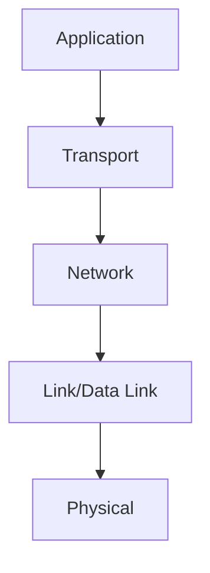
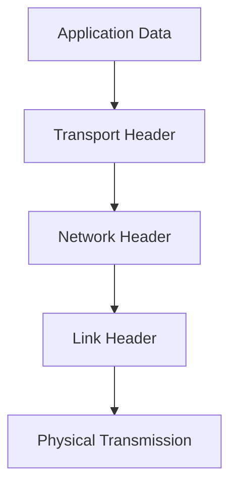

# 1.5 Protocol Layers and Service Models

- Protocol layering organizes network functions into layers.
- **OSI Model:** 7 layers (Physical, Data Link, Network, Transport, Session, Presentation, Application).
- **TCP/IP Model:** 5 layers (Physical, Link, Network, Transport, Application).
- **Encapsulation:** Data wrapped with headers as it moves down layers.
- **Decapsulation:** Headers removed as data moves up layers.

---

## Encapsulation/Decapsulation Example
- Application data → Transport header added → Network header added → Link header added → Physical transmission
- At receiver: Physical → Link header removed → Network header removed → Transport header removed → Application data

---

## Diagram: OSI vs. TCP/IP Layers

---

## Service Models
- **Connection-oriented:** Reliable, ordered delivery (e.g., TCP).
- **Connectionless:** Unreliable, unordered delivery (e.g., UDP, IP).

---

## OSI vs. TCP/IP Layers with Protocols Table
| OSI Layer      | TCP/IP Layer | Example Protocols         |
|---------------|--------------|---------------------------|
| Application   | Application  | HTTP, SMTP, FTP, DNS      |
| Presentation  | -            | SSL, JPEG, MPEG           |
| Session       | -            | NetBIOS, RPC              |
| Transport     | Transport    | TCP, UDP                  |
| Network       | Network      | IP, ICMP, IGMP            |
| Data Link     | Link         | Ethernet, PPP, ARP        |
| Physical      | Physical     | Copper, Fiber, Wireless   |

---

## Summary Table
| OSI Layer      | TCP/IP Layer | Function                |
|---------------|--------------|-------------------------|
| Application   | Application  | Network services        |
| Presentation  | -            | Data format/crypto      |
| Session       | -            | Dialog control          |
| Transport     | Transport    | End-to-end delivery     |
| Network       | Network      | Routing                 |
| Data Link     | Link         | Framing, MAC            |
| Physical      | Physical     | Transmission medium     |

---

## Practice Questions
1. **List the OSI layers and their functions.**
2. **What is encapsulation?**
3. **Compare OSI and TCP/IP models.**
4. **Give an example protocol at each OSI layer.**
5. **Explain the difference between connection-oriented and connectionless service models.**

---

**Exam Tips:**
- Memorize layer names and order.
- Be able to draw and explain encapsulation/decapsulation.
- Know protocol examples for each layer.

---

## 1.5.1 Layered Architecture

- **TCP/IP Stack:**
  1. Application (HTTP, SMTP, FTP)
  2. Transport (TCP, UDP)
  3. Network (IP)
  4. Link (Ethernet, WiFi)
  5. Physical (cables, radio)
- **OSI Model:**
  1. Application
  2. Presentation
  3. Session
  4. Transport
  5. Network
  6. Data Link
  7. Physical
- **Comparison Table:**
| OSI Layer      | TCP/IP Layer      | Example Protocols      |
|---------------|-------------------|------------------------|
| Application   | Application       | HTTP, SMTP, FTP        |
| Presentation  | Application       | SSL, JPEG              |
| Session       | Application       | RPC                    |
| Transport     | Transport         | TCP, UDP               |
| Network       | Network           | IP                     |
| Data Link     | Link              | Ethernet, WiFi         |
| Physical      | Physical          | Copper, Fiber, Radio   |

---

## 1.5.2 Encapsulation

- Each layer adds its own header (and sometimes trailer) to the data.
- **Example:**
  - Application data → TCP header → IP header → Ethernet header/trailer
- **Scenario:** Sending an email: SMTP data is encapsulated in TCP, then IP, then Ethernet frames.

---

## Practice Questions
1. **Draw and label the TCP/IP and OSI protocol stacks.**
2. **Explain encapsulation with a real-world example.**
3. **Compare the OSI and TCP/IP models in a table.**

---

**Exam Tips:**
- Draw and explain the protocol stack and encapsulation process.
- Compare OSI and TCP/IP models.

---

## Standards Organizations
- **IETF:** Develops Internet standards (e.g., TCP/IP, HTTP) via RFCs.
- **IEEE:** Defines LAN/MAN standards (e.g., Ethernet, WiFi).
- **ITU:** Sets global telecom standards (e.g., phone networks).
- **ISO:** Developed the OSI model, general standards.

---

## More on Encapsulation/Decapsulation
- **Analogy:** Like mailing a letter: you put your message in an envelope (application), add an address (transport), put it in a bigger envelope (network), and so on. At the destination, each layer removes its envelope.

---

## Diagram: Encapsulation Process
