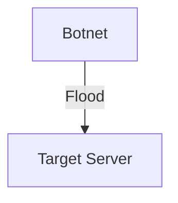

# 1.6 Networks Under Attack

- Networks face threats: eavesdropping, DoS, malware, spoofing, phishing, man-in-the-middle, ransomware, SQL injection.
- **Security goals:** Confidentiality, integrity, availability, authentication, non-repudiation.

---

## Network Security Context

### Internet's Original Design
- **Internet not originally designed with (much) security in mind**
- **Original vision:** "a group of mutually trusting users attached to a transparent network" ☺
- **Internet protocol designers playing "catch-up"**
- **Security considerations in all layers!**

### Current Security Needs
We now need to think about:
- **How bad guys can attack computer networks**
- **How we can defend networks against attacks**
- **How to design architectures that are immune to attacks**

---

## Bad Guys: Packet Interception

### Packet "Sniffing"
- **Broadcast media:** Shared Ethernet, wireless
- **Promiscuous network interface:** Reads/records all packets passing by
- **Example:** Including passwords!
- **Tools:** Wireshark software used for end-of-chapter labs is a (free) packet-sniffer

### Real-World Example
```
A sends: src:A dest:B payload
C (attacker) can read: src:A dest:B payload
```

---

## Bad Guys: Fake Identity

### IP Spoofing
- **Method:** Injection of packet with false source address
- **Example:** Attacker sends packet with source address of trusted host
- **Impact:** Can bypass access controls, launch attacks

### Real-World Example
```
A sends: src:A dest:B payload
C (attacker) sends: src:A dest:B payload (fake source)
```

---

## Bad Guys: Denial of Service

### Denial of Service (DoS) Attack
- **Target:** Make resources (server, bandwidth) unavailable to legitimate traffic
- **Method:** Overwhelm resource with bogus traffic

### Attack Process
1. **Select target**
2. **Break into hosts around the network (see botnet)**
3. **Send packets to target from compromised hosts**

### Real-World Example: 2016 Dyn DDoS Attack
- **Target:** Dyn DNS provider
- **Method:** Botnet of IoT devices
- **Impact:** Major websites (Twitter, Netflix, Reddit) taken down
- **Scale:** 1.2 Tbps attack traffic

---

## Lines of Defense

### Authentication
- **Purpose:** Proving you are who you say you are
- **Cellular networks:** Provide hardware identity via SIM card
- **Traditional Internet:** No such hardware assist

### Confidentiality
- **Method:** Via encryption
- **Examples:** HTTPS, VPN, encrypted messaging

### Integrity Checks
- **Method:** Digital signatures prevent/detect tampering
- **Examples:** SSL certificates, code signing

### Access Restrictions
- **Method:** Password-protected VPNs
- **Examples:** Corporate VPNs, secure remote access

### Firewalls
- **Specialized "middleboxes"** in access and core networks
- **Off-by-default:** Filter incoming packets to restrict senders, receivers, applications
- **Functions:** Detecting/reacting to DOS attacks
- **Examples:** Network firewalls, host firewalls, application firewalls

---

## Common Attack Types
- **Eavesdropping:** Intercepting data (sniffers).
- **Denial of Service (DoS):** Overloading resources.
- **Malware:** Viruses, worms, trojans, ransomware.
- **Spoofing:** Impersonating another device/user.
- **Phishing:** Tricking users to reveal info.
- **Man-in-the-middle:** Attacker intercepts and possibly alters communication.
- **SQL injection:** Injecting malicious code into database queries.

---

## Security Goals Explained
- **Confidentiality:** Prevent unauthorized access to data.
- **Integrity:** Prevent unauthorized modification of data.
- **Availability:** Ensure services are accessible.
- **Authentication:** Verify identity of users/devices.
- **Non-repudiation:** Prevent denial of actions.

---

## Security Mechanisms Table
| Mechanism      | Purpose                        |
|---------------|-------------------------------|
| Encryption    | Confidentiality                |
| Hashing       | Integrity                      |
| Digital Sign. | Authentication, non-repudiation|
| Firewalls     | Access control                 |
| IDS/IPS       | Intrusion detection/prevention |
| VPN           | Secure remote access           |

---

## Real-World Example
- 2016 Dyn DDoS attack: Major websites taken down by botnet.

---

## Diagram: DoS Attack


---

## Summary Table
| Attack Type   | Description           | Example         |
|---------------|----------------------|-----------------|
| Eavesdropping | Data interception    | Packet sniffer  |
| DoS           | Resource overload    | DDoS attack     |
| Malware       | Malicious software   | Virus, worm     |
| Spoofing      | Fake identity        | IP spoofing     |
| Phishing      | Deceptive trick      | Fake emails     |
| MITM          | Intercept/alter data | WiFi MITM       |
| SQL Injection | DB code injection    | Web forms       |

---

## Practice Questions
1. **List three types of network attacks.**
2. **What is the goal of a DoS attack?**
3. **Give a real-world example of a network attack.**
4. **List and explain the five main security goals.**
5. **Match security mechanisms to their purposes.**
6. **What was the original vision of the Internet regarding security?**
7. **How does packet sniffing work?**
8. **What is IP spoofing and why is it dangerous?**
9. **Describe the three-step process of a DoS attack.**
10. **What are the five lines of defense against network attacks?**
11. **How do cellular networks provide authentication differently from the traditional Internet?**
12. **What are firewalls and how do they work?**

---

**Exam Tips:**
- Know attack types, security goals, and real examples.
- Be able to draw attack diagrams and explain mechanisms.
- **New:** Understand the Internet's original security design and current challenges.
- **New:** Know the specific attack methods (sniffing, spoofing, DoS) and their processes.
- **New:** Be familiar with defense mechanisms and their purposes.
- **New:** Understand the difference between cellular and traditional Internet authentication. 