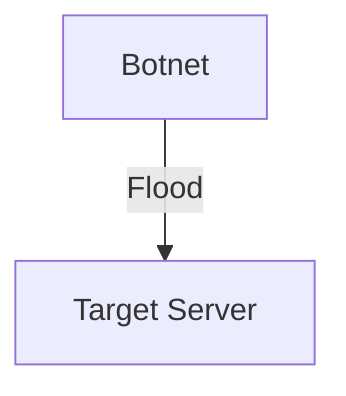

# 1.6 Networks Under Attack

- Networks face threats: eavesdropping, DoS, malware, spoofing, phishing, man-in-the-middle, ransomware, SQL injection.
- **Security goals:** Confidentiality, integrity, availability, authentication, non-repudiation.

---

## Common Attack Types
- **Eavesdropping:** Intercepting data (sniffers).
- **Denial of Service (DoS):** Overloading resources.
- **Malware:** Viruses, worms, trojans, ransomware.
- **Spoofing:** Impersonating another device/user.
- **Phishing:** Tricking users to reveal info.
- **Man-in-the-middle:** Attacker intercepts and possibly alters communication.
- **SQL injection:** Injecting malicious code into database queries.

---

## Security Goals Explained
- **Confidentiality:** Prevent unauthorized access to data.
- **Integrity:** Prevent unauthorized modification of data.
- **Availability:** Ensure services are accessible.
- **Authentication:** Verify identity of users/devices.
- **Non-repudiation:** Prevent denial of actions.

---

## Security Mechanisms Table
| Mechanism      | Purpose                        |
|---------------|-------------------------------|
| Encryption    | Confidentiality                |
| Hashing       | Integrity                      |
| Digital Sign. | Authentication, non-repudiation|
| Firewalls     | Access control                 |
| IDS/IPS       | Intrusion detection/prevention |
| VPN           | Secure remote access           |

---

## Real-World Example
- 2016 Dyn DDoS attack: Major websites taken down by botnet.

---

## Diagram: DoS Attack

---

## Summary Table
| Attack Type   | Description           | Example         |
|---------------|----------------------|-----------------|
| Eavesdropping | Data interception    | Packet sniffer  |
| DoS           | Resource overload    | DDoS attack     |
| Malware       | Malicious software   | Virus, worm     |
| Spoofing      | Fake identity        | IP spoofing     |
| Phishing      | Deceptive trick      | Fake emails     |
| MITM          | Intercept/alter data | WiFi MITM       |
| SQL Injection | DB code injection    | Web forms       |

---

## Practice Questions
1. **List three types of network attacks.**
2. **What is the goal of a DoS attack?**
3. **Give a real-world example of a network attack.**
4. **List and explain the five main security goals.**
5. **Match security mechanisms to their purposes.**

---

**Exam Tips:**
- Know attack types, security goals, and real examples.
- Be able to draw attack diagrams and explain mechanisms. 