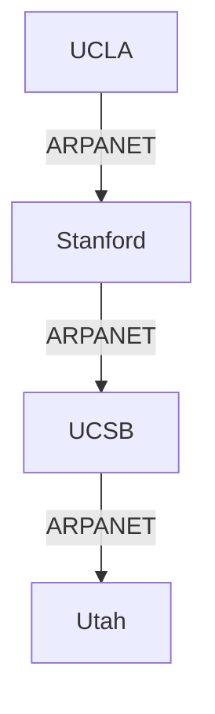

# 1.7 History of Computer Networking and the Internet

The development of computer networking and the Internet has occurred over several decades, marked by key innovations and milestones.

---

## 1.7.1 The Development of Packet Switching: 1961–1972

- **Key Points:**
  - Paul Baran and Donald Davies independently propose packet switching.
  - ARPANET, the first packet-switched network, is funded by the U.S. Department of Defense.
  - First ARPANET message sent in 1969.
- **Diagram:**

---

## 1.7.2 Proprietary Networks and Internetworking: 1972–1980

- **Key Points:**
  - Many organizations build their own proprietary networks (IBM SNA, DECnet).
  - Vint Cerf and Bob Kahn develop TCP/IP protocols for internetworking.
  - Email becomes a popular application.

---

## 1.7.3 A Proliferation of Networks: 1980–1990

- **Key Points:**
  - Local Area Networks (LANs) and Ethernet become widespread.
  - NSFNET established as a backbone connecting universities.
  - TCP/IP becomes the standard protocol for ARPANET and NSFNET.

---

## 1.7.4 The Internet Explosion: The 1990s

- **Key Points:**
  - The World Wide Web (WWW) is invented by Tim Berners-Lee (1991).
  - Commercial Internet Service Providers (ISPs) emerge.
  - Rapid growth in Internet users and websites.

---

## 1.7.5 The New Millennium

- **Key Points:**
  - Broadband and wireless access become common.
  - Social media, cloud computing, and mobile Internet revolutionize usage.
  - The Internet of Things (IoT) connects billions of devices.

---

**Exam Tip:**
- Be able to outline the major milestones in Internet history and explain the significance of packet switching and TCP/IP. 