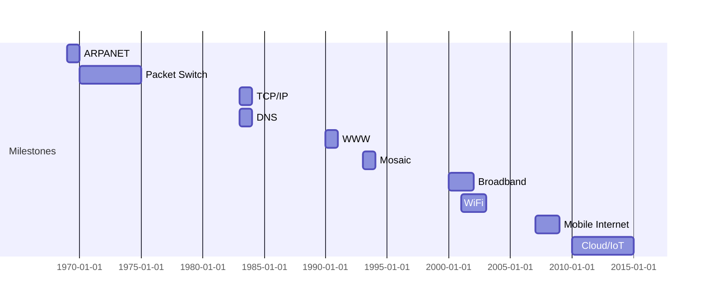

# 1.7 History of Computer Networking

- Computer networking evolved from ARPANET to the modern Internet.
- Key milestones: packet switching, TCP/IP, WWW, broadband, mobile Internet, cloud computing, IoT.

---

## Timeline
- **1969:** ARPANET launched.
- **1970s:** Packet switching, email, Telnet, FTP.
- **1983:** TCP/IP adopted as standard, DNS introduced.
- **1990:** World Wide Web invented by Tim Berners-Lee.
- **1993:** Mosaic web browser released.
- **2000s:** Broadband, WiFi, mobile Internet, VoIP.
- **2010s:** Cloud computing, IoT, 4G/5G.

---

## Diagram: Internet Evolution Timeline

---

## Protocol Evolution
- **Telnet/FTP:** Early remote access and file transfer.
- **SMTP/POP:** Email protocols.
- **TCP/IP:** Standardized communication.
- **HTTP/WWW:** Web browsing.
- **VoIP:** Voice over IP.
- **Cloud/IoT:** Modern distributed services.

---

## Summary Table
| Year | Milestone         | Impact                |
|------|-------------------|-----------------------|
| 1969 | ARPANET           | First network         |
| 1983 | TCP/IP, DNS       | Standardized Internet |
| 1990 | WWW               | Web browsing          |
| 1993 | Mosaic            | Popularized the Web   |
| 2000 | Broadband/WiFi    | Faster, wireless      |
| 2007 | Mobile Internet   | Internet everywhere   |
| 2010 | Cloud/IoT         | Distributed services  |

---

## Practice Questions
1. **What was ARPANET?**
2. **When was TCP/IP adopted?**
3. **List three major milestones in Internet history.**
4. **Explain the impact of the World Wide Web.**
5. **Describe the evolution of protocols from Telnet to IoT.**

---

**Exam Tips:**
- Memorize key dates and milestones.
- Be able to draw a timeline diagram and explain protocol evolution. 