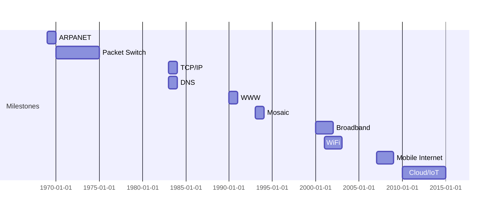

# 1.7 History of Computer Networking

- Computer networking evolved from ARPANET to the modern Internet.
- Key milestones: packet switching, TCP/IP, WWW, broadband, mobile Internet, cloud computing, IoT.

---

## 1961-1972: Early Packet-Switching Principles

### Key Developments
- **1961:** Kleinrock - queueing theory shows effectiveness of packet-switching
- **1964:** Baran - packet-switching in military nets
- **1967:** ARPAnet conceived by Advanced Research Projects Agency
- **1969:** First ARPAnet node operational
- **1972:**
  - ARPAnet public demo
  - NCP (Network Control Protocol) first host-host protocol
  - First e-mail program
  - ARPAnet has 15 nodes

---

## 1972-1980: Internetworking, New and Proprietary Networks

### Key Developments
- **1970:** ALOHAnet satellite network in Hawaii
- **1974:** Cerf and Kahn - architecture for interconnecting networks
- **1976:** Ethernet at Xerox PARC
- **Late 70s:** Proprietary architectures: DECnet, SNA, XNA
- **1979:** ARPAnet has 200 nodes

### Cerf and Kahn's Internetworking Principles
- **Minimalism, autonomy:** No internal changes required to interconnect networks
- **Best-effort service model**
- **Stateless routing**
- **Decentralized control**
- **Define today's Internet architecture**

---

## 1980-1990: New Protocols, a Proliferation of Networks

### Key Developments
- **1983:** Deployment of TCP/IP
- **1982:** SMTP e-mail protocol defined
- **1983:** DNS defined for name-to-IP-address translation
- **1985:** FTP protocol defined
- **1988:** TCP congestion control
- **New national networks:** CSnet, BITnet, NSFnet, Minitel
- **100,000 hosts connected to confederation of networks**

---

## 1990, 2000s: Commercialization, the Web, New Applications

### Key Developments
- **Early 1990s:** ARPAnet decommissioned
- **1991:** NSF lifts restrictions on commercial use of NSFnet (decommissioned, 1995)
- **Early 1990s:** Web
  - Hypertext [Bush 1945, Nelson 1960s]
  - HTML, HTTP: Berners-Lee
- **1994:** Mosaic, later Netscape
- **Late 1990s:** Commercialization of the Web
- **Late 1990s – 2000s:**
  - More killer apps: instant messaging, P2P file sharing
  - Network security to forefront
  - Est. 50 million host, 100 million+ users
  - Backbone links running at Gbps

---

## 2005-Present: Scale, SDN, Mobility, Cloud

### Key Developments
- **Aggressive deployment of broadband home access (10-100s Mbps)**
- **2008:** Software-defined networking (SDN)
- **Increasing ubiquity of high-speed wireless access:** 4G/5G, WiFi
- **Service providers (Google, FB, Microsoft):** Create their own networks
  - Bypass commercial Internet to connect "close" to end user
  - Provide "instantaneous" access to social media, search, video content
- **Enterprises run their services in "cloud"** (e.g., Amazon Web Services, Microsoft Azure)
- **Rise of smartphones:** More mobile than fixed devices on Internet (2017)
- **~15B devices attached to Internet (2023, statista.com)**

---

## Internet Standards Evolution

### RFCs and IETF
- **RFC:** Request for Comments
- **IETF:** Internet Engineering Task Force
- **Process:** Open standards development through RFC documents
- **Examples:** TCP/IP, HTTP, SMTP, DNS

### Protocol Evolution Timeline
- **Telnet/FTP:** Early remote access and file transfer
- **SMTP/POP:** Email protocols
- **TCP/IP:** Standardized communication
- **HTTP/WWW:** Web browsing
- **VoIP:** Voice over IP
- **Cloud/IoT:** Modern distributed services

---

## Timeline
- **1969:** ARPANET launched.
- **1970s:** Packet switching, email, Telnet, FTP.
- **1983:** TCP/IP adopted as standard, DNS introduced.
- **1990:** World Wide Web invented by Tim Berners-Lee.
- **1993:** Mosaic web browser released.
- **2000s:** Broadband, WiFi, mobile Internet, VoIP.
- **2010s:** Cloud computing, IoT, 4G/5G.

---

## Diagram: Internet Evolution Timeline

---

## Protocol Evolution
- **Telnet/FTP:** Early remote access and file transfer.
- **SMTP/POP:** Email protocols.
- **TCP/IP:** Standardized communication.
- **HTTP/WWW:** Web browsing.
- **VoIP:** Voice over IP.
- **Cloud/IoT:** Modern distributed services.

---

## Summary Table
| Year | Milestone         | Impact                |
|------|-------------------|-----------------------|
| 1969 | ARPANET           | First network         |
| 1983 | TCP/IP, DNS       | Standardized Internet |
| 1990 | WWW               | Web browsing          |
| 1993 | Mosaic            | Popularized the Web   |
| 2000 | Broadband/WiFi    | Faster, wireless      |
| 2007 | Mobile Internet   | Internet everywhere   |
| 2010 | Cloud/IoT         | Distributed services  |

---

## Practice Questions
1. **What was ARPANET?**
2. **When was TCP/IP adopted?**
3. **List three major milestones in Internet history.**
4. **Explain the impact of the World Wide Web.**
5. **Describe the evolution of protocols from Telnet to IoT.**
6. **What were Cerf and Kahn's internetworking principles?**
7. **What is the significance of the year 1983 in Internet history?**
8. **How did the commercialization of the Web change the Internet?**
9. **What is SDN and when was it introduced?**
10. **How many devices are connected to the Internet today?**
11. **What is the role of RFCs and IETF in Internet development?**
12. **How did service providers like Google change Internet architecture?**

---

**Exam Tips:**
- Memorize key dates and milestones.
- Be able to draw a timeline diagram and explain protocol evolution.
- **New:** Understand the five major periods of Internet development.
- **New:** Know Cerf and Kahn's internetworking principles.
- **New:** Be familiar with the role of RFCs and IETF.
- **New:** Understand how service providers changed Internet architecture. 