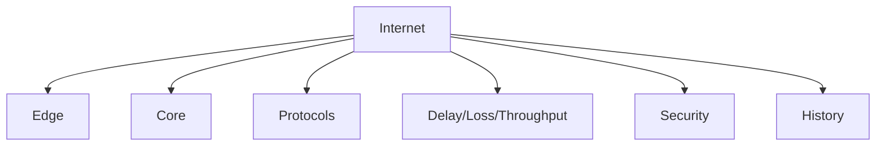

# 1.8 Summary

- The Internet connects billions of devices worldwide.
- Key concepts: network edge, core, protocols, delay, loss, throughput, security, history.
- Understand switching, layering, and attack types.

---

## Quick Revision Table
| Concept      | Key Point / Example         |
|--------------|----------------------------|
| Internet     | Global network             |
| Edge         | User devices, access       |
| Core         | Routers, backbone          |
| Delay        | Types, formulas            |
| Protocols    | OSI, TCP/IP, encapsulation |
| Attacks      | DoS, malware, phishing     |
| History      | ARPANET, TCP/IP, WWW       |

---

## Mind Map: Chapter 1 Overview

---

## Common Exam Mistakes
- Confusing the Internet with the World Wide Web.
- Forgetting the difference between circuit and packet switching.
- Not memorizing delay formulas or types.
- Mixing up OSI and TCP/IP layers.
- Overlooking security goals and attack types.

---

**Exam Tips:**
- Focus on definitions, diagrams, and formulas.
- Practice explaining concepts with analogies.
- Avoid common mistakes listed above. 