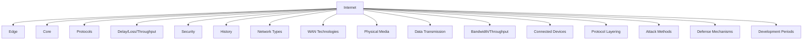

# 1.8 Summary

- The Internet connects billions of devices worldwide.
- Key concepts: network edge, core, protocols, delay, loss, throughput, security, history.
- Understand switching, layering, and attack types.
- **Network types:** LAN, MAN, WAN with distinct characteristics and technologies.
- **Physical media:** Twisted pair, coaxial, fiber optic, wireless with detailed specifications.
- **WAN technologies:** Circuit-switched and packet-switched options for wide-area connectivity.
- **Data transmission:** Bits, bytes, ASCII encoding, electrical/optical/wireless signals.
- **Bandwidth and throughput:** Network capacity vs. actual performance, latency impact.
- **Connected devices:** Mobile devices, IoT, smart home, medical devices, sensors.
- **Protocols:** Human vs. computer protocols, layering benefits, encapsulation process.
- **Security:** Internet's original design, attack methods, defense mechanisms.
- **History:** Five major development periods, key milestones, standards evolution.

---

## Quick Revision Table
| Concept      | Key Point / Example         |
|--------------|----------------------------|
| Internet     | Global network             |
| Edge         | User devices, access       |
| Core         | Routers, backbone          |
| Delay        | Types, formulas            |
| Protocols    | OSI, TCP/IP, encapsulation |
| Attacks      | DoS, malware, phishing     |
| History      | ARPANET, TCP/IP, WWW       |
| LAN/MAN/WAN  | Distance, speed, ownership |
| WAN Tech     | Circuit/packet switching   |
| Media Types  | Copper, fiber, wireless    |
| **Data Trans**| **Bits, ASCII, signals**   |
| **Bandwidth** | **bps, kbps, Mbps, Gbps** |
| **Throughput**| **Actual vs. theoretical** |
| **IoT Devices**| **Mobile, smart home, sensors** |
| **Protocols** | **Human vs. computer, layering** |
| **Security** | **Original design, attacks, defense** |
| **History** | **Five periods, RFCs, IETF** |

---

## Mind Map: Chapter 1 Overview

---

## Network Types Summary
| Type | Distance | Speed | Ownership | Example |
|------|----------|-------|-----------|---------|
| LAN  | Up to 1 km | 10 Mbps-10 Gbps | Private | Home/Office |
| MAN  | 1-50 km | 1 Mbps-1 Gbps | Public/Private | City Network |
| WAN  | 50+ km | 56 Kbps-100 Gbps | Public | Internet |

---

## WAN Technologies Summary
| Type | Technology | Speed | Use Case |
|------|------------|-------|----------|
| Circuit-Switched | Leased Lines, ISDN | 128 Kbps-622 Mbps | Predictable traffic |
| Packet-Switched | Frame Relay, ATM, MPLS | 56 Kbps-100 Gbps | Bursty data |
| Broadband | DSL, Cable, Fiber | 1 Mbps-10 Gbps | Internet access |

---

## Physical Media Summary
| Medium | Speed | Distance | Cost | Use Case |
|--------|-------|----------|------|----------|
| Twisted Pair | 10 Mbps-10 Gbps | 100m | Low | LAN, telephony |
| Coaxial | 10 Mbps-1 Gbps | 500m | Medium | Cable TV, legacy LAN |
| Fiber Optic | 100 Mbps-100+ Gbps | 60km | High | Backbone, WAN |
| Wireless | 1 Mbps-1 Gbps+ | 100m | Low | WiFi, mobile, IoT |

---

## Data Transmission Summary
| Component | Description | Example |
|-----------|-------------|---------|
| Bit | Binary digit (0 or 1) | 01000001 = 'A' |
| Byte | 8 bits | ASCII character |
| ASCII | Character encoding | A=65, a=97 |
| Electrical | Copper wire signals | Ethernet, telephone |
| Optical | Light pulses | Fiber optic |
| Wireless | Radio waves | WiFi, cellular |

---

## Bandwidth and Throughput Summary
| Unit | Abbreviation | Equivalence | Example Use |
|------|-------------|-------------|-------------|
| bps | bps | 1 bps = fundamental unit | Dial-up modems |
| kbps | kbps | 1 kbps = 1,000 bps | Basic Internet |
| Mbps | Mbps | 1 Mbps = 1,000,000 bps | Home broadband |
| Gbps | Gbps | 1 Gbps = 1,000,000,000 bps | High-speed LAN |
| Tbps | Tbps | 1 Tbps = 1,000,000,000,000 bps | Internet backbone |

---

## Connected Devices Summary
| Device Type | Examples | Connectivity | Use Cases |
|-------------|----------|--------------|-----------|
| Mobile | Smartphones, tablets, smartwatches | Cellular, WiFi, Bluetooth | Communication, productivity |
| Smart Home | Security systems, appliances, TVs | WiFi, Z-Wave, Zigbee | Automation, monitoring |
| IoT | Sensors, actuators, RFID tags | WiFi, LoRaWAN, cellular | Data collection, control |
| Medical | Pacemakers, monitors, pumps | Bluetooth, cellular | Health monitoring |
| Transportation | Smart cars, GPS | Cellular, WiFi, satellite | Navigation, diagnostics |

---

## Common Exam Mistakes
- Confusing the Internet with the World Wide Web.
- Forgetting the difference between circuit and packet switching.
- Not memorizing delay formulas or types.
- Mixing up OSI and TCP/IP layers.
- Overlooking security goals and attack types.
- **New:** Confusing LAN, MAN, and WAN characteristics.
- **New:** Not understanding WAN technology differences.
- **New:** Forgetting physical media specifications.
- **New:** Confusing bandwidth vs. throughput.
- **New:** Not understanding data transmission methods.
- **New:** Overlooking IoT device connectivity.
- **New:** Not understanding human vs. computer protocols.
- **New:** Forgetting the air travel analogy for layering.
- **New:** Confusing OSI vs. Internet protocol stacks.
- **New:** Not understanding the Internet's original security design.
- **New:** Forgetting the five periods of Internet development.

---

**Exam Tips:**
- Focus on definitions, diagrams, and formulas.
- Practice explaining concepts with analogies.
- Avoid common mistakes listed above.
- **New:** Memorize network type characteristics and WAN technologies.
- **New:** Know physical media types, speeds, and use cases.
- **New:** Understand bandwidth units and throughput factors.
- **New:** Know data transmission methods and encoding.
- **New:** Be familiar with connected device types and connectivity.
- **New:** Understand protocol layering and encapsulation process.
- **New:** Know security attack methods and defense mechanisms.
- **New:** Memorize key Internet development milestones and periods. 