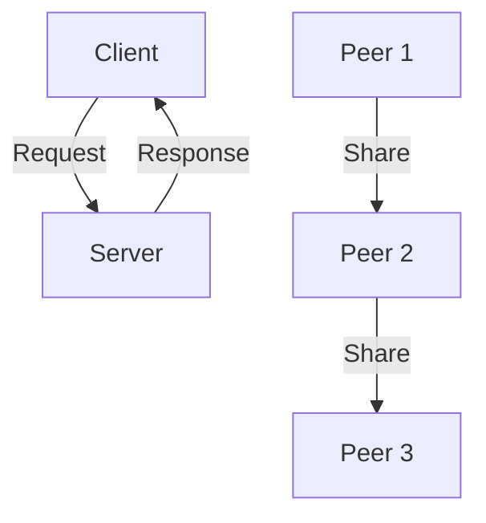
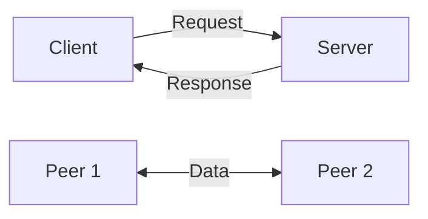
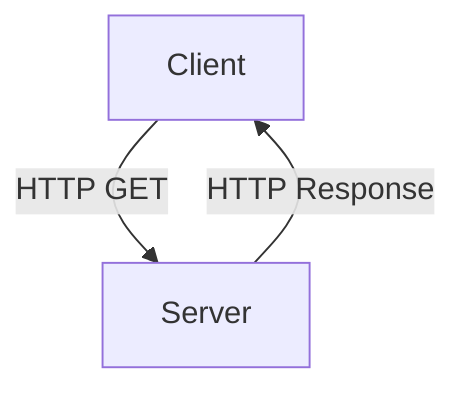

# 2.1 Principles of Network Applications

- Network applications enable communication and resource sharing over the Internet.
- **Examples:** Web, email, file transfer, streaming, messaging.
- **Architecture:** Client-server, peer-to-peer (P2P), hybrid (e.g., Skype).
- **Protocols:** Define rules for data exchange (HTTP, SMTP, FTP, DNS).

---

## Application Architectures
- **Client-server:** Centralized server provides resources/services to clients (e.g., web browsing, email).
- **Peer-to-peer (P2P):** Peers act as both clients and servers (e.g., BitTorrent, blockchain).
- **Hybrid:** Combines both (e.g., Skype, WhatsApp).

---

## Real-World Example
- Web browser (client) requests a web page from a server using HTTP.
- File sharing apps (P2P) like BitTorrent distribute files among users.
- Messaging apps (hybrid) use central servers for login, P2P for file transfer.

---

## Diagram: Client-Server vs. P2P

---

## 2.1.1 Network Application Architectures
- **Client-Server:** Centralized server, multiple clients (e.g., web, email).
- **Peer-to-Peer (P2P):** Peers act as both client and server (e.g., BitTorrent).
- **Hybrid:** Mix of client-server and P2P (e.g., Skype, modern streaming).
- **Diagram:**

---

## 2.1.2 Processes Communicating
- **Process:** Program running on a host.
- **Socket:** Interface for process-to-process communication.
- **Addressing:** IP address + port number identifies a process.
- **Scenario:** Web browser (client) connects to web server (process) via TCP socket.

---

## 2.1.3 Transport Services Available to Applications
- **Reliable Data Transfer:** Guarantees delivery (TCP).
- **Unreliable Data Transfer:** No guarantee (UDP).
- **Throughput, Timing, Security:** Some applications need high throughput (video), low delay (VoIP), or security (HTTPS).
- **Table:**
| Service      | TCP | UDP |
|--------------|-----|-----|
| Reliable     | Yes | No  |
| Ordered      | Yes | No  |
| Connection   | Yes | No  |
| Speed        | Med | High|
| Use-case     | Web | VoIP|

---

## 2.1.4 Transport Services Provided by the Internet
- **TCP:** Reliable, connection-oriented, ordered, congestion control.
- **UDP:** Unreliable, connectionless, unordered, fast.
- **Scenario:** File download uses TCP; live video uses UDP.

---

## 2.1.5 Application-Layer Protocols
- **Protocol:** Defines message format, order, actions.
- **Examples:** HTTP, SMTP, FTP, DNS, BitTorrent.
- **Diagram:**

---

## 2.1.6 Network Applications Covered in This Book
- Web (HTTP), Email (SMTP, POP3, IMAP), DNS, P2P (BitTorrent), Streaming, Sockets.

---

## Common Application-Layer Protocols
| Protocol | Port | Use Case         |
|----------|------|-----------------|
| HTTP     | 80   | Web browsing    |
| HTTPS    | 443  | Secure web      |
| SMTP     | 25   | Email sending   |
| POP3     | 110  | Email retrieval |
| IMAP     | 143  | Email sync      |
| FTP      | 21   | File transfer   |
| DNS      | 53   | Name resolution |

---

## Summary Table
| Architecture | Example      | Key Feature         |
|--------------|-------------|--------------------|
| Client-Server| Web, Email  | Centralized server |
| P2P          | BitTorrent  | Decentralized      |
| Hybrid       | Skype       | Mix of both        |

---

## Practice Questions
1. **What is a network application? Give two examples.**
2. **Compare client-server and P2P architectures.**
3. **Name two common application-layer protocols.**
4. **Give a real-world example of a hybrid architecture.**
5. **List three application-layer protocols and their default ports.**

---

**Exam Tips:**
- Know application architectures and protocol examples.
- Be able to draw and explain diagrams.
- Memorize common protocol ports for the exam.

## Practice Questions
1. **Compare client-server and P2P architectures. Give an example of each.**
2. **What is a socket? Why is it important for network applications?**
3. **List three differences between TCP and UDP.**
4. **Describe a scenario where UDP is preferred over TCP.**

---

**Exam Tips:**
- Know the differences between TCP and UDP.
- Be able to draw and explain client-server and P2P diagrams.
- Understand sockets and addressing.

---

## Other Important Application-Layer Protocols
- **FTP (File Transfer Protocol):** Transfers files between client and server. Uses separate control (port 21) and data (port 20) connections. Not encrypted by default.
- **Telnet:** Remote terminal access to servers. Insecure (plaintext). Superseded by SSH.
- **SSH (Secure Shell):** Secure remote login and command execution. Encrypts all traffic.

---

## Modern Application Protocols
- **REST APIs:** Web services using HTTP for communication. Stateless, uses JSON/XML. Common in web/mobile apps.
- **WebSockets:** Provides full-duplex, real-time communication over a single TCP connection. Used for chat, live updates, games.

---

## Application-Layer Security
- **HTTPS:** HTTP over TLS/SSL. Encrypts web traffic for privacy and integrity.
- **DNSSEC:** Adds authentication to DNS responses, preventing spoofing.
- **Email Security:** Protocols like SPF, DKIM, and DMARC help prevent email spoofing and phishing.

---

## Clients and Servers: Network Roles

### Client Roles and Functions
- **Definition:** Computer hosts that request and display information from servers
- **Software:** Client applications installed on user devices
- **Functions:**
  - Request resources from servers
  - Display information to users
  - Handle user interactions
  - Manage local data and settings
- **Examples:**
  - **Web Browsers:** Chrome, Firefox, Safari
  - **Email Clients:** Outlook, Thunderbird, Mail app
  - **File Transfer Clients:** FileZilla, WinSCP
  - **Database Clients:** MySQL Workbench, pgAdmin

### Server Roles and Functions
- **Definition:** Computer hosts that provide information and services to clients
- **Software:** Server applications that run continuously
- **Functions:**
  - Process client requests
  - Provide resources and services
  - Manage data and applications
  - Handle multiple concurrent clients
- **Characteristics:**
  - High availability (24/7 operation)
  - Scalable to handle many clients
  - Secure and reliable
  - Centralized management

### Types of Servers

#### Email Servers
- **Function:** Handle email sending, receiving, and storage
- **Software:** Microsoft Exchange, Postfix, Sendmail
- **Client Software:** Outlook, Thunderbird, mobile mail apps
- **Protocols:** SMTP (sending), POP3/IMAP (receiving)
- **Features:**
  - Message routing and delivery
  - Spam filtering
  - Virus scanning
  - Mailbox management
  - Calendar and contact sync

#### Web Servers
- **Function:** Serve web pages and web applications
- **Software:** Apache, Nginx, IIS, Node.js
- **Client Software:** Web browsers (Chrome, Firefox, Safari)
- **Protocols:** HTTP, HTTPS
- **Features:**
  - Static content delivery
  - Dynamic content generation
  - Load balancing
  - SSL/TLS encryption
  - Caching and compression

#### File Servers
- **Function:** Store and manage files for network access
- **Software:** Windows File Server, Samba, NFS
- **Client Software:** File Explorer, Finder, command line tools
- **Protocols:** SMB/CIFS, NFS, FTP
- **Features:**
  - Centralized file storage
  - Access control and permissions
  - Backup and recovery
  - Version control
  - Collaboration tools

#### Database Servers
- **Function:** Store and manage structured data
- **Software:** MySQL, PostgreSQL, SQL Server, Oracle
- **Client Software:** Database management tools, applications
- **Protocols:** SQL, ODBC, JDBC
- **Features:**
  - Data storage and retrieval
  - Transaction management
  - Backup and recovery
  - Security and access control
  - Performance optimization

#### Application Servers
- **Function:** Run business applications and services
- **Software:** Tomcat, JBoss, WebLogic, .NET Framework
- **Client Software:** Web browsers, mobile apps, desktop applications
- **Protocols:** HTTP, SOAP, REST, proprietary protocols
- **Features:**
  - Application hosting
  - Business logic processing
  - Integration with databases
  - Load balancing
  - Session management

### Server Comparison Table
| Server Type | Primary Function | Client Software | Key Protocols |
|-------------|-----------------|-----------------|---------------|
| Email Server | Email handling | Mail clients | SMTP, POP3, IMAP |
| Web Server | Web content | Browsers | HTTP, HTTPS |
| File Server | File storage | File managers | SMB, NFS, FTP |
| Database Server | Data storage | DB tools, apps | SQL, ODBC |
| Application Server | Business logic | Various clients | HTTP, SOAP, REST |

---

## Peer-to-Peer (P2P) Networks

### P2P Network Characteristics
- **Definition:** Network where devices act as both clients and servers
- **Architecture:** Decentralized, no central server required
- **Scalability:** More peers = more resources and capacity
- **Fault Tolerance:** Network continues if some peers fail

### P2P vs. Client-Server Comparison
| Feature | Client-Server | P2P |
|---------|---------------|-----|
| **Scalability** | Limited by server capacity | Scales with number of peers |
| **Fault Tolerance** | Server failure = service down | Network survives peer failures |
| **Resource Use** | Centralized resources | Distributed resources |
| **Cost** | High (server infrastructure) | Low (uses peer resources) |
| **Complexity** | Simple client, complex server | Complex peer software |
| **Security** | Centralized control | Distributed, harder to secure |
| **Performance** | Depends on server | Depends on peer network |

### P2P Network Types

#### File Sharing P2P
- **Purpose:** Distribute files among peers
- **Examples:** BitTorrent, eMule, Gnutella
- **Operation:**
  - Files split into pieces
  - Peers download and upload pieces simultaneously
  - Rarest pieces downloaded first for availability
  - Tit-for-tat sharing encourages cooperation
- **Advantages:**
  - High availability (multiple sources)
  - Scalable bandwidth (more peers = more bandwidth)
  - Fault tolerant (peers can leave/join)
- **Disadvantages:**
  - Copyright concerns
  - Security risks (malware, fake files)
  - Variable performance

#### Communication P2P
- **Purpose:** Direct communication between peers
- **Examples:** Skype (early versions), WhatsApp, Signal
- **Operation:**
  - Direct peer-to-peer connections
  - End-to-end encryption
  - Minimal server involvement
- **Advantages:**
  - Privacy (direct communication)
  - Low latency
  - Reduced server costs
- **Disadvantages:**
  - NAT traversal challenges
  - Limited features without servers

#### Computing P2P
- **Purpose:** Distributed computing tasks
- **Examples:** SETI@home, Folding@home, cryptocurrency mining
- **Operation:**
  - Tasks distributed among peers
  - Results collected and combined
  - Peer contributes computing power
- **Advantages:**
  - Massive computing power
  - Cost-effective
  - Scientific collaboration
- **Disadvantages:**
  - Coordination complexity
  - Result verification needed

### P2P Network Topologies

#### Unstructured P2P
- **Structure:** Random connections between peers
- **Examples:** Gnutella, early file sharing networks
- **Characteristics:**
  - Simple to implement
  - Flooding search (inefficient)
  - No guarantee of finding resources
- **Search Method:** Query flooding (send to all neighbors)

#### Structured P2P
- **Structure:** Organized overlay network
- **Examples:** Distributed Hash Tables (DHT), Chord, Kademlia
- **Characteristics:**
  - Efficient resource location
  - Predictable performance
  - Complex to implement
- **Search Method:** Routing based on network structure

#### Hybrid P2P
- **Structure:** Combines P2P with centralized elements
- **Examples:** BitTorrent (trackers), modern Skype
- **Characteristics:**
  - Best of both worlds
  - Centralized discovery, P2P transfer
  - More reliable than pure P2P
- **Search Method:** Centralized directory + P2P transfer

### P2P Applications in Detail

#### BitTorrent Protocol
- **File Distribution:** Large files split into pieces
- **Piece Selection:** Rarest-first strategy
- **Incentive Mechanism:** Tit-for-tat (upload to get download)
- **Tracker:** Central server for peer discovery
- **DHT:** Distributed peer discovery (no tracker needed)
- **Real-world Use:**
  - Software distribution (Linux ISOs)
  - Game updates (Blizzard, Steam)
  - Content delivery (Facebook, Twitter)

#### Blockchain and Cryptocurrency
- **Distributed Ledger:** All peers maintain transaction history
- **Consensus:** Agreement on valid transactions
- **Mining:** Computational proof of work
- **Examples:** Bitcoin, Ethereum, other cryptocurrencies
- **Characteristics:**
  - Decentralized trust
  - Immutable records
  - No central authority

### P2P Network Challenges

#### Technical Challenges
- **NAT Traversal:** Peers behind firewalls/NAT
- **Churn:** Peers joining/leaving frequently
- **Free Riding:** Peers that download but don't upload
- **Sybil Attacks:** Malicious peers creating fake identities

#### Security Challenges
- **Malware Distribution:** Infected files in file sharing
- **Privacy:** IP addresses visible to other peers
- **DDoS:** Coordinated attacks on specific peers
- **Eclipse Attacks:** Isolating specific peers

#### Legal and Ethical Challenges
- **Copyright Infringement:** Sharing copyrighted content
- **Bandwidth Usage:** High bandwidth consumption
- **Network Policies:** ISP restrictions on P2P traffic
- **Responsibility:** Who is liable for shared content?

### Modern P2P Applications

#### Content Delivery
- **CDN Integration:** P2P complements traditional CDNs
- **Live Streaming:** P2P reduces server load for live events
- **Video on Demand:** Hybrid P2P-CDN systems

#### IoT and Edge Computing
- **Device-to-Device:** Direct communication between IoT devices
- **Edge Computing:** Distributed processing at network edge
- **Mesh Networks:** Self-organizing device networks

#### Decentralized Applications (DApps)
- **Blockchain-based:** Applications running on blockchain
- **Smart Contracts:** Automated agreements and transactions
- **Web3:** Decentralized web applications

---

## Multiple Roles in Networks

### Single Computer Multiple Roles
- **Home/Small Business:** One computer can act as multiple server types
- **Examples:**
  - File server + Web server + Email server
  - Database server + Application server
  - Print server + DHCP server + DNS server
- **Advantages:**
  - Cost-effective for small networks
  - Simplified management
  - Reduced hardware requirements
- **Disadvantages:**
  - Single point of failure
  - Limited scalability
  - Resource contention
  - Security risks (multiple services on one machine)

### Role Separation in Enterprise Networks
- **Dedicated Servers:** Each server type on separate hardware
- **Virtualization:** Multiple virtual servers on physical hardware
- **Load Balancing:** Multiple servers of same type
- **High Availability:** Redundant servers for critical services

### Server Consolidation vs. Separation
| Approach | Pros | Cons | Use Case |
|----------|------|------|----------|
| **Consolidation** | Lower cost, simpler management | Single point of failure, resource contention | Small networks, testing |
| **Separation** | Better performance, security, scalability | Higher cost, complex management | Enterprise, production |

---

## Case Studies & Real-World Strategies

### 1. Web Application Delivery
- **Google, Facebook, Amazon:** Use global load balancing, edge caching (CDNs), and HTTP/2/3 for fast, reliable web delivery. Employ A/B testing and canary releases for feature rollouts.
- **YouTube:** Uses adaptive streaming (DASH), edge servers, and prefetching to optimize video delivery.

### 2. DNS Optimization
- **Google Public DNS, Cloudflare 1.1.1.1:** Provide fast, secure, and privacy-focused DNS resolution. Use anycast routing to direct users to the nearest DNS server.
- **Netflix:** Uses DNS-based request routing to direct users to the optimal CDN edge location.

### 3. Email Security and Delivery
- **Gmail, Outlook:** Implement SPF, DKIM, DMARC, and advanced spam/phishing detection. Use TLS for secure email transport and support encrypted email (S/MIME).

### 4. Streaming and CDN Strategies
- **Netflix:** Open Connect CDN, places servers inside ISP networks, pre-positions popular content, uses adaptive bitrate streaming.
- **Amazon Prime Video:** Uses AWS CloudFront, multi-tier caching, and dynamic scaling.
- **Twitch:** Uses HLS for live streaming, with low-latency and scalable edge delivery.

### 5. Peer-to-Peer (P2P) and File Sharing
- **BitTorrent:** Uses tit-for-tat, rarest-first piece selection, and DHT for decentralized peer discovery. Used by Blizzard (game updates), Facebook (internal file distribution), and others.

### 6. REST APIs and WebSockets
- **Twitter, Slack, WhatsApp:** Use REST APIs for stateless communication and WebSockets for real-time updates (chat, notifications).
- **Facebook Graph API:** Provides unified access to social data via RESTful endpoints.

### 7. Security Best Practices
- **All major providers:** Enforce HTTPS by default, use HSTS, implement rate limiting, and monitor for abuse. Employ OAuth2/OpenID Connect for secure authentication and authorization. 