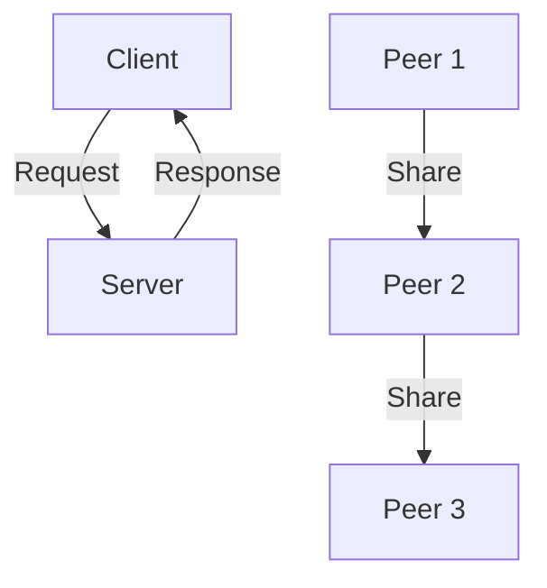
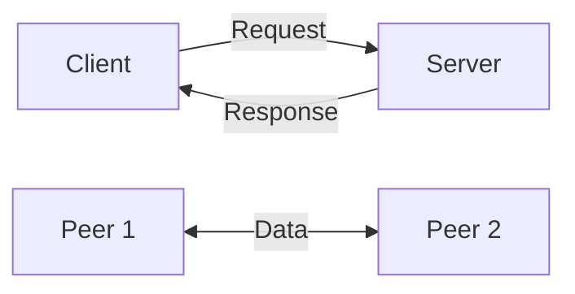
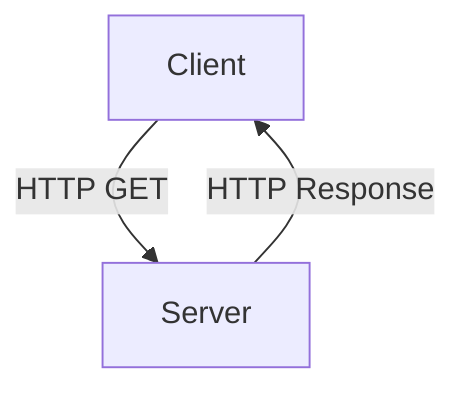

# 2.1 Principles of Network Applications

- Network applications enable communication and resource sharing over the Internet.
- **Examples:** Web, email, file transfer, streaming, messaging.
- **Architecture:** Client-server, peer-to-peer (P2P), hybrid (e.g., Skype).
- **Protocols:** Define rules for data exchange (HTTP, SMTP, FTP, DNS).

---

## Application Architectures
- **Client-server:** Centralized server provides resources/services to clients (e.g., web browsing, email).
- **Peer-to-peer (P2P):** Peers act as both clients and servers (e.g., BitTorrent, blockchain).
- **Hybrid:** Combines both (e.g., Skype, WhatsApp).

---

## Real-World Example
- Web browser (client) requests a web page from a server using HTTP.
- File sharing apps (P2P) like BitTorrent distribute files among users.
- Messaging apps (hybrid) use central servers for login, P2P for file transfer.

---

## Diagram: Client-Server vs. P2P

---

## 2.1.1 Network Application Architectures
- **Client-Server:** Centralized server, multiple clients (e.g., web, email).
- **Peer-to-Peer (P2P):** Peers act as both client and server (e.g., BitTorrent).
- **Hybrid:** Mix of client-server and P2P (e.g., Skype, modern streaming).
- **Diagram:**

---

## 2.1.2 Processes Communicating
- **Process:** Program running on a host.
- **Socket:** Interface for process-to-process communication.
- **Addressing:** IP address + port number identifies a process.
- **Scenario:** Web browser (client) connects to web server (process) via TCP socket.

---

## 2.1.3 Transport Services Available to Applications
- **Reliable Data Transfer:** Guarantees delivery (TCP).
- **Unreliable Data Transfer:** No guarantee (UDP).
- **Throughput, Timing, Security:** Some applications need high throughput (video), low delay (VoIP), or security (HTTPS).
- **Table:**
| Service      | TCP | UDP |
|--------------|-----|-----|
| Reliable     | Yes | No  |
| Ordered      | Yes | No  |
| Connection   | Yes | No  |
| Speed        | Med | High|
| Use-case     | Web | VoIP|

---

## 2.1.4 Transport Services Provided by the Internet
- **TCP:** Reliable, connection-oriented, ordered, congestion control.
- **UDP:** Unreliable, connectionless, unordered, fast.
- **Scenario:** File download uses TCP; live video uses UDP.

---

## 2.1.5 Application-Layer Protocols
- **Protocol:** Defines message format, order, actions.
- **Examples:** HTTP, SMTP, FTP, DNS, BitTorrent.
- **Diagram:**

---

## 2.1.6 Network Applications Covered in This Book
- Web (HTTP), Email (SMTP, POP3, IMAP), DNS, P2P (BitTorrent), Streaming, Sockets.

---

## Common Application-Layer Protocols
| Protocol | Port | Use Case         |
|----------|------|-----------------|
| HTTP     | 80   | Web browsing    |
| HTTPS    | 443  | Secure web      |
| SMTP     | 25   | Email sending   |
| POP3     | 110  | Email retrieval |
| IMAP     | 143  | Email sync      |
| FTP      | 21   | File transfer   |
| DNS      | 53   | Name resolution |

---

## Summary Table
| Architecture | Example      | Key Feature         |
|--------------|-------------|--------------------|
| Client-Server| Web, Email  | Centralized server |
| P2P          | BitTorrent  | Decentralized      |
| Hybrid       | Skype       | Mix of both        |

---

## Practice Questions
1. **What is a network application? Give two examples.**
2. **Compare client-server and P2P architectures.**
3. **Name two common application-layer protocols.**
4. **Give a real-world example of a hybrid architecture.**
5. **List three application-layer protocols and their default ports.**

---

**Exam Tips:**
- Know application architectures and protocol examples.
- Be able to draw and explain diagrams.
- Memorize common protocol ports for the exam.

## Practice Questions
1. **Compare client-server and P2P architectures. Give an example of each.**
2. **What is a socket? Why is it important for network applications?**
3. **List three differences between TCP and UDP.**
4. **Describe a scenario where UDP is preferred over TCP.**

---

**Exam Tips:**
- Know the differences between TCP and UDP.
- Be able to draw and explain client-server and P2P diagrams.
- Understand sockets and addressing. 