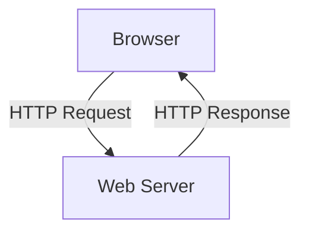
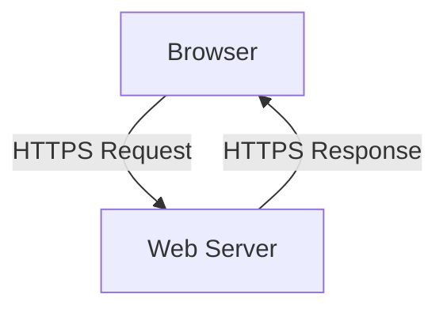

# 2.2 The Web and HTTP

- The Web uses HTTP (HyperText Transfer Protocol) for communication between browsers and servers.
- **HTTP:** Application-layer protocol, stateless, uses TCP.

---

## Web and HTTP: First, a Quick Review

### Web Page Structure
- **Web page consists of objects**, each of which can be stored on different Web servers
- **Object can be:** HTML file, JPEG image, Java applet, audio file, etc.
- **Web page consists of base HTML-file** which includes several referenced objects, each addressable by a URL

### URL Structure
- **Example:** `www.someschool.edu/someDept/pic.gif`
- **Host name:** `www.someschool.edu`
- **Path name:** `/someDept/pic.gif`

### Real-World Example
- **Homepage:** Contains HTML text and 10 referenced JPEG images
- **Total objects:** 11 objects (1 HTML + 10 images)
- **Each object:** Addressable by a separate URL

## 2.2.1 Overview of HTTP

### HTTP: Hypertext Transfer Protocol
- **Web's application-layer protocol**
- **Client/server model:**
  - **Client:** Browser that requests, receives, (using HTTP protocol) and "displays" Web objects
  - **Server:** Web server sends (using HTTP protocol) objects in response to requests

### HTTP Overview (Continued)

#### HTTP Uses TCP
- **Client initiates TCP connection** (creates socket) to server, port 80
- **Server accepts TCP connection** from client
- **HTTP messages (application-layer protocol messages)** exchanged between browser (HTTP client) and Web server (HTTP server)
- **TCP connection closed**

#### HTTP is "Stateless"
- **Server maintains no information** about past client requests
- **Protocols that maintain "state" are complex!**
  - Past history (state) must be maintained
  - If server/client crashes, their views of "state" may be inconsistent, must be reconciled

### Real-World Example
- **iPhone running Safari browser** (client)
- **PC running Firefox browser** (client)
- **Server running Apache Web server** (server)
- **HTTP request/response** exchanged between clients and server

## HTTP Methods
- **GET:** Retrieve resource.
- **POST:** Submit data.
- **HEAD, PUT, DELETE:** Other operations.

## 2.2.2 Non-Persistent and Persistent Connections

### HTTP Connections: Two Types

#### Non-persistent HTTP
- **TCP connection opened**
- **At most one object sent** over TCP connection
- **TCP connection closed**
- **Downloading multiple objects required multiple connections**

#### Persistent HTTP
- **TCP connection opened** to a server
- **Multiple objects can be sent** over single TCP connection between client, and that server
- **TCP connection closed**

### Non-persistent HTTP: Example

#### Step-by-Step Process
1. **User enters URL:** `www.someSchool.edu/someDepartment/home.index`
2. **HTTP client initiates TCP connection** to HTTP server (process) at www.someSchool.edu on port 80
3. **HTTP server at host www.someSchool.edu waiting for TCP connection** at port 80 "accepts" connection, notifying client
4. **HTTP client sends HTTP request message** (containing URL) into TCP connection socket. Message indicates that client wants object someDepartment/home.index
5. **HTTP server receives request message**, forms response message containing requested object, and sends message into its socket
6. **HTTP server closes TCP connection**
7. **HTTP client receives response message** containing html file, displays html. Parsing html file, finds 10 referenced jpeg objects
8. **Steps 1-5 repeated for each of 10 jpeg objects**

### Non-persistent HTTP: Response Time

#### RTT Definition
- **RTT (Round Trip Time):** Time for a small packet to travel from client to server and back

#### HTTP Response Time (per object)
- **One RTT** to initiate TCP connection
- **One RTT** for HTTP request and first few bytes of HTTP response to return
- **Object/file transmission time**

#### Formula
**Non-persistent HTTP response time = 2RTT + file transmission time**

### Persistent HTTP (HTTP 1.1)

#### Non-persistent HTTP Issues
- **Requires 2 RTTs per object**
- **OS overhead for each TCP connection**
- **Browsers often open multiple parallel TCP connections** to fetch referenced objects in parallel

#### Persistent HTTP (HTTP1.1) Solution
- **Server leaves connection open** after sending response
- **Subsequent HTTP messages** between same client/server sent over open connection
- **Client sends requests as soon as it encounters a referenced object**
- **As little as one RTT for all the referenced objects** (cutting response time in half)

## 2.2.3 HTTP Message Format

### HTTP Request Message

#### Two Types of HTTP Messages
- **Request messages** (from client to server)
- **Response messages** (from server to client)

#### HTTP Request Message Format
- **ASCII (human-readable format)**
- **Header lines**
- **Request line (GET, POST, HEAD commands)**
- **Carriage return, line feed at start of line indicates end of header lines**

#### Example HTTP Request Message
```
GET /index.html HTTP/1.1\r\n
Host: www-net.cs.umass.edu\r\n
User-Agent: Mozilla/5.0 (Macintosh; Intel Mac OS X 10.15; rv:80.0) Gecko/20100101 Firefox/80.0 \r\n
Accept: text/html,application/xhtml+xml\r\n
Accept-Language: en-us,en;q=0.5\r\n
Accept-Encoding: gzip,deflate\r\n
Connection: keep-alive\r\n
\r\n
```

#### HTTP Request Message: General Format
```
request line
header lines
body
```

#### Other HTTP Request Messages

##### POST Method
- **Web page often includes form input**
- **User input sent from client to server in entity body of HTTP POST request message**

##### GET Method (for sending data to server)
- **Include user data in URL field of HTTP GET request message (following a '?'):**
- **Example:** `www.somesite.com/animalsearch?monkeys&banana`

##### HEAD Method
- **Requests headers (only) that would be returned if specified URL were requested with an HTTP GET method**

##### PUT Method
- **Uploads new file (object) to server**
- **Completely replaces file that exists at specified URL with content in entity body of POST HTTP request message**

### HTTP Response Message

#### Example HTTP Response Message
```
HTTP/1.1 200 OK
Date: Tue, 08 Sep 2020 00:53:20 GMT
Server: Apache/2.4.6 (CentOS) OpenSSL/1.0.2k-fips PHP/7.4.9 mod_perl/2.0.11 Perl/v5.16.3
Last-Modified: Tue, 01 Mar 2016 18:57:50 GMT
ETag: "a5b-52d015789ee9e"
Accept-Ranges: bytes
Content-Length: 2651
Content-Type: text/html; charset=UTF-8
\r\n
data data data data data ...
```

#### HTTP Response Status Codes
- **Status code appears in 1st line in server-to-client response message**
- **Some sample codes:**
  - **200 OK:** Request succeeded, requested object later in this message
  - **301 Moved Permanently:** Requested object moved, new location specified later in this message (in Location: field)
  - **400 Bad Request:** Request msg not understood by server
  - **404 Not Found:** Requested document not found on this server
  - **505 HTTP Version Not Supported**

## 2.2.4 User-Server Interaction: Cookies

### Trying Out HTTP (Client Side) for Yourself

#### Method 1: Using netcat
1. **Netcat to your favorite Web server:**
   - Opens TCP connection to port 80 (default HTTP server port) at gaia.cs.umass.edu
   - Anything typed in will be sent to port 80 at gaia.cs.umass.edu
2. **Type in a GET HTTP request:**
   ```
   GET /kurose_ross/interactive/index.php HTTP/1.1
   Host: gaia.cs.umass.edu
   ```
   - By typing this in (hit carriage return twice), you send this minimal (but complete) GET request to HTTP server
3. **Look at response message sent by HTTP server!**

#### Method 2: Using Wireshark
- **Use Wireshark to look at captured HTTP request/response**

### Maintaining User/Server State: Cookies

#### Recall: HTTP GET/Response Interaction is Stateless
- **No notion of multi-step exchanges** of HTTP messages to complete a Web "transaction"
- **No need for client/server to track "state"** of multi-step exchange
- **All HTTP requests are independent** of each other
- **No need for client/server to "recover"** from a partially-completed-but-never-completely-completed transaction

#### Stateful Protocol Example
- **Client makes two changes to X, or none at all**
- **Time sequence:** Lock data record X → Update X → Update X → Unlock X
- **Question:** What happens if network connection or client crashes at t'?

### Cookies: How They Work

#### Four Components
1. **Cookie header line of HTTP response message**
2. **Cookie header line in next HTTP request message**
3. **Cookie file kept on user's host, managed by user's browser**
4. **Back-end database at Web site**

#### Example: Susan's First Visit
- **Susan uses browser on laptop, visits specific e-commerce site for first time**
- **When initial HTTP requests arrives at site, site creates:**
  - Unique ID (aka "cookie")
  - Entry in backend database for ID
- **Subsequent HTTP requests from Susan to this site will contain cookie ID value, allowing site to "identify" Susan**

### Cookies: Detailed Example

#### Initial Visit
- **Client sends:** Usual HTTP request msg
- **Amazon server creates:** ID 1678 for user
- **Amazon server sends:** Usual HTTP response + Set-cookie: 1678
- **Client stores:** Cookie file with amazon 1678

#### One Week Later
- **Client sends:** Usual HTTP request msg + Cookie: 1678
- **Amazon server:** Performs cookie-specific action, accesses backend database
- **Amazon server sends:** Usual HTTP response msg

### HTTP Cookies: Comments

#### What Cookies Can Be Used For
- **Authorization:** Login sessions, access control
- **Shopping carts:** E-commerce transactions
- **Recommendations:** Personalized content
- **User session state:** Web e-mail, online banking

#### Cookies and Privacy
- **Cookies permit sites to learn a lot about you** on their site
- **Third party persistent cookies (tracking cookies)** allow common identity (cookie value) to be tracked across multiple web sites
- **Challenge:** How to keep state?
  - **At protocol endpoints:** Maintain state at sender/receiver over multiple transactions
  - **In messages:** Cookies in HTTP messages carry state

### Cookies: Tracking User's Browsing Behavior

#### First Party vs Third Party Cookies
- **"First party" cookie:** From website you chose to visit (provides base html file)
- **"Third party" cookie:** From website you did not choose to visit

#### Example: NY Times and AdX
1. **User visits nytimes.com (sports)**
2. **NY Times sets cookie 1634**
3. **NY Times page includes ad from AdX.com**
4. **AdX sets cookie 7493**
5. **User later visits socks.com**
6. **Socks.com page includes AdX ad**
7. **AdX cookie 7493 tracks user across sites**
8. **AdX can return targeted ads based on browsing history**

#### Privacy Regulations
- **GDPR (EU General Data Protection Regulation):**
  - "Natural persons may be associated with online identifiers […] such as internet protocol addresses, cookie identifiers or other identifiers […]. This may leave traces which, in particular when combined with unique identifiers and other information received by the servers, may be used to create profiles of the natural persons and identify them."
- **User has explicit control over whether or not cookies are allowed**
- **When cookies can identify an individual, cookies are considered personal data, subject to GDPR personal data regulations**

## 2.2.5 Web Caching

### Web Caches (Proxy Servers)

#### How Web Caching Works
- **User configures browser** to point to a (local) Web cache
- **Browser sends all HTTP requests** to cache
- **If object in cache:** Cache returns object to client
- **Else:** Cache requests object from origin server, caches received object, then returns object to client
- **Goal:** Satisfy client requests without involving origin server

#### Web Cache Acts as Both Client and Server
- **Server for original requesting client**
- **Client to origin server**

#### Why Web Caching?
- **Reduce response time for client request** (cache is closer to client)
- **Reduce traffic on an institution's access link** (Internet is dense with caches)
- **Enables "poor" content providers** to more effectively deliver content
- **Server tells cache about object's allowable caching** in response header

### Caching Example

#### Scenario
- **Access link rate:** 1.54 Mbps
- **RTT from institutional router to server:** 2 sec
- **Web object size:** 100K bits
- **Average request rate from browsers to origin servers:** 15/sec
- **Avg data rate to browsers:** 1.50 Mbps

#### Performance Without Cache
- **Access link utilization:** 0.97
- **LAN utilization:** 0.0015
- **End-end delay:** Internet delay + access link delay + LAN delay = 2 sec + minutes + usecs
- **Problem:** Large queueing delays at high utilization!

#### Option 1: Buy a Faster Access Link
- **Upgrade to 154 Mbps**
- **Access link utilization:** 0.0097
- **End-end delay:** msecs
- **Cost:** Faster access link (expensive!)

#### Option 2: Install a Web Cache
- **Cost:** Web cache (cheap!)
- **Suppose cache hit rate is 0.4:**
  - 40% requests served by cache, with low (msec) delay
  - 60% requests satisfied at origin
  - Rate to browsers over access link = 0.6 × 1.50 Mbps = 0.9 Mbps
  - Access link utilization = 0.9/1.54 = 0.58 (means low queueing delay)
  - Average end-end delay = 0.6 × (delay from origin servers) + 0.4 × (delay when satisfied at cache) = 0.6(2.01) + 0.4(~msecs) = ~1.2 secs
- **Result:** Lower average end-end delay than with 154 Mbps link (and cheaper too!)

### Browser Caching: Conditional GET

#### Goal
- **Don't send object if browser has up-to-date cached version**
- **No object transmission delay (or use of network resources)**

#### Method
- **Client:** Specify date of browser-cached copy in HTTP request
  - `If-modified-since: <date>`
- **Server:** Response contains no object if browser-cached copy is up-to-date
  - `HTTP/1.0 304 Not Modified`

#### Example
- **If object not modified before date:** Server sends 304 Not Modified
- **If object modified after date:** Server sends 200 OK with new data

## Diagram: HTTP Transaction


## HTTP Status Codes
- **1xx:** Informational
- **2xx:** Success (e.g., 200 OK)
- **3xx:** Redirection (e.g., 301 Moved Permanently)
- **4xx:** Client error (e.g., 404 Not Found)
- **5xx:** Server error (e.g., 500 Internal Server Error)

## Common HTTP Response Codes
| Code | Meaning                |
|------|------------------------|
| 200  | OK                     |
| 301  | Moved Permanently      |
| 302  | Found (Redirect)       |
| 400  | Bad Request            |
| 401  | Unauthorized           |
| 403  | Forbidden              |
| 404  | Not Found              |
| 500  | Internal Server Error  |
| 503  | Service Unavailable    |

## Summary Table
| Feature         | Non-Persistent | Persistent |
|-----------------|----------------|------------|
| TCP Connections | Multiple       | Single     |
| Speed           | Slower         | Faster     |
| Overhead        | Higher         | Lower      |

## Practice Questions
1. **List three HTTP methods.**
2. **What is the difference between persistent and non-persistent HTTP?**
3. **What are cookies used for?**
4. **List three common HTTP status codes and their meanings.**
5. **Explain HTTP pipelining.**

**Exam Tips:**
- Know HTTP methods, status codes, and connection types.
- Be able to draw HTTP transaction diagrams.
- Memorize common response codes for the exam.

## HTTP/2 and HTTP/3
- **HTTP/2:** Introduces multiplexing (multiple requests/responses in one connection), header compression, binary framing. Improves speed and efficiency.
- **HTTP/3:** Uses QUIC protocol (built on UDP), further reduces latency, improves connection setup and security.

| Version | Key Features                | Transport |
|---------|----------------------------|-----------|
| 1.1     | Persistent, pipelining     | TCP       |
| 2       | Multiplexing, compression  | TCP       |
| 3       | QUIC, low latency, secure  | UDP       |

## More on Cookies and Session Management
- **Secure Cookies:** Only sent over HTTPS.
- **HttpOnly:** Not accessible via JavaScript (prevents XSS).
- **SameSite:** Restricts cross-site cookie sending (prevents CSRF).
- **Session Management:** Cookies often store session IDs; servers use these to track logged-in users.

## More on Web Caching and Proxy Servers
- **Forward Proxy:** Sits between client and Internet, used for filtering, privacy.
- **Reverse Proxy:** Sits in front of web servers, used for load balancing, caching.
- **Transparent Proxy:** Intercepts traffic without client configuration.

## Example: HTTPS (TLS/SSL Basics)
- **HTTPS:** HTTP over TLS/SSL. Encrypts data between browser and server.
- **TLS Handshake:** Negotiates encryption keys before data transfer.
- **Benefits:** Confidentiality, integrity, authentication.

## Diagram: HTTPS Transaction
