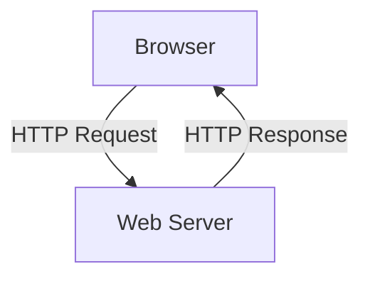

# 2.2 The Web and HTTP

- The Web uses HTTP (HyperText Transfer Protocol) for communication between browsers and servers.
- **HTTP:** Application-layer protocol, stateless, uses TCP.

## 2.2.1 Overview of HTTP
- **Client-Server Model:** Browser (client) requests, server responds.
- **Stateless:** Each request is independent; server does not retain session info by default.

## HTTP Methods
- **GET:** Retrieve resource.
- **POST:** Submit data.
- **HEAD, PUT, DELETE:** Other operations.

## 2.2.2 Non-Persistent and Persistent Connections
- **Non-persistent:** One TCP connection per object.
- **Persistent:** Single connection for multiple objects (faster, default in HTTP/1.1).
- **Pipelining:** Multiple requests sent before responses received (improves efficiency).

## 2.2.3 HTTP Message Format
- **Request:**
  - Request line (method, URL, version)
  - Headers (Host, User-Agent, etc.)
  - Optional body (for POST)
- **Response:**
  - Status line (version, status code, phrase)
  - Headers (Content-Type, Content-Length, etc.)
  - Body (HTML, image, etc.)
- **Example:**
```
GET /index.html HTTP/1.1
Host: www.example.com
User-Agent: Chrome

HTTP/1.1 200 OK
Content-Type: text/html
Content-Length: 100
<html>...</html>
```

## 2.2.4 User-Server Interaction: Cookies
- **Cookies:** Store user info for session management, personalization, tracking.
- **How it works:** Server sets cookie in response; browser sends cookie in future requests.

## 2.2.5 Web Caching
- **Web Cache (Proxy):** Stores copies of web objects to reduce load and latency.
- **Benefits:** Faster access, reduced bandwidth usage.
- **Scenario:** Multiple users in a network access the same website; cache serves repeated requests.

## Diagram: HTTP Transaction


## HTTP Status Codes
- **1xx:** Informational
- **2xx:** Success (e.g., 200 OK)
- **3xx:** Redirection (e.g., 301 Moved Permanently)
- **4xx:** Client error (e.g., 404 Not Found)
- **5xx:** Server error (e.g., 500 Internal Server Error)

## Common HTTP Response Codes
| Code | Meaning                |
|------|------------------------|
| 200  | OK                     |
| 301  | Moved Permanently      |
| 302  | Found (Redirect)       |
| 400  | Bad Request            |
| 401  | Unauthorized           |
| 403  | Forbidden              |
| 404  | Not Found              |
| 500  | Internal Server Error  |
| 503  | Service Unavailable    |

## Summary Table
| Feature         | Non-Persistent | Persistent |
|-----------------|----------------|------------|
| TCP Connections | Multiple       | Single     |
| Speed           | Slower         | Faster     |
| Overhead        | Higher         | Lower      |

## Practice Questions
1. **List three HTTP methods.**
2. **What is the difference between persistent and non-persistent HTTP?**
3. **What are cookies used for?**
4. **List three common HTTP status codes and their meanings.**
5. **Explain HTTP pipelining.**

**Exam Tips:**
- Know HTTP methods, status codes, and connection types.
- Be able to draw HTTP transaction diagrams.
- Memorize common response codes for the exam. 