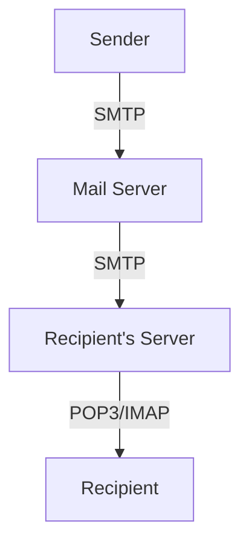

# 2.3 Electronic Mail

- Email allows users to send and receive messages over the Internet.
- **Protocols:** SMTP (sending), POP3/IMAP (retrieving).

---

## Email Protocols
- **SMTP (Simple Mail Transfer Protocol):** Pushes mail from client to server and between servers.
- **POP3 (Post Office Protocol):** Downloads mail to client, usually deletes from server.
- **IMAP (Internet Message Access Protocol):** Synchronizes mail across devices, keeps mail on server.
- **MIME (Multipurpose Internet Mail Extensions):** Allows email to include multimedia (images, audio, attachments).

---

## Diagram: Email Flow

---

## Email Protocols Table
| Protocol | Port | Use         | Feature                |
|----------|------|-------------|------------------------|
| SMTP     | 25   | Sending     | Push, server-to-server |
| POP3     | 110  | Receiving   | Download, delete       |
| IMAP     | 143  | Receiving   | Sync, keep on server   |
| MIME     | -    | Attachments | Multimedia support     |

---

## Summary Table
| Protocol | Use         | Feature                |
|----------|-------------|------------------------|
| SMTP     | Sending     | Push, server-to-server |
| POP3     | Receiving   | Download, delete       |
| IMAP     | Receiving   | Sync, keep on server   |

---

## Practice Questions
1. **Which protocol is used to send email?**
2. **Compare POP3 and IMAP.**
3. **Draw a diagram of email delivery.**
4. **What is MIME and why is it important?**
5. **List the ports for SMTP, POP3, and IMAP.**

---

**Exam Tips:**
- Know protocol roles, ports, and differences.
- Be able to draw and explain email flow diagrams.
- Understand MIME for multimedia email.

---

## Email Security
- **SPF (Sender Policy Framework):** Prevents sender address forgery by specifying allowed sending servers for a domain.
- **DKIM (DomainKeys Identified Mail):** Adds a digital signature to emails, allowing recipients to verify authenticity.
- **DMARC (Domain-based Message Authentication, Reporting, and Conformance):** Builds on SPF and DKIM, provides policy and reporting for email authentication.
- **Email Encryption:**
  - **PGP (Pretty Good Privacy):** End-to-end encryption for email content.
  - **S/MIME (Secure/Multipurpose Internet Mail Extensions):** Uses certificates for email encryption and signing. 