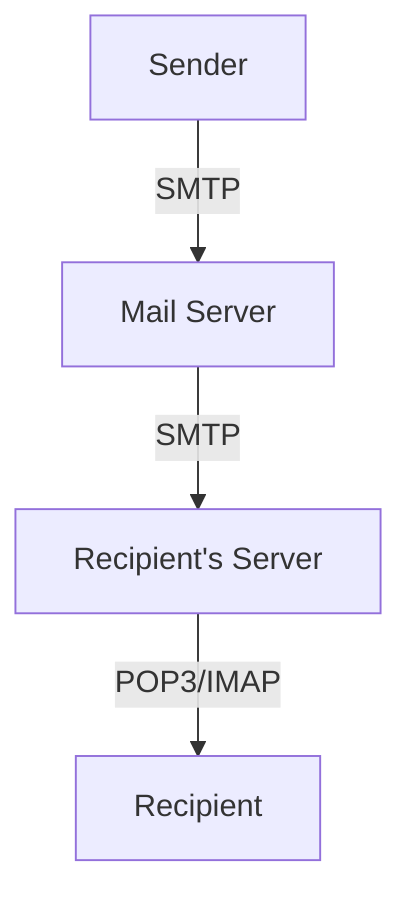

# 2.3 Electronic Mail

- Email allows users to send and receive messages over the Internet.
- **Protocols:** SMTP (sending), POP3/IMAP (retrieving).

---

## Electronic Mail: Three Major Components

### User Agents
- **A.k.a. "mail reader"**
- **Composing, editing, reading mail messages**
- **E.g., Outlook, Thunderbird, iPhone mail client**
- **Outgoing, incoming messages stored on server**

### Mail Servers
- **Mailbox contains incoming messages for user**
- **Message queue of outgoing (to be sent) mail messages**
- **SMTP protocol between mail servers to send email messages**
- **Client: sending mail server**
- **Server: receiving mail server**

### SMTP (Simple Mail Transfer Protocol)
- **Uses TCP to reliably transfer email message from client to server, port 25**
- **Direct transfer: sending server to receiving server**
- **Three phases of transfer:**
  - Handshaking (greeting)
  - Transfer of messages
  - Closure
- **Command/response interaction (like HTTP):**
  - Commands: ASCII text
  - Response: Status code and phrase
- **Messages must be in 7-bit ASCII**

### Mail Access Protocols

#### SMTP: Delivery/Storage to Receiver's Server
- **Mail access protocol:** Retrieval from server
- **POP:** Post Office Protocol [RFC 1939] (authorization (agent <-->server) and download)
- **IMAP:** Internet Mail Access Protocol [RFC 1730] (more features (more complex), manipulation of stored messages on server)
- **HTTP:** Hotmail, Gmail, Yahoo! Mail, etc.

#### POP3 Protocol: Authorization Phase
- **Client commands:**
  - `user`: Declare username
  - `pass`: Password
- **Server responses:**
  - `+OK` (success)
  - `-ERR` (failure)

#### POP3 Protocol: Transaction Phase
- **Client commands:**
  - `list`: List message numbers
  - `retr`: Retrieve message by number
  - `dele`: Delete message by number
  - `quit`
- **Server responses:**
  - `+OK` (success)
  - `-ERR` (failure)

#### POP3 (More) and IMAP

##### POP3 "Download and Keep" Modes
- **Download and keep:** Messages from different client host are accumulated on mail server
- **Download and delete:** Bob cannot re-read e-mail if he changes client
- **POP3 is stateless across sessions**

##### IMAP
- **Keep all messages in one place: the server**
- **Allows user to organize messages in folders**
- **IMAP keeps user state across sessions:**
  - Names of folders and mappings between message IDs and folder name
- **IMAP provides commands to:**
  - Create folders
  - Move messages from one folder to another
  - Search remote folders for messages matching criteria
  - Fetch portions of messages (e.g., just the header, or just a specific MIME section)

---

## Email Protocols
- **SMTP (Simple Mail Transfer Protocol):** Pushes mail from client to server and between servers.
- **POP3 (Post Office Protocol):** Downloads mail to client, usually deletes from server.
- **IMAP (Internet Message Access Protocol):** Synchronizes mail across devices, keeps mail on server.
- **MIME (Multipurpose Internet Mail Extensions):** Allows email to include multimedia (images, audio, attachments).

---

## Diagram: Email Flow

---

## Email Protocols Table
| Protocol | Port | Use         | Feature                |
|----------|------|-------------|------------------------|
| SMTP     | 25   | Sending     | Push, server-to-server |
| POP3     | 110  | Receiving   | Download, delete       |
| IMAP     | 143  | Receiving   | Sync, keep on server   |
| MIME     | -    | Attachments | Multimedia support     |

---

## Summary Table
| Protocol | Use         | Feature                |
|----------|-------------|------------------------|
| SMTP     | Sending     | Push, server-to-server |
| POP3     | Receiving   | Download, delete       |
| IMAP     | Receiving   | Sync, keep on server   |

---

## Practice Questions
1. **Which protocol is used to send email?**
2. **Compare POP3 and IMAP.**
3. **Draw a diagram of email delivery.**
4. **What is MIME and why is it important?**
5. **List the ports for SMTP, POP3, and IMAP.**

---

**Exam Tips:**
- Know protocol roles, ports, and differences.
- Be able to draw and explain email flow diagrams.
- Understand MIME for multimedia email.

---

## Email Security
- **SPF (Sender Policy Framework):** Prevents sender address forgery by specifying allowed sending servers for a domain.
- **DKIM (DomainKeys Identified Mail):** Adds a digital signature to emails, allowing recipients to verify authenticity.
- **DMARC (Domain-based Message Authentication, Reporting, and Conformance):** Builds on SPF and DKIM, provides policy and reporting for email authentication.
- **Email Encryption:**
  - **PGP (Pretty Good Privacy):** End-to-end encryption for email content.
  - **S/MIME (Secure/Multipurpose Internet Mail Extensions):** Uses certificates for email encryption and signing. 