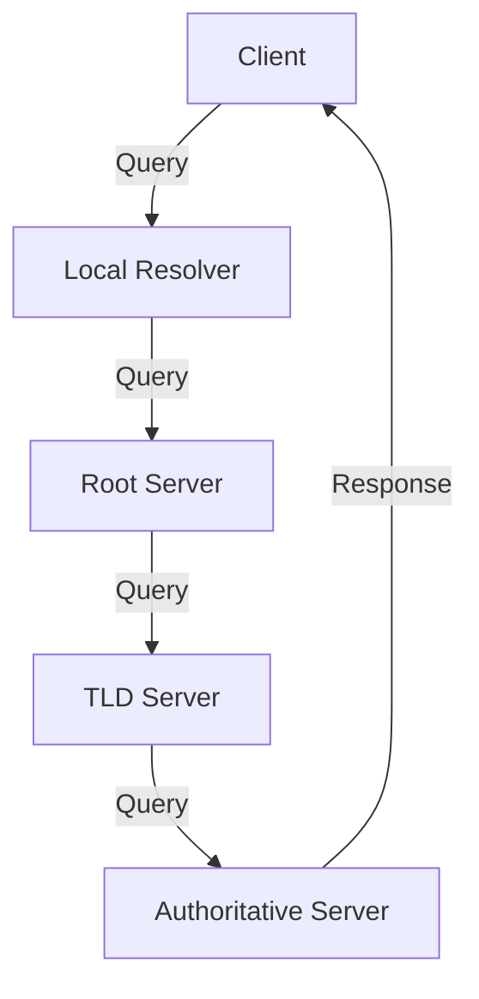

# 2.4 DNS: The Internet's Directory Service

- DNS (Domain Name System) translates domain names to IP addresses.
- **Hierarchical:** Root, TLD, authoritative servers.

---

## DNS: Domain Name System

### DNS: Services, Structure

#### DNS Services
- **Hostname to IP address translation**
- **Host aliasing**
  - Canonical and alias names
- **Mail server aliasing**
- **Load distribution**
  - Replicated Web servers: set of IP addresses for one canonical name

#### Why Not Centralize DNS?
- **Single point of failure**
- **Traffic volume**
- **Distant centralized database**
- **Maintenance**
- **A centralized database doesn't scale!**

### DNS: A Distributed, Hierarchical Database

#### Root DNS Servers
- **Contacted by local name server that can not resolve name**
- **Root name server:**
  - Contacts authoritative name server if name mapping not known
  - Gets mapping
  - Returns mapping to local name server
- **13 root name servers worldwide**

#### Top-Level Domain (TLD) Servers
- **Responsible for com, org, net, edu, etc., and all top-level country domains uk, fr, ca, jp**
- **Network Solutions maintains servers for com TLD**
- **Educause for edu TLD**

#### Authoritative DNS Servers
- **Organization's DNS servers, providing authoritative hostname to IP mappings for organization's servers (e.g., Web and mail)**
- **Can be maintained by organization or service provider**

#### Local DNS Name Server
- **Does not strictly belong to hierarchy**
- **Each ISP (residential ISP, company, university) has one**
- **Also called "default name server"**
- **When a host makes a DNS query, query is sent to its local DNS server**
- **Has local cache of recent name-to-address translation pairs (but may be out of date!)**
- **Acts as proxy, forwards query into hierarchy**

### DNS: Root Name Servers

#### Geographic Distribution
- **13 root name servers worldwide**
- **a.rootservers.net (VeriSign, Los Angeles)**
- **b.rootservers.net (University of Southern California, Marina del Rey)**
- **c.rootservers.net (Cogent Communications)**
- **d.rootservers.net (University of Maryland)**
- **e.rootservers.net (NASA Ames Research Center)**
- **f.rootservers.net (Internet Systems Consortium, Inc.)**
- **g.rootservers.net (US Department of Defense)**
- **h.rootservers.net (US Army Research Lab)**
- **i.rootservers.net (Netnod)**
- **j.rootservers.net (VeriSign)**
- **k.rootservers.net (RIPE NCC)**
- **l.rootservers.net (ICANN)**
- **m.rootservers.net (WIDE Project)**

#### Anycast Routing
- **Multiple root servers share the same IP address**
- **When a client sends a query to a root server, the query is routed to the "closest" root server by the Internet's routing infrastructure**

## DNS Hierarchy
- **Root servers:** Top-level, direct queries to TLD servers.
- **TLD servers:** Handle domains like .com, .org.
- **Authoritative servers:** Store actual domain records.

## Record Types
- **A:** Maps name to IPv4 address.
- **AAAA:** Maps name to IPv6 address.
- **MX:** Mail exchange.
- **CNAME:** Alias for another name.
- **NS:** Name server for a domain.
- **PTR:** Reverse lookup (IP to name).

## DNS Caching
- **Resolvers cache responses to speed up future queries.**
- **Reduces load on root/TLD servers.**

## DNS Resolution Process
- **Recursive:** Resolver handles all queries for client.
- **Iterative:** Resolver queries each server in turn.

## Diagram: DNS Lookup

## DNS Record Types Table
| Type | Purpose         | Example           |
|------|----------------|-------------------|
| A    | IPv4 address   | 93.184.216.34     |
| AAAA | IPv6 address   | 2606:2800:220:1   |
| MX   | Mail server    | mail.example.com  |
| CNAME| Alias          | www → example.com |
| NS   | Name server    | ns1.example.com   |
| PTR  | Reverse lookup | 34.216.184.93.in-addr.arpa |

## Summary Table
| Record | Purpose         | Example           |
|--------|----------------|-------------------|
| A      | IPv4 address   | 93.184.216.34     |
| AAAA   | IPv6 address   | 2606:2800:220:1   |
| MX     | Mail server    | mail.example.com  |
| CNAME  | Alias          | www → example.com |

## Practice Questions
1. **What is the purpose of DNS?**
2. **List two DNS record types and their uses.**
3. **Explain the difference between recursive and iterative resolution.**
4. **What is DNS caching and why is it important?**
5. **Give an example of a PTR record.**

**Exam Tips:**
- Know DNS hierarchy, record types, and caching.
- Be able to draw DNS lookup diagrams.
- Understand recursive vs. iterative queries.

## DNS Security Extensions (DNSSEC)
- **DNSSEC:** Adds digital signatures to DNS data, allowing clients to verify authenticity and integrity of responses. Prevents DNS spoofing/poisoning.
- **How it works:** Each DNS zone signs its records with a private key; resolvers verify with the public key.

## DNS Privacy Improvements
- **DNS over HTTPS (DoH):** Encrypts DNS queries using HTTPS, preventing eavesdropping and tampering.
- **DNS over TLS (DoT):** Encrypts DNS queries using TLS protocol. 