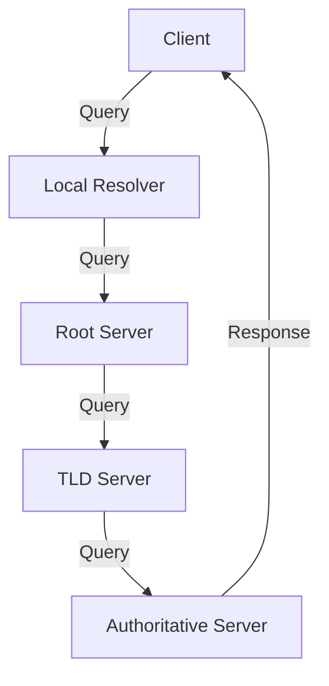

# 2.4 DNS: The Internet's Directory Service

- DNS (Domain Name System) translates domain names to IP addresses.
- **Hierarchical:** Root, TLD, authoritative servers.

## DNS Hierarchy
- **Root servers:** Top-level, direct queries to TLD servers.
- **TLD servers:** Handle domains like .com, .org.
- **Authoritative servers:** Store actual domain records.

## Record Types
- **A:** Maps name to IPv4 address.
- **AAAA:** Maps name to IPv6 address.
- **MX:** Mail exchange.
- **CNAME:** Alias for another name.
- **NS:** Name server for a domain.
- **PTR:** Reverse lookup (IP to name).

## DNS Caching
- **Resolvers cache responses to speed up future queries.**
- **Reduces load on root/TLD servers.**

## DNS Resolution Process
- **Recursive:** Resolver handles all queries for client.
- **Iterative:** Resolver queries each server in turn.

## Diagram: DNS Lookup

## DNS Record Types Table
| Type | Purpose         | Example           |
|------|----------------|-------------------|
| A    | IPv4 address   | 93.184.216.34     |
| AAAA | IPv6 address   | 2606:2800:220:1   |
| MX   | Mail server    | mail.example.com  |
| CNAME| Alias          | www → example.com |
| NS   | Name server    | ns1.example.com   |
| PTR  | Reverse lookup | 34.216.184.93.in-addr.arpa |

## Summary Table
| Record | Purpose         | Example           |
|--------|----------------|-------------------|
| A      | IPv4 address   | 93.184.216.34     |
| AAAA   | IPv6 address   | 2606:2800:220:1   |
| MX     | Mail server    | mail.example.com  |
| CNAME  | Alias          | www → example.com |

## Practice Questions
1. **What is the purpose of DNS?**
2. **List two DNS record types and their uses.**
3. **Explain the difference between recursive and iterative resolution.**
4. **What is DNS caching and why is it important?**
5. **Give an example of a PTR record.**

**Exam Tips:**
- Know DNS hierarchy, record types, and caching.
- Be able to draw DNS lookup diagrams.
- Understand recursive vs. iterative queries.

## DNS Security Extensions (DNSSEC)
- **DNSSEC:** Adds digital signatures to DNS data, allowing clients to verify authenticity and integrity of responses. Prevents DNS spoofing/poisoning.
- **How it works:** Each DNS zone signs its records with a private key; resolvers verify with the public key.

## DNS Privacy Improvements
- **DNS over HTTPS (DoH):** Encrypts DNS queries using HTTPS, preventing eavesdropping and tampering.
- **DNS over TLS (DoT):** Encrypts DNS queries using TLS protocol. 