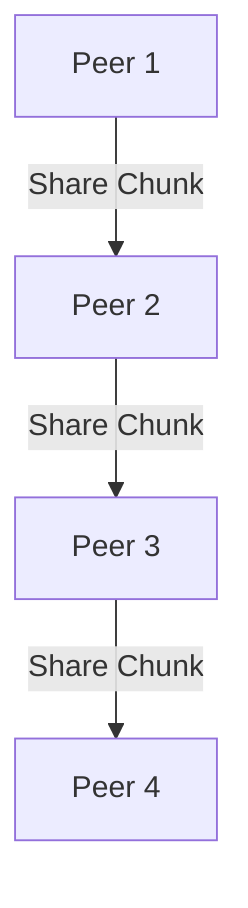

# 2.5 Peer-to-Peer Applications

- P2P applications distribute resources among peers without central servers.
- **Examples:** BitTorrent, Skype (early), blockchain, Gnutella.

---

## P2P Architecture
- **Peers:** Act as both clients and servers.
- **Scalability:** More peers = more resources.
- **File sharing:** Files split into chunks, shared among peers.
- **Fault tolerance:** If one peer fails, others can still provide data.

---

## P2P File Sharing Example
- BitTorrent: File is split into pieces, each peer downloads and uploads pieces to/from others, improving speed and reliability.

---

## Diagram: P2P File Sharing

---

## Client-Server vs. P2P Table
| Feature         | Client-Server | P2P           |
|-----------------|---------------|---------------|
| Scalability     | Limited       | High          |
| Fault Tolerance | Low           | High          |
| Resource Use    | Centralized   | Distributed   |
| Cost            | High (server) | Low (peers)   |
| Example         | Web, Email    | BitTorrent    |

---

## Summary Table
| Feature      | Client-Server | P2P           |
|--------------|---------------|---------------|
| Scalability  | Limited       | High          |
| Fault Tolerance| Low         | High          |
| Resource Use | Centralized   | Distributed   |

---

## Practice Questions
1. **What is a P2P application? Give an example.**
2. **How does P2P improve scalability?**
3. **Draw a diagram of P2P file sharing.**
4. **Compare client-server and P2P in terms of fault tolerance.**
5. **Describe how BitTorrent works.**

---

**Exam Tips:**
- Know P2P features, advantages, and file sharing mechanisms.
- Be able to draw and explain P2P diagrams.
- Compare client-server and P2P for exam questions.

---

## BitTorrent Protocol Details
- **Piece Selection:** Peers download rarest pieces first to maximize availability.
- **Tit-for-Tat:** Peers upload to those who upload back, encouraging sharing.
- **Trackers:** Central servers that help peers find each other.
- **DHT (Distributed Hash Table):** Decentralized peer discovery, no central tracker needed.

---

## Security and Legal Issues in P2P
- **Security:** Malware, fake files, privacy risks.
- **Legal:** Copyright infringement, liability for sharing protected content. 