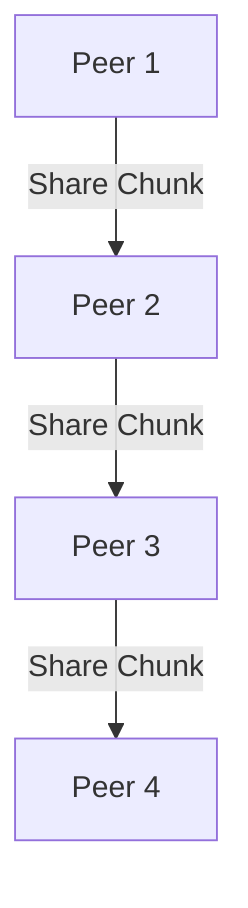

# 2.5 Peer-to-Peer Applications

- P2P applications distribute resources among peers without central servers.
- **Examples:** BitTorrent, Skype (early), blockchain, Gnutella.

---

## P2P Applications

### Pure P2P Architecture
- **No always-on server**
- **Arbitrary end systems directly communicate**
- **Peers are intermittently connected and change IP addresses**
- **Examples:**
  - File distribution (BitTorrent)
  - Streaming (KanKan)
  - VoIP (Skype)

### File Distribution: Client-Server vs P2P

#### Question: How Much Time to Distribute File from One Server to N Peers?
- **File size:** F (bits)
- **Server upload rate:** us (file bits/sec)
- **Server download rate:** di (file bits/sec)
- **Peers download rate:** di (file bits/sec)
- **Peers upload rate:** ui (file bits/sec)

#### Client-Server Architecture
- **Server transmission:** Must sequentially upload (send) N file copies:
  - Time to send one copy: F/us
  - Time to send N copies: NF/us
- **Client:** Each client must download file copy
  - di = min {di} = dmin
  - Time for client to download: F/dmin
- **Time for all clients to get copy:** max {NF/us, F/dmin}

#### P2P Architecture
- **Server transmission:** Must upload at least one copy
  - Time to send one copy: F/us
- **Client:** Each client must download file copy
  - Time for client to download: F/dmin
- **Clients:** As aggregate must download NF bits
  - Max upload rate (limiting max download rate) is us + Σui
  - Time for all clients to get copy: max {F/us, F/dmin, NF/(us + Σui)}

### P2P File Distribution: BitTorrent

#### BitTorrent: File Distribution
- **File divided into 256Kb chunks**
- **Peers in torrent send/receive file chunks**
- **Tracker:** Tracks peers participating in torrent
- **Torrent:** Group of peers exchanging chunks of a file

#### BitTorrent: Requesting, Sending File Chunks

##### Requesting Chunks
- **At any given time, different peers have different subsets of file chunks**
- **Periodically, Alice asks each peer for list of chunks that they have**
- **Alice requests missing chunks from peers, rarest first**

##### Sending Chunks: Tit-for-Tat
- **Alice sends chunks to four peers currently sending her chunks at highest rate**
  - Other peers are choked by Alice (do not receive chunks from her)
  - Re-evaluate top 4 every 10 seconds
- **Every 30 seconds: randomly select another peer, starts sending chunks**
  - "Optimistically unchoke" this peer
  - New peer may join top 4

#### BitTorrent: Getting First Chunks
- **New peer joining torrent:**
  - Has no chunks, but will accumulate them over time from other peers
  - Registers with tracker to get list of peers, connects to subset of peers ("neighbors")
- **While downloading, peer uploads chunks to other peers**
- **Peer may change peers with whom it exchanges chunks**
- **When peer has entire file, it may (selfishly) leave or (altruistically) remain in torrent**

### Distributed Hash Tables (DHTs)

#### DHT: Distributed Hash Table
- **Hash table-like interface**
- **put(key, value)**
- **get(key)**
- **DHT distributes (key, value) pairs over (millions of) nodes**
- **Automatic handling of node arrival/departure**

#### DHT: Circular DHT (1)
- **Each node only aware of immediate successor and predecessor**
- **"Overlay network"**
- **Example:**
  - Node 3 knows that "file with hash 10" should be placed in (successor) node 12
  - Node 15 knows that "file with hash 10" should be placed in (successor) node 12
  - Node 1 doesn't know that "file with hash 10" should be placed in node 12

#### DHT: Circular DHT (2)
- **Who's responsible for key 14?**
  - Node 14
- **Who's responsible for key 10?**
  - Node 12
- **Who's responsible for key 24?**
  - Node 24

#### DHT: Circular DHT with Shortcuts
- **Each node has finger to some successor nodes**
- **Example:**
  - Node 1 has finger to node 1+1, 1+2, 1+4, 1+8
  - Node 3 has finger to node 3+1, 3+2, 3+4, 3+8
  - Node 0 has finger to node 0+1, 0+2, 0+4, 0+8

#### DHT: Circular DHT with Shortcuts
- **Who's responsible for key 14?**
  - Node 1 looks up 14, knows 14 is between 12 and 15, forwards to 12
- **Who's responsible for key 10?**
  - Node 1 looks up 10, knows 10 is between 8 and 12, forwards to 12
- **Who's responsible for key 24?**
  - Node 1 looks up 24, knows 24 is between 20 and 28, forwards to 24

#### DHT: Node Arrival/Departure
- **Node arrival:**
  - Node 18 joins between nodes 15 and 20
  - Node 18 acquires some keys from node 20
- **Node departure:**
  - Node 21 departs
  - Keys from node 21 acquired by node 24

---

## P2P Architecture
- **Peers:** Act as both clients and servers.
- **Scalability:** More peers = more resources.
- **File sharing:** Files split into chunks, shared among peers.
- **Fault tolerance:** If one peer fails, others can still provide data.

---

## P2P File Sharing Example
- BitTorrent: File is split into pieces, each peer downloads and uploads pieces to/from others, improving speed and reliability.

---

## Diagram: P2P File Sharing

---

## Client-Server vs. P2P Table
| Feature         | Client-Server | P2P           |
|-----------------|---------------|---------------|
| Scalability     | Limited       | High          |
| Fault Tolerance | Low           | High          |
| Resource Use    | Centralized   | Distributed   |
| Cost            | High (server) | Low (peers)   |
| Example         | Web, Email    | BitTorrent    |

---

## Summary Table
| Feature      | Client-Server | P2P           |
|--------------|---------------|---------------|
| Scalability  | Limited       | High          |
| Fault Tolerance| Low         | High          |
| Resource Use | Centralized   | Distributed   |

---

## Practice Questions
1. **What is a P2P application? Give an example.**
2. **How does P2P improve scalability?**
3. **Draw a diagram of P2P file sharing.**
4. **Compare client-server and P2P in terms of fault tolerance.**
5. **Describe how BitTorrent works.**

---

**Exam Tips:**
- Know P2P features, advantages, and file sharing mechanisms.
- Be able to draw and explain P2P diagrams.
- Compare client-server and P2P for exam questions.

---

## BitTorrent Protocol Details
- **Piece Selection:** Peers download rarest pieces first to maximize availability.
- **Tit-for-Tat:** Peers upload to those who upload back, encouraging sharing.
- **Trackers:** Central servers that help peers find each other.
- **DHT (Distributed Hash Table):** Decentralized peer discovery, no central tracker needed.

---

## Security and Legal Issues in P2P
- **Security:** Malware, fake files, privacy risks.
- **Legal:** Copyright infringement, liability for sharing protected content. 