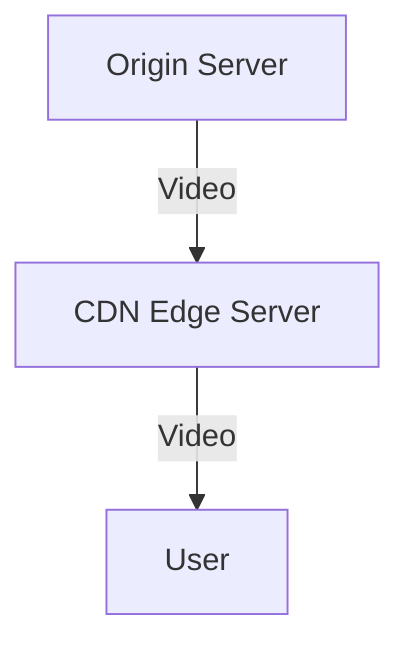
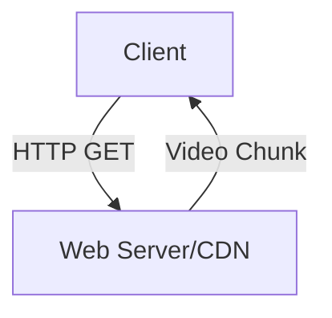

# 2.6 Video Streaming and Content Distribution Networks (CDNs)

- Video streaming: Playing video as it downloads.
- **Types:** Live streaming, on-demand (stored) streaming.
- **CDN:** Distributes content across multiple servers for scalability and reliability.

---

## Streaming Types
- **Live streaming:** Real-time broadcast (Twitch, sports).
- **On-demand:** Pre-recorded (YouTube, Netflix).
- **Adaptive streaming:** Adjusts video quality based on network conditions (e.g., DASH, HLS).

---

## CDN Operation
- **Edge servers:** Store copies of content closer to users.
- **Load balancing:** Distributes requests among servers.
- **Redundancy:** Multiple servers ensure reliability.

---

## Buffering
- Handles network jitter and delay.
- Startup delay: Time to fill buffer before playback.

---

## Diagram: CDN Streaming

---

## Live vs. On-Demand Streaming Table
| Feature      | Live Streaming | On-Demand | CDN Benefit   |
|--------------|---------------|-----------|--------------|
| Delay        | Low           | Higher    | Reduces delay|
| Scalability  | Medium        | High      | High         |
| Buffering    | Critical      | Important | Yes          |
| Adaptivity   | Less common   | Common    | Yes          |

---

## Summary Table
| Feature      | Live Streaming | On-Demand | CDN Benefit   |
|--------------|---------------|-----------|--------------|
| Delay        | Low           | Higher    | Reduces delay|
| Scalability  | Medium        | High      | High         |
| Buffering    | Critical      | Important | Yes          |

---

## Practice Questions
1. **What is a CDN and why is it used?**
2. **Compare live and on-demand streaming.**
3. **How does buffering help streaming?**
4. **What is adaptive streaming?**
5. **Describe how a CDN improves reliability.**

---

**Exam Tips:**
- Know streaming types, CDN operation, and adaptive streaming.
- Be able to draw CDN diagrams.
- Compare live and on-demand streaming for exam questions.

---

## 2.6.1 Internet Video
- **Properties:** High bandwidth, delay-sensitive, variable bit rate.
- **Challenges:** Jitter, loss, delay, bandwidth fluctuations.

---

## 2.6.2 HTTP Streaming and DASH
- **HTTP Streaming:** Video split into small files (chunks), delivered over HTTP.
- **DASH (Dynamic Adaptive Streaming over HTTP):** Client measures bandwidth, requests video chunks at appropriate quality. Allows smooth playback even with changing network conditions.
- **HLS (HTTP Live Streaming):** Apple's adaptive streaming protocol, widely used on mobile devices.
- **Diagram:**

---

## 2.6.3 Content Distribution Networks
- **CDN:** Network of servers that cache and deliver content closer to users.
- **Benefits:** Reduces latency, improves reliability, handles flash crowds.
- **Examples:** Akamai, Cloudflare, Netflix Open Connect.

---

## 2.6.4 Case Studies: Netflix, YouTube, and Kankan
- **Netflix:** Uses its own CDN (Open Connect) to deliver video.
- **YouTube:** Uses Google's global infrastructure and caching.
- **Kankan:** P2P-based video streaming in China.

---

## Practice Questions
1. **What is DASH and how does it improve video streaming?**
2. **Explain the role of a CDN in video delivery.**
3. **Draw a diagram showing HTTP streaming with a CDN.**
4. **Compare Netflix and YouTube's approaches to content delivery.**

---

## Summary Table
| Technology | Key Feature         | Example      |
|------------|--------------------|-------------|
| DASH       | Adaptive streaming | YouTube     |
| CDN        | Caching, scaling   | Netflix     |
| P2P Video  | Peer upload/share  | Kankan      |

---

**Exam Tips:**
- Know how DASH and CDNs work.
- Be able to draw streaming and CDN diagrams.
- Compare case studies for real-world context.

---

## More on Adaptive Streaming
- **DASH (Dynamic Adaptive Streaming over HTTP):** Client measures bandwidth, requests video chunks at appropriate quality. Allows smooth playback even with changing network conditions.
- **HLS (HTTP Live Streaming):** Apple's adaptive streaming protocol, widely used on mobile devices.

---

## Live Streaming Protocols
- **RTMP (Real-Time Messaging Protocol):** Used for live video delivery to streaming platforms.
- **WebRTC:** Enables real-time peer-to-peer video/audio in browsers (used for video calls, live chat). 