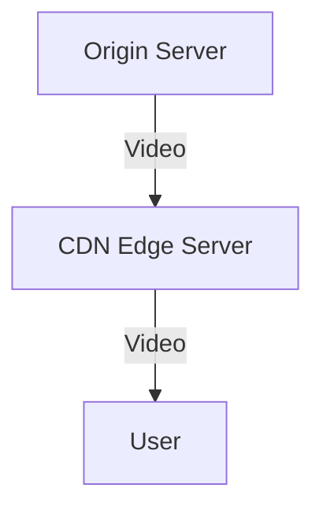
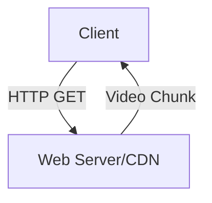

# 2.6 Video Streaming and Content Distribution Networks (CDNs)

- Video streaming: Playing video as it downloads.
- **Types:** Live streaming, on-demand (stored) streaming.
- **CDN:** Distributes content across multiple servers for scalability and reliability.

---

## Video Streaming and Content Distribution Networks

### Video Streaming: DASH

#### DASH: Dynamic, Adaptive Streaming over HTTP
- **Server:**
  - Divides video file into multiple chunks
  - Each chunk stored, encoded at different rates
  - Manifest file: provides URLs for different chunks
- **Client:**
  - Periodically measures server-to-client bandwidth
  - Consulting manifest, requests one chunk at a time
  - Chooses maximum coding rate sustainable given current bandwidth
  - Can choose different coding rates at different points in time (depending on available bandwidth at time)

#### DASH: Client Intelligence
- **Client determines:**
  - When to request chunk (so that buffer starvation, or overflow, does not occur)
  - What encoding rate to request (higher quality when more bandwidth available)
  - Where to request chunk (can request from URL server that is "close" to client or has high available bandwidth)

#### DASH: Client-Server Interaction
- **Client requests manifest file**
- **Client requests chunk 1 at rate 1**
- **Client requests chunk 2 at rate 2**
- **Client requests chunk 3 at rate 1**
- **Client requests chunk 4 at rate 3**
- **Client requests chunk 5 at rate 2**

### Content Distribution Networks

#### CDN: Content Distribution Networks
- **Challenge:** How to stream content (selected from millions of videos) to hundreds of thousands of simultaneous users?
- **Option 1:** Single, large "mega-server"
  - Single point of failure
  - Point of network congestion
  - Long path to distant clients
  - Multiple copies of video sent over outgoing link
- **Option 2:** Store/serve multiple copies of videos at multiple geographically distributed sites (CDN)

#### CDN: Store/Forward Multiple Copies in Multiple Geographic Sites
- **Enter deep:** Push CDN servers deep into many access networks
  - Close to users
  - Used by Akamai, 1700 locations
- **Bring home:** Smaller number (10's) of larger clusters in POPs near (but not within) access networks
  - Used by Limelight

#### CDN: Simple Operation
- **User requests video from netcinema.com**
- **Directed by netcinema.com to a CDN server**
- **CDN server delivers video to user**
- **CDN server may be located in user's ISP or in a nearby ISP**

#### CDN: "Simple" Content Access
- **User enters URL for a video**
- **User's host receives DNS reply from local DNS server**
- **User's host sends HTTP GET request to CDN server**
- **CDN server responds with video file**
- **User's host displays video**

#### CDN: Content Access
- **User enters URL for a video**
- **User's host receives DNS reply from local DNS server**
- **User's host sends HTTP GET request to CDN server**
- **CDN server responds with video file**
- **User's host displays video**

#### CDN: Content Access (More)
- **User enters URL for a video**
- **User's host receives DNS reply from local DNS server**
- **User's host sends HTTP GET request to CDN server**
- **CDN server responds with video file**
- **User's host displays video**

#### CDN: Content Access (Even More)
- **User enters URL for a video**
- **User's host receives DNS reply from local DNS server**
- **User's host sends HTTP GET request to CDN server**
- **CDN server responds with video file**
- **User's host displays video**

### CDN: Content Access (DNS Redirection)

#### CDN: Content Access (DNS Redirection)
- **User enters URL for a video**
- **User's host receives DNS reply from local DNS server**
- **User's host sends HTTP GET request to CDN server**
- **CDN server responds with video file**
- **User's host displays video**

#### CDN: Content Access (DNS Redirection) - More
- **User enters URL for a video**
- **User's host receives DNS reply from local DNS server**
- **User's host sends HTTP GET request to CDN server**
- **CDN server responds with video file**
- **User's host displays video**

#### CDN: Content Access (DNS Redirection) - Even More
- **User enters URL for a video**
- **User's host receives DNS reply from local DNS server**
- **User's host sends HTTP GET request to CDN server**
- **CDN server responds with video file**
- **User's host displays video**

### CDN: Content Access (HTTP Redirection)

#### CDN: Content Access (HTTP Redirection)
- **User enters URL for a video**
- **User's host receives DNS reply from local DNS server**
- **User's host sends HTTP GET request to CDN server**
- **CDN server responds with video file**
- **User's host displays video**

#### CDN: Content Access (HTTP Redirection) - More
- **User enters URL for a video**
- **User's host receives DNS reply from local DNS server**
- **User's host sends HTTP GET request to CDN server**
- **CDN server responds with video file**
- **User's host displays video**

#### CDN: Content Access (HTTP Redirection) - Even More
- **User enters URL for a video**
- **User's host receives DNS reply from local DNS server**
- **User's host sends HTTP GET request to CDN server**
- **CDN server responds with video file**
- **User's host displays video**

### CDN: Content Access (HTTP Redirection) - Final

#### CDN: Content Access (HTTP Redirection) - Final
- **User enters URL for a video**
- **User's host receives DNS reply from local DNS server**
- **User's host sends HTTP GET request to CDN server**
- **CDN server responds with video file**
- **User's host displays video**

#### CDN: Content Access (HTTP Redirection) - Final More
- **User enters URL for a video**
- **User's host receives DNS reply from local DNS server**
- **User's host sends HTTP GET request to CDN server**
- **CDN server responds with video file**
- **User's host displays video**

#### CDN: Content Access (HTTP Redirection) - Final Even More
- **User enters URL for a video**
- **User's host receives DNS reply from local DNS server**
- **User's host sends HTTP GET request to CDN server**
- **CDN server responds with video file**
- **User's host displays video**

---

## Streaming Types
- **Live streaming:** Real-time broadcast (Twitch, sports).
- **On-demand:** Pre-recorded (YouTube, Netflix).
- **Adaptive streaming:** Adjusts video quality based on network conditions (e.g., DASH, HLS).

---

## CDN Operation
- **Edge servers:** Store copies of content closer to users.
- **Load balancing:** Distributes requests among servers.
- **Redundancy:** Multiple servers ensure reliability.

---

## Buffering
- Handles network jitter and delay.
- Startup delay: Time to fill buffer before playback.

---

## Diagram: CDN Streaming

---

## Live vs. On-Demand Streaming Table
| Feature      | Live Streaming | On-Demand | CDN Benefit   |
|--------------|---------------|-----------|--------------|
| Delay        | Low           | Higher    | Reduces delay|
| Scalability  | Medium        | High      | High         |
| Buffering    | Critical      | Important | Yes          |
| Adaptivity   | Less common   | Common    | Yes          |

---

## Summary Table
| Feature      | Live Streaming | On-Demand | CDN Benefit   |
|--------------|---------------|-----------|--------------|
| Delay        | Low           | Higher    | Reduces delay|
| Scalability  | Medium        | High      | High         |
| Buffering    | Critical      | Important | Yes          |

---

## Practice Questions
1. **What is a CDN and why is it used?**
2. **Compare live and on-demand streaming.**
3. **How does buffering help streaming?**
4. **What is adaptive streaming?**
5. **Describe how a CDN improves reliability.**
6. **How does DASH adaptive streaming work?**
7. **What are the two main CDN deployment strategies?**
8. **Explain the difference between DNS redirection and HTTP redirection in CDNs.**
9. **What is the manifest file in DASH streaming?**
10. **How does client intelligence work in adaptive streaming?**
11. **Compare Akamai's "enter deep" vs Limelight's "bring home" strategies.**
12. **What are the challenges of single-server video streaming?**

---

**Exam Tips:**
- Know streaming types, CDN operation, and adaptive streaming.
- Be able to draw CDN diagrams.
- Compare live and on-demand streaming for exam questions.
- **New:** Understand DASH adaptive streaming and client intelligence.
- **New:** Know CDN deployment strategies (enter deep vs bring home).
- **New:** Be familiar with DNS and HTTP redirection methods.
- **New:** Understand the challenges of single-server video streaming.
- **New:** Know the role of manifest files in DASH streaming.

---

## 2.6.1 Internet Video
- **Properties:** High bandwidth, delay-sensitive, variable bit rate.
- **Challenges:** Jitter, loss, delay, bandwidth fluctuations.

---

## 2.6.2 HTTP Streaming and DASH
- **HTTP Streaming:** Video split into small files (chunks), delivered over HTTP.
- **DASH (Dynamic Adaptive Streaming over HTTP):** Client measures bandwidth, requests video chunks at appropriate quality. Allows smooth playback even with changing network conditions.
- **HLS (HTTP Live Streaming):** Apple's adaptive streaming protocol, widely used on mobile devices.
- **Diagram:**

---

## 2.6.3 Content Distribution Networks
- **CDN:** Network of servers that cache and deliver content closer to users.
- **Benefits:** Reduces latency, improves reliability, handles flash crowds.
- **Examples:** Akamai, Cloudflare, Netflix Open Connect.

---

## 2.6.4 Case Studies: Netflix, YouTube, and Kankan
- **Netflix:** Uses its own CDN (Open Connect) to deliver video.
- **YouTube:** Uses Google's global infrastructure and caching.
- **Kankan:** P2P-based video streaming in China.

---

## Practice Questions
1. **What is DASH and how does it improve video streaming?**
2. **Explain the role of a CDN in video delivery.**
3. **Draw a diagram showing HTTP streaming with a CDN.**
4. **Compare Netflix and YouTube's approaches to content delivery.**

---

## Summary Table
| Technology | Key Feature         | Example      |
|------------|--------------------|-------------|
| DASH       | Adaptive streaming | YouTube     |
| CDN        | Caching, scaling   | Netflix     |
| P2P Video  | Peer upload/share  | Kankan      |

---

**Exam Tips:**
- Know how DASH and CDNs work.
- Be able to draw streaming and CDN diagrams.
- Compare case studies for real-world context.

---

## More on Adaptive Streaming
- **DASH (Dynamic Adaptive Streaming over HTTP):** Client measures bandwidth, requests video chunks at appropriate quality. Allows smooth playback even with changing network conditions.
- **HLS (HTTP Live Streaming):** Apple's adaptive streaming protocol, widely used on mobile devices.

---

## Live Streaming Protocols
- **RTMP (Real-Time Messaging Protocol):** Used for live video delivery to streaming platforms.
- **WebRTC:** Enables real-time peer-to-peer video/audio in browsers (used for video calls, live chat). 