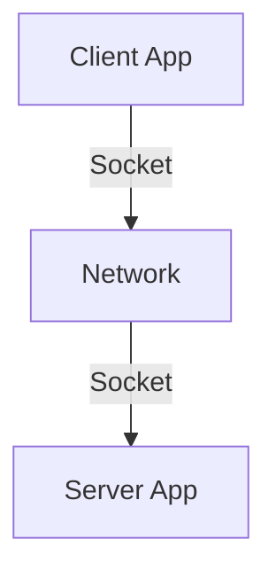

# 2.7 Socket Programming

- Sockets provide an interface for network communication between applications.
- **Types:** TCP sockets (reliable), UDP sockets (unreliable).

---

## Socket API
- **Socket:** Endpoint for communication (IP address + port).
- **API:** Functions to create, bind, listen, accept, connect, send, receive, close.

---

## TCP vs. UDP Sockets
- **TCP:** Connection-oriented, reliable, ordered.
- **UDP:** Connectionless, unreliable, faster.

---

## Code Example: TCP Client (Python)
```python
import socket
s = socket.socket(socket.AF_INET, socket.SOCK_STREAM)
s.connect(('example.com', 80))
s.send(b'GET / HTTP/1.1\r\nHost: example.com\r\n\r\n')
print(s.recv(1024))
s.close()
```

---

## Code Example: UDP Client (Python)
```python
import socket
s = socket.socket(socket.AF_INET, socket.SOCK_DGRAM)
s.sendto(b'Hello', ('example.com', 12345))
print(s.recvfrom(1024))
s.close()
```

---

## Diagram: Socket Communication


---

## Socket Types Table
| Type   | Reliable | Ordered | Connection | Use Case      |
|--------|----------|---------|------------|--------------|
| TCP    | Yes      | Yes     | Yes        | Web, email    |
| UDP    | No       | No      | No         | Streaming, DNS|

---

## Summary Table
| Feature   | TCP Socket | UDP Socket |
|-----------|------------|------------|
| Reliable  | Yes        | No         |
| Ordered   | Yes        | No         |
| Speed     | Slower     | Faster     |

---

## Practice Questions
1. **What is a socket?**
2. **Compare TCP and UDP sockets.**
3. **Write a simple TCP client in Python.**
4. **Write a simple UDP client in Python.**
5. **List three socket API functions.**

---

**Exam Tips:**
- Know socket types, API functions, and their properties.
- Be able to write and explain basic socket code.
- Compare TCP and UDP sockets for exam questions.

---

## 2.7.1 Socket Programming with UDP
- **UDP Socket:** No connection setup, send/receive datagrams.
- **Code Example (Python):**
```python
import socket
s = socket.socket(socket.AF_INET, socket.SOCK_DGRAM)
s.sendto(b'Hello', ('server.com', 12345))
data, addr = s.recvfrom(1024)
```
- **Scenario:** Simple chat app or DNS query.

---

## 2.7.2 Socket Programming with TCP
- **TCP Socket:** Connection setup (3-way handshake), reliable byte stream.
- **Code Example (Python):**
```python
import socket
s = socket.socket(socket.AF_INET, socket.SOCK_STREAM)
s.connect(('server.com', 80))
s.send(b'GET / HTTP/1.1\r\nHost: server.com\r\n\r\n')
data = s.recv(1024)
```
- **Scenario:** Web browser, file transfer.

---

## Practice Questions
1. **Write a simple UDP client in Python.**
2. **Explain the difference between TCP and UDP sockets.**
3. **Describe a scenario where you would use a UDP socket.**

---

## Summary Table
| Socket Type | Connection | Reliability | Use-case      |
|-------------|------------|-------------|--------------|
| UDP         | No         | No          | DNS, VoIP    |
| TCP         | Yes        | Yes         | Web, Email   |

---

**Exam Tips:**
- Know basic socket programming for both UDP and TCP.
- Be able to write and explain simple socket code.
- Understand when to use each socket type.

---

## More Socket Programming Examples
### TCP Server Example (Python)
```python
import socket
s = socket.socket(socket.AF_INET, socket.SOCK_STREAM)
s.bind(('0.0.0.0', 8080))
s.listen(1)
conn, addr = s.accept()
print('Connection from', addr)
data = conn.recv(1024)
conn.send(b'Hello, client!')
conn.close()
```

### UDP Server Example (Python)
```python
import socket
s = socket.socket(socket.AF_INET, socket.SOCK_DGRAM)
s.bind(('0.0.0.0', 12345))
data, addr = s.recvfrom(1024)
print('Received from', addr, data)
s.sendto(b'Hello, UDP client!', addr)
```

---

## REST API Client Example (Python)
```python
import requests
response = requests.get('https://api.example.com/data')
print(response.json())
```

---

## WebSocket Client Example (Python, using websocket-client)
```python
import websocket
ws = websocket.create_connection('ws://echo.websocket.org')
ws.send('Hello, WebSocket!')
print(ws.recv())
ws.close()
```

---

## Security in Socket Programming
- **TLS Sockets:** Use libraries like `ssl` in Python to wrap sockets for encryption.
- **Secure Coding Tips:** Validate input, handle exceptions, avoid hardcoded credentials, use secure protocols (TLS/SSL). 