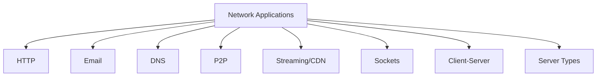

# 2.8 Summary

- Network applications use client-server or P2P architectures.
- Key protocols: HTTP, SMTP, POP3, IMAP, DNS, FTP.
- Concepts: sockets, streaming, CDN, DNS, email, P2P.
- **Client-server roles:** Clear separation of client and server functions.
- **P2P networks:** Decentralized architecture with distributed resources.
- **Multiple roles:** Single computers can serve multiple functions.

---

## Chapter 2: Application Layer - Complete Coverage

### Application Layer Overview
- **Conceptual and implementation aspects** of application-layer protocols
- **Transport-layer service models** and their requirements
- **Client-server paradigm** and its characteristics
- **Peer-to-peer paradigm** and its advantages
- **Popular applications:** Social networking, Web, email, streaming, games, VoIP
- **Programming network applications** using socket API

### Creating Network Applications
- **Write programs that run on different end systems**
- **Communicate over network** (e.g., web server ↔ browser)
- **No need to write software for network-core devices**
- **Applications on end systems allows for rapid app development**

### Processes Communicating
- **Process:** Program running within a host
- **Client process:** Initiates communication
- **Server process:** Waits to be contacted
- **P2P applications:** Have both client and server processes

### Transport Service Requirements
- **Data integrity:** Some apps require 100% reliable transfer, others tolerate loss
- **Timing:** Real-time apps need low delay, others can tolerate higher delays
- **Throughput:** Multimedia apps need minimum throughput, elastic apps use whatever available
- **Security:** Encryption, data integrity, authentication

### Internet Transport Protocols
- **TCP Service:** Reliable transport, flow control, congestion control, connection-oriented
- **UDP Service:** Unreliable data transfer, no guarantees
- **TLS:** Provides encrypted TCP connections, data integrity, end-point authentication

### Web and HTTP
- **Web page structure:** Objects addressable by URLs
- **HTTP:** Stateless protocol using TCP
- **Non-persistent vs Persistent:** Connection management strategies
- **HTTP messages:** Request/response format with headers and body
- **Cookies:** Maintain user/server state, privacy implications
- **Web caching:** Proxy servers, conditional GET, performance benefits

### Electronic Mail
- **Three components:** User agents, mail servers, SMTP
- **SMTP:** TCP-based, command/response, 7-bit ASCII
- **Mail access protocols:** POP3 (download/delete), IMAP (server-side management)
- **POP3 phases:** Authorization, transaction
- **IMAP features:** Folder management, state across sessions

### DNS: Internet Directory Service
- **Services:** Hostname to IP translation, aliasing, load distribution
- **Why distributed:** Avoid single point of failure, traffic volume, maintenance
- **Hierarchy:** Root servers, TLD servers, authoritative servers, local DNS
- **Root servers:** 13 worldwide, geographic distribution, anycast routing
- **Resolution process:** Iterative queries through hierarchy

### P2P Applications
- **Pure P2P:** No always-on server, peers directly communicate
- **File distribution:** Client-server vs P2P performance comparison
- **BitTorrent:** Chunk-based distribution, tit-for-tat, rarest first
- **DHTs:** Distributed hash tables, circular DHT with shortcuts
- **Node management:** Arrival/departure handling

### Video Streaming and CDNs
- **DASH:** Dynamic adaptive streaming over HTTP
- **Client intelligence:** Bandwidth measurement, chunk selection, encoding rate adaptation
- **CDN challenges:** Single server limitations (failure, congestion, distance)
- **CDN strategies:** Enter deep (Akamai), bring home (Limelight)
- **Content access:** DNS-based redirection, HTTP delivery

### Socket Programming
- **Socket API:** BSD4.1 UNIX introduction, client/server paradigm
- **UDP sockets:** No connection, unreliable datagrams, explicit addressing
- **TCP sockets:** Connection-oriented, reliable byte stream, multiple clients
- **Programming models:** Handshake processes for both protocols

---

## Quick Revision Table
| Concept      | Key Point / Example         |
|--------------|----------------------------|
| HTTP         | Web, stateless, TCP        |
| SMTP/POP3    | Email send/receive         |
| DNS          | Name to IP mapping         |
| P2P          | BitTorrent, scalable       |
| CDN          | Video streaming, edge      |
| Socket       | App network interface      |
| **Client**   | **Request/display data**   |
| **Server**   | **Provide services**       |
| **P2P**      | **Decentralized sharing**  |

---

## Mind Map: Chapter 2 Overview

---

## Client-Server Architecture Summary
| Component | Role | Examples | Functions |
|-----------|------|----------|-----------|
| Client | Request/display | Browsers, email clients | User interface, local processing |
| Server | Provide services | Web servers, mail servers | Data storage, processing, management |
| Email Server | Handle email | Exchange, Postfix | SMTP, POP3, IMAP, spam filtering |
| Web Server | Serve web content | Apache, Nginx | HTTP, HTTPS, content delivery |
| File Server | Store files | Windows File Server, Samba | SMB, NFS, access control |
| Database Server | Store data | MySQL, PostgreSQL | SQL, transactions, backup |

---

## P2P Network Summary
| Feature | Client-Server | P2P |
|---------|---------------|-----|
| Scalability | Limited by server | Scales with peers |
| Fault Tolerance | Server failure = down | Survives peer failures |
| Resource Use | Centralized | Distributed |
| Cost | High (servers) | Low (peer resources) |
| Complexity | Simple client | Complex peer software |
| Security | Centralized control | Distributed, harder to secure |

---

## P2P Types Summary
| Type | Purpose | Examples | Characteristics |
|------|---------|----------|-----------------|
| File Sharing | Distribute files | BitTorrent, eMule | Piece-based, tit-for-tat |
| Communication | Direct messaging | Skype, WhatsApp | End-to-end, low latency |
| Computing | Distributed tasks | SETI@home, mining | Task distribution, result collection |

---

## Common Exam Mistakes
- Confusing client-server and P2P architectures.
- Forgetting protocol ports (e.g., HTTP 80, SMTP 25).
- Not distinguishing between POP3 and IMAP.
- Overlooking DNS caching and record types.
- Not practicing socket programming code.
- **New:** Not understanding server roles and types.
- **New:** Confusing P2P network characteristics.
- **New:** Overlooking multiple server roles on single computer.

---

**Exam Tips:**
- Focus on protocol roles, architectures, and code examples.
- Practice drawing diagrams and writing code snippets.
- Avoid common mistakes listed above.
- **New:** Know client-server roles and server types.
- **New:** Understand P2P vs. client-server differences.
- **New:** Be familiar with multiple roles in networks. 