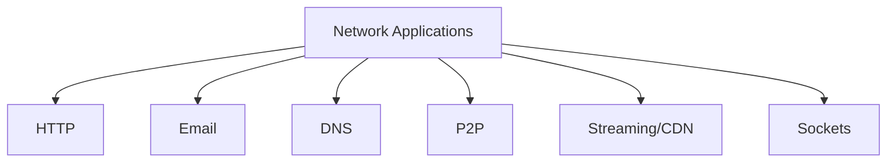

# 2.8 Summary

- Network applications use client-server or P2P architectures.
- Key protocols: HTTP, SMTP, POP3, IMAP, DNS, FTP.
- Concepts: sockets, streaming, CDN, DNS, email, P2P.

---

## Quick Revision Table
| Concept      | Key Point / Example         |
|--------------|----------------------------|
| HTTP         | Web, stateless, TCP        |
| SMTP/POP3    | Email send/receive         |
| DNS          | Name to IP mapping         |
| P2P          | BitTorrent, scalable       |
| CDN          | Video streaming, edge      |
| Socket       | App network interface      |

---

## Mind Map: Chapter 2 Overview

---

## Common Exam Mistakes
- Confusing client-server and P2P architectures.
- Forgetting protocol ports (e.g., HTTP 80, SMTP 25).
- Not distinguishing between POP3 and IMAP.
- Overlooking DNS caching and record types.
- Not practicing socket programming code.

---

**Exam Tips:**
- Focus on protocol roles, architectures, and code examples.
- Practice drawing diagrams and writing code snippets.
- Avoid common mistakes listed above. 