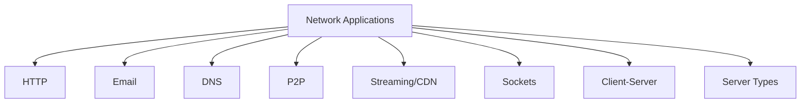

# 2.8 Summary

- Network applications use client-server or P2P architectures.
- Key protocols: HTTP, SMTP, POP3, IMAP, DNS, FTP.
- Concepts: sockets, streaming, CDN, DNS, email, P2P.
- **Client-server roles:** Clear separation of client and server functions.
- **P2P networks:** Decentralized architecture with distributed resources.
- **Multiple roles:** Single computers can serve multiple functions.

---

## Quick Revision Table
| Concept      | Key Point / Example         |
|--------------|----------------------------|
| HTTP         | Web, stateless, TCP        |
| SMTP/POP3    | Email send/receive         |
| DNS          | Name to IP mapping         |
| P2P          | BitTorrent, scalable       |
| CDN          | Video streaming, edge      |
| Socket       | App network interface      |
| **Client**   | **Request/display data**   |
| **Server**   | **Provide services**       |
| **P2P**      | **Decentralized sharing**  |

---

## Mind Map: Chapter 2 Overview

---

## Client-Server Architecture Summary
| Component | Role | Examples | Functions |
|-----------|------|----------|-----------|
| Client | Request/display | Browsers, email clients | User interface, local processing |
| Server | Provide services | Web servers, mail servers | Data storage, processing, management |
| Email Server | Handle email | Exchange, Postfix | SMTP, POP3, IMAP, spam filtering |
| Web Server | Serve web content | Apache, Nginx | HTTP, HTTPS, content delivery |
| File Server | Store files | Windows File Server, Samba | SMB, NFS, access control |
| Database Server | Store data | MySQL, PostgreSQL | SQL, transactions, backup |

---

## P2P Network Summary
| Feature | Client-Server | P2P |
|---------|---------------|-----|
| Scalability | Limited by server | Scales with peers |
| Fault Tolerance | Server failure = down | Survives peer failures |
| Resource Use | Centralized | Distributed |
| Cost | High (servers) | Low (peer resources) |
| Complexity | Simple client | Complex peer software |
| Security | Centralized control | Distributed, harder to secure |

---

## P2P Types Summary
| Type | Purpose | Examples | Characteristics |
|------|---------|----------|-----------------|
| File Sharing | Distribute files | BitTorrent, eMule | Piece-based, tit-for-tat |
| Communication | Direct messaging | Skype, WhatsApp | End-to-end, low latency |
| Computing | Distributed tasks | SETI@home, mining | Task distribution, result collection |

---

## Common Exam Mistakes
- Confusing client-server and P2P architectures.
- Forgetting protocol ports (e.g., HTTP 80, SMTP 25).
- Not distinguishing between POP3 and IMAP.
- Overlooking DNS caching and record types.
- Not practicing socket programming code.
- **New:** Not understanding server roles and types.
- **New:** Confusing P2P network characteristics.
- **New:** Overlooking multiple server roles on single computer.

---

**Exam Tips:**
- Focus on protocol roles, architectures, and code examples.
- Practice drawing diagrams and writing code snippets.
- Avoid common mistakes listed above.
- **New:** Know client-server roles and server types.
- **New:** Understand P2P vs. client-server differences.
- **New:** Be familiar with multiple roles in networks. 