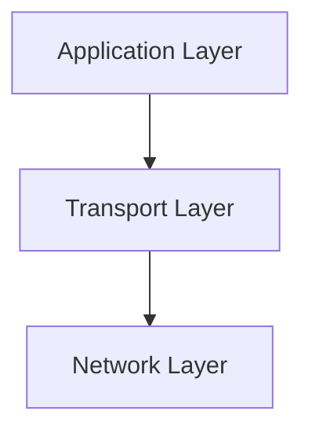

# 3.1 Transport Layer Services

- The transport layer provides logical communication between application processes on different hosts.
- **Key services:** Multiplexing/demultiplexing, reliable data transfer, flow control, congestion control.
- **Protocols:** TCP (reliable), UDP (unreliable), SCTP (stream control transmission protocol).

---

## Service Models
- **Process-to-process:** Communication between applications (e.g., web browser to web server).
- **Host-to-host:** Network layer provides delivery between hosts, not applications.
- **Connection-oriented:** Reliable, ordered (TCP).
- **Connectionless:** Unreliable, unordered (UDP).

---

## Real-World Analogy
- The transport layer is like a delivery service: it ensures packages (data) are delivered to the correct recipient (application) and may guarantee delivery (TCP) or just drop them off (UDP).

---

## Common Transport Protocols Table
| Protocol | Reliable | Ordered | Congestion Ctrl | Use Case      |
|----------|---------|---------|----------------|--------------|
| TCP      | Yes     | Yes     | Yes            | Web, email   |
| UDP      | No      | No      | No             | Streaming    |
| SCTP     | Yes     | Yes     | Yes            | Telephony    |

---

## Diagram: Transport Layer in the Stack

---

## Summary Table
| Service         | TCP      | UDP      |
|-----------------|----------|----------|
| Reliable        | Yes      | No       |
| Ordered         | Yes      | No       |
| Congestion Ctrl | Yes      | No       |
| Flow Control    | Yes      | No       |
| Connection      | Yes      | No       |

---

## Practice Questions
1. **What is the main function of the transport layer?**
2. **Compare TCP and UDP services.**
3. **Give a real-world analogy for the transport layer.**
4. **Explain the difference between process-to-process and host-to-host communication.**
5. **List three transport protocols and their features.**

---

**Exam Tips:**
- Know the key services and differences between TCP, UDP, and SCTP.
- Be able to draw and explain the transport layer's role in the stack.
- Understand process-to-process vs. host-to-host delivery. 