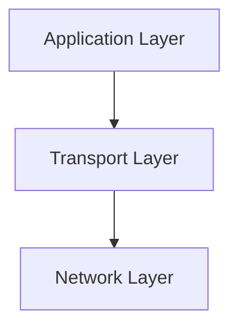

# 3.1 Transport Layer Services

- The transport layer provides logical communication between application processes on different hosts.
- **Key services:** Multiplexing/demultiplexing, reliable data transfer, flow control, congestion control.
- **Protocols:** TCP (reliable), UDP (unreliable), SCTP (stream control transmission protocol).

---

## Transport Layer: Overview

### Our Goals
- **Understand principles behind transport layer services:**
  - Multiplexing, demultiplexing
  - Reliable data transfer
  - Flow control
  - Congestion control
- **Learn about Internet transport layer protocols:**
  - UDP: connectionless transport
  - TCP: connection-oriented reliable transport
  - TCP congestion control

### Transport Layer: Roadmap
1. **Transport-layer services**
2. **Multiplexing and demultiplexing**
3. **Connectionless transport: UDP**
4. **Principles of reliable data transfer**
5. **Connection-oriented transport: TCP**
6. **Principles of congestion control**
7. **TCP congestion control**
8. **Evolution of transport-layer functionality**

---

## Transport Services and Protocols

### Logical Communication
- **Provide logical communication between application processes running on different hosts**
- **Transport protocols actions in end systems:**
  - **Sender:** Breaks application messages into segments, passes to network layer
  - **Receiver:** Reassembles segments into messages, passes to application layer
- **Two transport protocols available to Internet applications:** TCP, UDP

### Transport vs. Network Layer Services

#### Household Analogy
- **12 kids in Ann's house sending letters to 12 kids in Bill's house:**
  - **Hosts = houses**
  - **Processes = kids**
  - **App messages = letters in envelopes**
  - **Transport protocol = Ann and Bill who demux to in-house siblings**
  - **Network-layer protocol = postal service**

#### Key Differences
- **Network layer:** Communication between hosts
- **Transport layer:** Communication between processes
- **Transport layer:** Relies on, enhances, network layer services

### Transport Layer Actions

#### Sender Actions
- **Application message is passed**
- **Determines segment header fields values**
- **Creates segment**
- **Passes segment to IP**

#### Receiver Actions
- **Receives segment from IP**
- **Checks header values**
- **Extracts application-layer message**
- **Demultiplexes message up to application via socket**

---

## Two Principal Internet Transport Protocols

### TCP: Transmission Control Protocol
- **Reliable, in-order delivery**
- **Congestion control**
- **Flow control**
- **Connection setup**

### UDP: User Datagram Protocol
- **Unreliable, unordered delivery**
- **No-frills extension of "best-effort" IP**
- **Services not available:**
  - Delay guarantees
  - Bandwidth guarantees

---

## Service Models
- **Process-to-process:** Communication between applications (e.g., web browser to web server).
- **Host-to-host:** Network layer provides delivery between hosts, not applications.
- **Connection-oriented:** Reliable, ordered (TCP).
- **Connectionless:** Unreliable, unordered (UDP).

---

## Real-World Analogy
- The transport layer is like a delivery service: it ensures packages (data) are delivered to the correct recipient (application) and may guarantee delivery (TCP) or just drop them off (UDP).

---

## Common Transport Protocols Table
| Protocol | Reliable | Ordered | Congestion Ctrl | Use Case      |
|----------|---------|---------|----------------|--------------|
| TCP      | Yes     | Yes     | Yes            | Web, email   |
| UDP      | No      | No      | No             | Streaming    |
| SCTP     | Yes     | Yes     | Yes            | Telephony    |

---

## Diagram: Transport Layer in the Stack

---

## Summary Table
| Service         | TCP      | UDP      |
|-----------------|----------|----------|
| Reliable        | Yes      | No       |
| Ordered         | Yes      | No       |
| Congestion Ctrl | Yes      | No       |
| Flow Control    | Yes      | No       |
| Connection      | Yes      | No       |

---

## Practice Questions
1. **What is the main function of the transport layer?**
2. **Compare TCP and UDP services.**
3. **Give a real-world analogy for the transport layer.**
4. **Explain the difference between process-to-process and host-to-host communication.**
5. **List three transport protocols and their features.**

---

**Exam Tips:**
- Know the key services and differences between TCP, UDP, and SCTP.
- Be able to draw and explain the transport layer's role in the stack.
- Understand process-to-process vs. host-to-host delivery.

---

## Modern Transport Protocol: QUIC
- **QUIC:** Developed by Google, used by HTTP/3. Runs over UDP, provides reliable, multiplexed, and secure connections. Reduces connection setup time and improves performance for web applications. 

---

## Case Studies & Real-World Strategies

### 1. TCP Optimization at Scale
- **Google:** Developed and deployed BBR congestion control for higher throughput and lower latency, now used in YouTube and Google Cloud.
- **Facebook:** Uses DCTCP (Data Center TCP) in its data centers for low-latency, high-throughput communication. Also tunes TCP parameters (window scaling, initial congestion window) for global services.
- **Amazon AWS:** Customizes TCP stack for EC2 and S3 to optimize performance for cloud workloads.

### 2. QUIC and HTTP/3 Deployment
- **Google and Cloudflare:** Early adopters of QUIC (over UDP) and HTTP/3, reducing connection setup time and improving web performance for Gmail, YouTube, and millions of sites.
- **Akamai:** Supports QUIC/HTTP/3 for CDN customers to improve user experience on mobile and high-latency networks.

### 3. UDP in Real-Time and Streaming
- **Netflix, Twitch:** Use UDP for video streaming and real-time chat, with custom reliability and error correction at the application layer.
- **Online Gaming (e.g., Fortnite, League of Legends):** Use UDP for low-latency communication, with in-game logic to handle packet loss and reordering.

### 4. Congestion Control and Fairness
- **ISPs:** Implement Active Queue Management (AQM) techniques (e.g., RED, CoDel) in routers to reduce bufferbloat and improve fairness for all users.
- **Microsoft Azure:** Uses custom congestion control algorithms for cloud networking to balance throughput and latency.

### 5. Reliability and Multipath
- **Apple iOS:** Uses Multipath TCP (MPTCP) to combine WiFi and cellular for seamless handover and improved reliability in FaceTime and Siri.
- **Google Meet:** Uses FEC and adaptive retransmission for real-time video/audio reliability over UDP. 