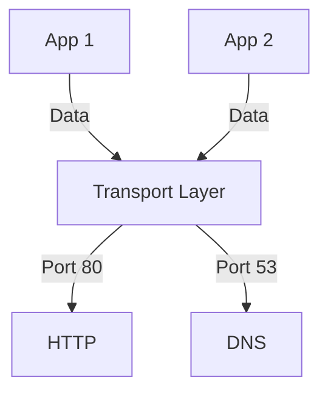

# 3.2 Multiplexing and Demultiplexing

- Multiplexing: Combining data from multiple applications for transmission.
- Demultiplexing: Delivering received data to the correct application.
- **Port numbers:** Identify applications on a host.

---

## Multiplexing/Demultiplexing

### Basic Concept
- **Multiplexing as sender:** Handle data from multiple sockets, add transport header (later used for demultiplexing)
- **Demultiplexing as receiver:** Use header info to deliver received segments to correct socket

### How Demultiplexing Works
- **Host receives IP datagrams**
- **Each datagram has source IP address, destination IP address**
- **Each datagram carries one transport-layer segment**
- **Each segment has source, destination port number**
- **Host uses IP addresses & port numbers to direct segment to appropriate socket**

### TCP/UDP Segment Format
```
source port #    dest port #
32 bits
application data (payload)
other header fields
```

---

## Connectionless Demultiplexing (UDP)

### UDP Socket Creation
- **When creating socket, must specify host-local port #:**
  ```java
  DatagramSocket mySocket1 = new DatagramSocket(12534);
  ```
- **When receiving host receives UDP segment:**
  - Checks destination port # in segment
  - Directs UDP segment to socket with that port #
- **When creating datagram to send into UDP socket, must specify:**
  - Destination IP address
  - Destination port #

### UDP Demultiplexing Rule
- **IP/UDP datagrams with same dest. port #, but different source IP addresses and/or source port numbers will be directed to same socket at receiving host**

### Connectionless Demultiplexing Example
- **Host A:** Creates UDP socket with port 9157
- **Host B:** Creates UDP socket with port 5775
- **Host C:** Creates UDP socket with port 6428
- **Host D:** Creates UDP socket with port 6428
- **All segments with dest port 6428 go to same socket on hosts C and D**

---

## Connection-Oriented Demultiplexing (TCP)

### TCP Socket Identification
- **TCP socket identified by 4-tuple:**
  - Source IP address
  - Source port number
  - Dest IP address
  - Dest port number
- **Server may support many simultaneous TCP sockets:**
  - Each socket identified by its own 4-tuple
  - Each socket associated with a different connecting client
- **Demux:** Receiver uses all four values (4-tuple) to direct segment to appropriate socket

### Connection-Oriented Demultiplexing Example
- **Server (IP address B):** Has multiple TCP sockets
- **Client 1 (IP A, port 9157):** Connects to server port 80
- **Client 2 (IP C, port 5775):** Connects to server port 80
- **Client 3 (IP C, port 9157):** Connects to server port 80
- **Three segments, all destined to IP address B, dest port 80 are demultiplexed to different sockets**

### Key Question
- **Q: How did transport layer know to deliver message to Firefox browser process rather than Netflix process or Skype process?**
- **A: Through port numbers and socket addressing**

---

## Socket Addressing
- **Socket:** (IP address, port number) pair.
- **Well-known ports:** HTTP (80), HTTPS (443), FTP (21), DNS (53), SMTP (25), SSH (22).
- **Ephemeral ports:** Temporary ports assigned to client applications.

---

## Table: Well-Known Ports
| Port | Service   |
|------|-----------|
| 21   | FTP       |
| 22   | SSH       |
| 25   | SMTP      |
| 53   | DNS       |
| 80   | HTTP      |
| 110  | POP3      |
| 143  | IMAP      |
| 443  | HTTPS     |

---

## Diagram: Multiplexing/Demultiplexing


---

## Summary Table
| Concept      | Description                        |
|-------------|------------------------------------|
| Multiplexing| Combine data from apps              |
| Demultiplex | Deliver to correct app (port)       |
| Socket      | IP + port identifies app endpoint   |

---

## Practice Questions
1. **What is multiplexing in the transport layer?**
2. **How does a socket identify an application?**
3. **List two well-known port numbers and their uses.**
4. **What is an ephemeral port?**
5. **Give an example of socket addressing.**

---

**Exam Tips:**
- Know the role of port numbers and sockets.
- Be able to draw multiplexing/demultiplexing diagrams.
- Memorize well-known ports for the exam.

---

## Socket Pairs and Unique Connections
- **Socket Pair:** (Source IP, Source Port, Destination IP, Destination Port) uniquely identifies each connection.
- **Example:** Two clients from the same IP can connect to the same server using different source ports.

## Ephemeral Ports
- **Ephemeral Ports:** Temporary ports assigned by the OS to client applications for outgoing connections (typically in the range 49152–65535).
- **Allocation:** OS selects an unused port for each new connection. 