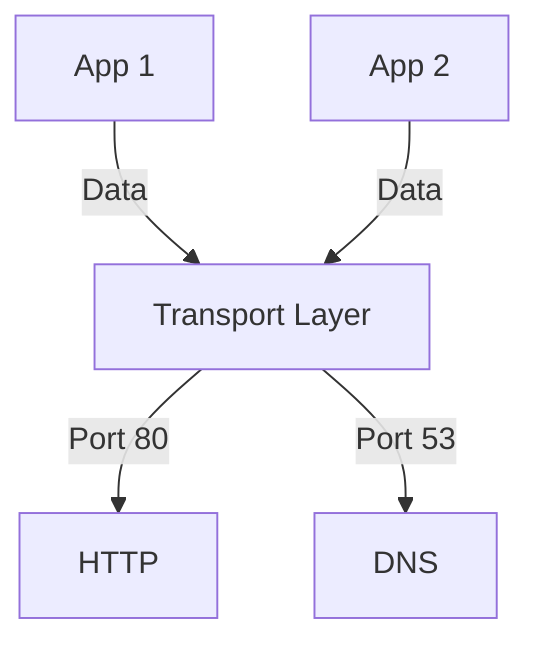

# 3.2 Multiplexing and Demultiplexing

- Multiplexing: Combining data from multiple applications for transmission.
- Demultiplexing: Delivering received data to the correct application.
- **Port numbers:** Identify applications on a host.

---

## Socket Addressing
- **Socket:** (IP address, port number) pair.
- **Well-known ports:** HTTP (80), HTTPS (443), FTP (21), DNS (53), SMTP (25), SSH (22).
- **Ephemeral ports:** Temporary ports assigned to client applications.

---

## Table: Well-Known Ports
| Port | Service   |
|------|-----------|
| 21   | FTP       |
| 22   | SSH       |
| 25   | SMTP      |
| 53   | DNS       |
| 80   | HTTP      |
| 110  | POP3      |
| 143  | IMAP      |
| 443  | HTTPS     |

---

## Diagram: Multiplexing/Demultiplexing

---

## Summary Table
| Concept      | Description                        |
|-------------|------------------------------------|
| Multiplexing| Combine data from apps              |
| Demultiplex | Deliver to correct app (port)       |
| Socket      | IP + port identifies app endpoint   |

---

## Practice Questions
1. **What is multiplexing in the transport layer?**
2. **How does a socket identify an application?**
3. **List two well-known port numbers and their uses.**
4. **What is an ephemeral port?**
5. **Give an example of socket addressing.**

---

**Exam Tips:**
- Know the role of port numbers and sockets.
- Be able to draw multiplexing/demultiplexing diagrams.
- Memorize well-known ports for the exam.

---

## Socket Pairs and Unique Connections
- **Socket Pair:** (Source IP, Source Port, Destination IP, Destination Port) uniquely identifies each connection.
- **Example:** Two clients from the same IP can connect to the same server using different source ports.

## Ephemeral Ports
- **Ephemeral Ports:** Temporary ports assigned by the OS to client applications for outgoing connections (typically in the range 49152–65535).
- **Allocation:** OS selects an unused port for each new connection. 