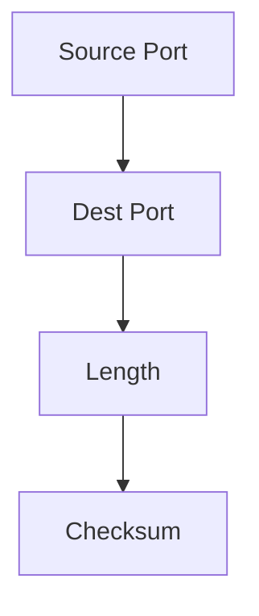

# 3.3 UDP

- UDP (User Datagram Protocol) is a simple, connectionless transport protocol.
- **Features:** Unreliable, unordered, no congestion or flow control, low overhead.
- **Use cases:** Streaming, DNS, VoIP, gaming, DHCP, SNMP.

---

## UDP Header Format
- **Fields:** Source port, destination port, length, checksum.
- **No sequence numbers or acknowledgments.**

---

## Table: UDP vs. TCP Features
| Feature     | UDP      | TCP      |
|-------------|----------|----------|
| Reliable    | No       | Yes      |
| Ordered     | No       | Yes      |
| Overhead    | Low      | High     |
| Use Case    | Streaming| Web, email|
| Congestion  | No       | Yes      |
| Flow Ctrl   | No       | Yes      |

---

## Diagram: UDP Header

---

## Summary Table
| Feature     | UDP Value |
|-------------|-----------|
| Reliable    | No        |
| Ordered     | No        |
| Overhead    | Low       |
| Use Case    | Streaming |

---

## Practice Questions
1. **List two features of UDP.**
2. **Give an example use case for UDP.**
3. **Draw the UDP header format.**
4. **Compare UDP and TCP for reliability and overhead.**
5. **List the fields in a UDP header.**

---

**Exam Tips:**
- Know UDP features, header fields, and use cases.
- Be able to draw and explain the UDP header.
- Compare UDP and TCP for exam questions.

---

## UDP Checksum
- **Purpose:** Detects errors in transmitted segments.
- **Calculation:** Covers UDP header, data, and a pseudo-header (includes source/dest IPs).
- **Importance:** Ensures data integrity; if checksum fails, segment is discarded.

## More UDP Use Cases
- **VoIP:** Real-time voice communication.
- **Online Gaming:** Low-latency updates.
- **DHCP:** Dynamic IP address assignment.
- **SNMP:** Network management. 