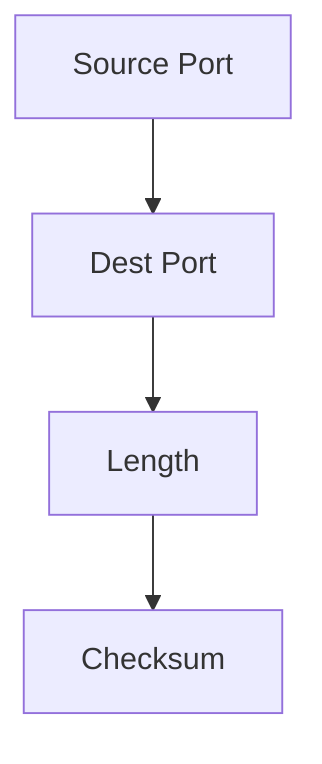

# 3.3 UDP

- UDP (User Datagram Protocol) is a simple, connectionless transport protocol.
- **Features:** Unreliable, unordered, no congestion or flow control, low overhead.
- **Use cases:** Streaming, DNS, VoIP, gaming, DHCP, SNMP.

---

## UDP: User Datagram Protocol

### UDP Characteristics
- **"No frills," "bare bones" Internet transport protocol**
- **"Best effort" service, UDP segments may be:**
  - Lost
  - Delivered out-of-order to app
- **No connection establishment** (which can add RTT delay)
- **Simple:** No connection state at sender, receiver
- **Small header size**
- **No congestion control**
- **UDP can blast away as fast as desired!**
- **Can function in the face of congestion**

### Why is There a UDP?
- **Connectionless:**
  - No handshaking between UDP sender, receiver
  - Each UDP segment handled independently of others

### UDP Use Cases
- **Streaming multimedia apps** (loss tolerant, rate sensitive)
- **DNS**
- **SNMP**
- **HTTP/3**
- **If reliable transfer needed over UDP (e.g., HTTP/3):**
  - Add needed reliability at application layer
  - Add congestion control at application layer

---

## UDP: Transport Layer Actions

### UDP Sender Actions
- **Application-layer message is passed**
- **Determines UDP segment header fields values**
- **Creates UDP segment**
- **Passes segment to IP**

### UDP Receiver Actions
- **Receives segment from IP**
- **Checks UDP checksum header value**
- **Extracts application-layer message**
- **Demultiplexes message up to application via socket**

---

## UDP Segment Header

### UDP Segment Format
```
source port #    dest port #
32 bits
application data (payload)
length    checksum
```

### Header Fields
- **Length:** In bytes of UDP segment, including header
- **Checksum:** Data to/from application layer

---

## UDP Checksum

### Goal
- **Detect errors (i.e., flipped bits) in transmitted segment**

### Internet Checksum Algorithm
- **Sender:**
  - Treat contents of UDP segment (including UDP header fields and IP addresses) as sequence of 16-bit integers
  - Checksum: addition (one's complement sum) of segment content
  - Checksum value put into UDP checksum field
- **Receiver:**
  - Compute checksum of received segment
  - Check if computed checksum equals checksum field value:
    - Not equal - error detected
    - Equal - no error detected. But maybe errors nonetheless?

### Internet Checksum Example
- **Add two 16-bit integers:**
  - Sum: 1 1 0 1 1 1 0 1 1 1 0 1 1 1 0 1 1
  - Wraparound: 1 0 1 1 1 0 1 1 1 0 1 1 1 1 0 0
  - Checksum: 0 1 0 0 0 1 0 0 0 1 0 0 0 0 1 1

### Internet Checksum: Weak Protection!
- **Example:** Even though numbers have changed (bit flips), no change in checksum!
- **Limitation:** May miss some error patterns

---

## UDP Header Format
- **Fields:** Source port, destination port, length, checksum.
- **No sequence numbers or acknowledgments.**

---

## Table: UDP vs. TCP Features
| Feature     | UDP      | TCP      |
|-------------|----------|----------|
| Reliable    | No       | Yes      |
| Ordered     | No       | Yes      |
| Overhead    | Low      | High     |
| Use Case    | Streaming| Web, email|
| Congestion  | No       | Yes      |
| Flow Ctrl   | No       | Yes      |

---

## Diagram: UDP Header


---

## Summary Table
| Feature     | UDP Value |
|-------------|-----------|
| Reliable    | No        |
| Ordered     | No        |
| Overhead    | Low       |
| Use Case    | Streaming |

---

## Practice Questions
1. **List two features of UDP.**
2. **Give an example use case for UDP.**
3. **Draw the UDP header format.**
4. **Compare UDP and TCP for reliability and overhead.**
5. **List the fields in a UDP header.**

---

**Exam Tips:**
- Know UDP features, header fields, and use cases.
- Be able to draw and explain the UDP header.
- Compare UDP and TCP for exam questions.

---

## UDP Checksum
- **Purpose:** Detects errors in transmitted segments.
- **Calculation:** Covers UDP header, data, and a pseudo-header (includes source/dest IPs).
- **Importance:** Ensures data integrity; if checksum fails, segment is discarded.

## More UDP Use Cases
- **VoIP:** Real-time voice communication.
- **Online Gaming:** Low-latency updates.
- **DHCP:** Dynamic IP address assignment.
- **SNMP:** Network management. 