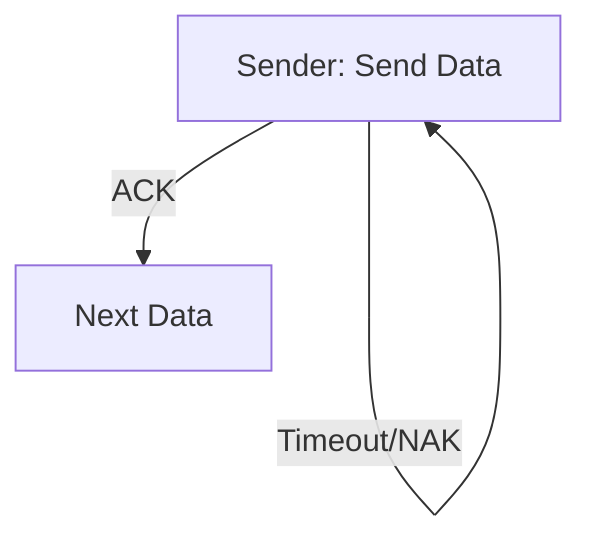

# 3.4 Reliable Data Transfer

- Reliable Data Transfer (RDT) ensures data is delivered correctly and in order.
- **Key concepts:** Acknowledgments (ACK), negative ACK (NAK), timeouts, retransmissions.
- **Protocols:** rdt1.0 (no errors), rdt2.0 (error detection), rdt3.0 (loss, timeouts), Go-Back-N, Selective Repeat.

---

## Principles of Reliable Data Transfer

### Reliable Service Abstraction
- **Sending process → data → receiving process**
- **Reliable channel** provides perfect data transfer

### Reliable Service Implementation
- **Sending process → data → unreliable channel → receiving process**
- **Sender-side of reliable data transfer protocol**
- **Receiver-side of reliable data transfer protocol**
- **Complexity depends on characteristics of unreliable channel** (lose, corrupt, reorder data?)

### Key Insight
- **Sender, receiver do not know the "state" of each other** (e.g., was a message received?)
- **Unless communicated via a message**

---

## Reliable Data Transfer Protocol (rdt): Interfaces

### Protocol Functions
- **rdt_send():** Called from above (e.g., by app.). Passed data to deliver to receiver upper layer
- **udt_send():** Called by rdt to transfer packet over unreliable channel to receiver
- **rdt_rcv():** Called when packet arrives on receiver side of channel
- **deliver_data():** Called by rdt to deliver data to upper layer

### Bi-directional Communication
- **Bidirectional communication over unreliable channel**
- **Control info will flow in both directions!**

### Finite State Machines (FSM)
- **Use finite state machines (FSM) to specify sender, receiver**
- **State:** When in this "state" next state uniquely determined by next event
- **Event:** Actions taken on state transition

---

## rdt1.0: Reliable Transfer Over a Reliable Channel

### Assumptions
- **Underlying channel perfectly reliable**
- **No bit errors**
- **No loss of packets**

### Separate FSMs for Sender and Receiver
- **Sender sends data into underlying channel**
- **Receiver reads data from underlying channel**

### FSM Specifications
- **Sender:** Wait for call from above → send packet → wait for call from above
- **Receiver:** Wait for call from below → deliver data → wait for call from below

---

## rdt2.0: Channel with Bit Errors

### Assumptions
- **Underlying channel may flip bits in packet**
- **Checksum (e.g., Internet checksum) to detect bit errors**
- **Question:** How to recover from errors?

### Error Recovery Mechanisms
- **Acknowledgements (ACKs):** Receiver explicitly tells sender that pkt received OK
- **Negative acknowledgements (NAKs):** Receiver explicitly tells sender that pkt had errors
- **Sender retransmits pkt on receipt of NAK**
- **Stop and wait:** Sender sends one packet, then waits for receiver response

### FSM Specifications
- **Sender states:** Wait for call from above, Wait for ACK or NAK
- **Receiver states:** Wait for call from below
- **Actions:** Send packet, send ACK/NAK, retransmit on NAK

---

## rdt2.1: Handling Garbled ACK/NAKs

### Problem with rdt2.0
- **What happens if ACK/NAK corrupted?**
- **Sender doesn't know what happened at receiver!**
- **Can't just retransmit: possible duplicate**

### Solution
- **Handling duplicates:**
  - Sender retransmits current pkt if ACK/NAK corrupted
  - Sender adds sequence number to each pkt
  - Receiver discards (doesn't deliver up) duplicate pkt
- **Stop and wait:** Sender sends one packet, then waits for receiver response

### FSM Specifications
- **Sender:** Two states for each sequence number (0 and 1)
- **Receiver:** Two states for each expected sequence number
- **Sequence numbers:** 0 and 1 sufficient (alternating)

---

## rdt2.2: A NAK-Free Protocol

### Same Functionality as rdt2.1
- **Using ACKs only**
- **Instead of NAK, receiver sends ACK for last pkt received OK**
- **Receiver must explicitly include seq # of pkt being ACKed**
- **Duplicate ACK at sender results in same action as NAK: retransmit current pkt**

### TCP Connection
- **As we will see, TCP uses this approach to be NAK-free**

---

## rdt3.0: Channels with Errors and Loss

### New Channel Assumption
- **Underlying channel can also lose packets (data, ACKs)**
- **Checksum, sequence #s, ACKs, retransmissions will be of help … but not quite enough**

### Approach
- **Sender waits "reasonable" amount of time for ACK**
- **Retransmits if no ACK received in this time**
- **If pkt (or ACK) just delayed (not lost):**
  - Retransmission will be duplicate, but seq #s already handles this!
- **Receiver must specify seq # of packet being ACKed**

### Timeout Mechanism
- **Use countdown timer to interrupt after "reasonable" amount of time**

### FSM Specifications
- **Sender:** Includes timeout events and timer management
- **States:** Wait for call from above, Wait for ACK0, Wait for ACK1
- **Actions:** Start timer, stop timer, retransmit on timeout

---

## rdt3.0 in Action

### Scenarios
1. **No loss:** Normal operation
2. **Packet loss:** Timeout triggers retransmission
3. **ACK loss:** Cumulative ACK covers for earlier lost ACK
4. **Premature timeout:** Duplicate packets handled by sequence numbers

### Performance Analysis
- **Example:** 1 Gbps link, 15 ms prop. delay, 8000 bit packet
- **Dtrans = L/R = 8000 bits / 10^9 bits/sec = 8 microsecs**
- **U sender = L/R / (RTT + L/R) = 0.00027**
- **Protocol limits performance of underlying infrastructure (channel)**

---

## Pipelined Protocols

### Problem with Stop-and-Wait
- **rdt3.0 protocol performance stinks!**
- **Protocol limits performance of underlying infrastructure (channel)**

### Solution: Pipelining
- **Sender allows multiple, "in-flight", yet-to-be-acknowledged packets**
- **Range of sequence numbers must be increased**
- **Buffering at sender and/or receiver**

### Increased Utilization
- **3-packet pipelining increases utilization by a factor of 3!**

---

## Go-Back-N: Sender

### Sender Characteristics
- **"Window" of up to N, consecutive transmitted but unACKed pkts**
- **k-bit seq # in pkt header**
- **Cumulative ACK:** ACK(n): ACKs all packets up to, including seq # n
- **On receiving ACK(n):** Move window forward to begin at n+1
- **Timer for oldest in-flight packet**
- **Timeout(n):** Retransmit packet n and all higher seq # packets in window

---

## Go-Back-N: Receiver

### Receiver Characteristics
- **ACK-only:** Always send ACK for correctly-received packet so far, with highest in-order seq #
- **May generate duplicate ACKs**
- **Need only remember rcv_base**
- **On receipt of out-of-order packet:**
  - Can discard (don't buffer) or buffer: an implementation decision
  - Re-ACK pkt with highest in-order seq #

### Receiver View of Sequence Number Space
- **rcv_base:** Received and ACKed
- **Out-of-order:** Received but not ACKed
- **Not received**

---

## Selective Repeat: The Approach

### Pipelining
- **Multiple packets in flight**
- **Receiver individually ACKs all correctly received packets**
- **Buffers packets, as needed, for in-order delivery to upper layer**

### Sender Characteristics
- **Maintains (conceptually) a timer for each unACKed pkt**
- **Timeout:** Retransmits single unACKed packet associated with timeout
- **Maintains (conceptually) "window" over N consecutive seq #s**
- **Limits pipelined, "in flight" packets to be within this window**

---

## Selective Repeat: Sender and Receiver

### Sender Actions
- **Data from above:** If next available seq # in window, send packet
- **Timeout(n):** Resend packet n, restart timer
- **ACK(n) in [sendbase,sendbase+N-1]:** Mark packet n as received
- **If n smallest unACKed packet:** Advance window base to next unACKed seq #

### Receiver Actions
- **Packet n in [rcvbase, rcvbase+N-1]:** Send ACK(n), out-of-order: buffer, in-order: deliver (also deliver buffered, in-order packets), advance window to next not-yet-received packet
- **Packet n in [rcvbase-N,rcvbase-1]:** ACK(n)
- **Otherwise:** Ignore

---

## Selective Repeat: A Dilemma!

### Problem Scenario
- **Example:** seq #s: 0, 1, 2, 3 (base 4 counting), window size=3
- **Question:** What relationship is needed between sequence # size and window size to avoid problem?

### Key Insight
- **Receiver can't see sender side**
- **Receiver behavior identical in both cases!**
- **Something's (very) wrong!**

---

## Pipelined Protocols
- **Go-Back-N:** Sender can send N unacknowledged packets; on error, retransmit from error onward.
- **Selective Repeat:** Only retransmit lost packets; receiver buffers out-of-order packets.

---

## State Diagram: rdt3.0

---

## Error Handling
- **Checksums:** Detect errors.
- **Timeouts:** Retransmit lost packets.
- **Sequence numbers:** Ensure order.

---

## RDT Protocols Table
| Protocol      | Handles Errors | Handles Loss | Uses Timeout | Pipelined | Buffering |
|--------------|---------------|-------------|-------------|-----------|-----------|
| rdt1.0       | No            | No          | No          | No        | No        |
| rdt2.0       | Yes           | No          | No          | No        | No        |
| rdt3.0       | Yes           | Yes         | Yes         | No        | No        |
| Go-Back-N    | Yes           | Yes         | Yes         | Yes       | Sender    |
| Selective Rep| Yes           | Yes         | Yes         | Yes       | Both      |

---

## Summary Table
| Protocol | Handles Errors | Handles Loss | Uses Timeout |
|----------|---------------|-------------|-------------|
| rdt1.0   | No            | No          | No          |
| rdt2.0   | Yes           | No          | No          |
| rdt3.0   | Yes           | Yes         | Yes         |

---

## Practice Questions
1. **What is the purpose of ACK and NAK?**
2. **How does rdt3.0 handle packet loss?**
3. **Draw a state diagram for rdt3.0.**
4. **Compare Go-Back-N and Selective Repeat.**
5. **List the main differences between rdt1.0, rdt2.0, and rdt3.0.**

---

**Exam Tips:**
- Know the differences between RDT protocols.
- Be able to draw and explain state diagrams.
- Compare pipelined protocols for exam questions.

---

## More on Error Handling and Sequence Numbers
- **Error Handling:** Retransmissions triggered by timeouts or NAKs. Sequence numbers prevent duplicate delivery and ensure correct order.
- **Protocol Comparison:**
  - **Go-Back-N:** Simpler, but less efficient if loss is frequent (many unnecessary retransmissions).
  - **Selective Repeat:** More efficient, but requires more complex buffering and logic.
- **When to Use:** Use Go-Back-N for simple, low-loss links; Selective Repeat for high-loss or high-bandwidth-delay links. 