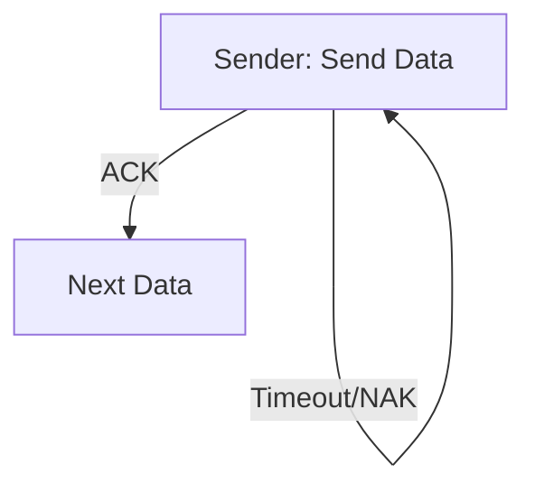

# 3.4 Reliable Data Transfer

- Reliable Data Transfer (RDT) ensures data is delivered correctly and in order.
- **Key concepts:** Acknowledgments (ACK), negative ACK (NAK), timeouts, retransmissions.
- **Protocols:** rdt1.0 (no errors), rdt2.0 (error detection), rdt3.0 (loss, timeouts), Go-Back-N, Selective Repeat.

---

## Pipelined Protocols
- **Go-Back-N:** Sender can send N unacknowledged packets; on error, retransmit from error onward.
- **Selective Repeat:** Only retransmit lost packets; receiver buffers out-of-order packets.

---

## State Diagram: rdt3.0

---

## Error Handling
- **Checksums:** Detect errors.
- **Timeouts:** Retransmit lost packets.
- **Sequence numbers:** Ensure order.

---

## RDT Protocols Table
| Protocol      | Handles Errors | Handles Loss | Uses Timeout | Pipelined | Buffering |
|--------------|---------------|-------------|-------------|-----------|-----------|
| rdt1.0       | No            | No          | No          | No        | No        |
| rdt2.0       | Yes           | No          | No          | No        | No        |
| rdt3.0       | Yes           | Yes         | Yes         | No        | No        |
| Go-Back-N    | Yes           | Yes         | Yes         | Yes       | Sender    |
| Selective Rep| Yes           | Yes         | Yes         | Yes       | Both      |

---

## Summary Table
| Protocol | Handles Errors | Handles Loss | Uses Timeout |
|----------|---------------|-------------|-------------|
| rdt1.0   | No            | No          | No          |
| rdt2.0   | Yes           | No          | No          |
| rdt3.0   | Yes           | Yes         | Yes         |

---

## Practice Questions
1. **What is the purpose of ACK and NAK?**
2. **How does rdt3.0 handle packet loss?**
3. **Draw a state diagram for rdt3.0.**
4. **Compare Go-Back-N and Selective Repeat.**
5. **List the main differences between rdt1.0, rdt2.0, and rdt3.0.**

---

**Exam Tips:**
- Know the differences between RDT protocols.
- Be able to draw and explain state diagrams.
- Compare pipelined protocols for exam questions.

---

## More on Error Handling and Sequence Numbers
- **Error Handling:** Retransmissions triggered by timeouts or NAKs. Sequence numbers prevent duplicate delivery and ensure correct order.
- **Protocol Comparison:**
  - **Go-Back-N:** Simpler, but less efficient if loss is frequent (many unnecessary retransmissions).
  - **Selective Repeat:** More efficient, but requires more complex buffering and logic.
- **When to Use:** Use Go-Back-N for simple, low-loss links; Selective Repeat for high-loss or high-bandwidth-delay links. 