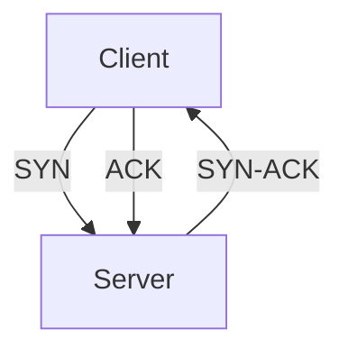

# 3.5 TCP

- TCP (Transmission Control Protocol) is a reliable, connection-oriented transport protocol.
- **Features:** Reliable, ordered, congestion and flow control, byte-stream.

---

## Connection Setup and Teardown
- **Three-way handshake:** SYN, SYN-ACK, ACK.
- **Teardown:** FIN, ACK.

---

## TCP Header Format
- **Fields:** Source port, dest port, seq number, ack number, flags, window, checksum, urgent pointer.

---

## Diagram: TCP Three-Way Handshake

---

## Summary Table
| Feature     | TCP Value |
|-------------|-----------|
| Reliable    | Yes       |
| Ordered     | Yes       |
| Flow Ctrl   | Yes       |
| Congestion  | Yes       |
| Use Case    | Web, Email|

---

## Practice Questions
1. **List three features of TCP.**
2. **Describe the three-way handshake.**
3. **Draw the TCP header format.**

---

**Exam Tips:**
- Know TCP features and header fields.
- Be able to draw handshake and header diagrams. 