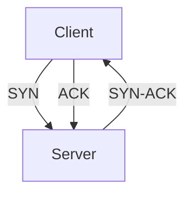
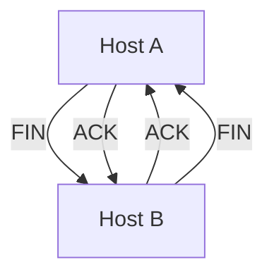

# 3.5 TCP

- TCP (Transmission Control Protocol) is a reliable, connection-oriented transport protocol.
- **Features:** Reliable, ordered, congestion and flow control, byte-stream.

---

## TCP: Overview RFCs: 793,1122, 2018, 5681, 7323

### TCP Characteristics
- **Cumulative ACKs**
- **Pipelining:** TCP congestion and flow control set window size
- **Connection-oriented:** Handshaking (exchange of control messages) initializes sender, receiver state before data exchange
- **Flow controlled:** Sender will not overwhelm receiver
- **Point-to-point:** One sender, one receiver
- **Reliable, in-order byte stream:** No "message boundaries"
- **Full duplex data:** Bi-directional data flow in same connection
- **MSS:** Maximum segment size

---

## TCP Segment Structure

### TCP Header Fields
```
source port #    dest port #
32 bits
sequence number
acknowledgement number
not used
receive window
flow control: # bytes receiver willing to accept
head len
length (of TCP header)
checksum
Internet checksum
options (variable length)
TCP options
application data (variable length)
data sent by application into TCP socket
```

### Control Bits
- **RST, SYN, FIN:** Connection management
- **P, U, C, E:** Congestion notification
- **Urg data pointer:** Urgent data pointer

---

## TCP Sequence Numbers, ACKs

### Sequence Numbers
- **Byte stream "number" of first byte in segment's data**

### Acknowledgements
- **Seq # of next byte expected from other side**
- **Cumulative ACK**

### Sequence Number Space
- **Sent, ACKed:** Already acknowledged
- **Sent, not-yet ACKed ("in-flight"):** In transit
- **Usable but not yet sent:** Available to send
- **Not usable:** Outside window

### Key Question
- **Q: How receiver handles out-of-order segments?**
- **A: TCP spec doesn't say - up to implementor**

---

## TCP Sequence Numbers, ACKs Example

### Simple Telnet Scenario
- **Host A:** User types 'C'
- **Host B:** Host ACKs receipt of echoed 'C'
- **Host B:** Host ACKs receipt of 'C', echoes back 'C'
- **Host A:** Seq=42, ACK=79, data = 'C'
- **Host B:** Seq=79, ACK=43, data = 'C'
- **Host A:** Seq=43, ACK=80

---

## TCP Round Trip Time, Timeout

### Key Questions
- **Q: How to set TCP timeout value?**
  - Longer than RTT, but RTT varies!
  - Too short: premature timeout, unnecessary retransmissions
  - Too long: slow reaction to segment loss
- **Q: How to estimate RTT?**
  - SampleRTT: measured time from segment transmission until ACK receipt
  - Ignore retransmissions
  - SampleRTT will vary, want estimated RTT "smoother"
  - Average several recent measurements, not just current SampleRTT

### RTT Estimation
- **EstimatedRTT = (1- α)*EstimatedRTT + α*SampleRTT**
- **Exponential weighted moving average (EWMA)**
- **Influence of past sample decreases exponentially fast**
- **Typical value: α = 0.125**

### Timeout Interval
- **TimeoutInterval = EstimatedRTT + 4*DevRTT**
- **Estimated RTT + "safety margin"**
- **Large variation in EstimatedRTT: want a larger safety margin**
- **DevRTT = (1-β)*DevRTT + β*|SampleRTT-EstimatedRTT|**
- **Typically, β = 0.25**
- **DevRTT: EWMA of SampleRTT deviation from EstimatedRTT**

---

## TCP Sender (Simplified)

### Events and Actions
- **Event: data received from application**
  - Create segment with seq #
  - Seq # is byte-stream number of first data byte in segment
  - Start timer if not already running
  - Think of timer as for oldest unACKed segment
  - Expiration interval: TimeOutInterval
- **Event: timeout**
  - Retransmit segment that caused timeout
  - Restart timer
- **Event: ACK received**
  - If ACK acknowledges previously unACKed segments
  - Update what is known to be ACKed
  - Start timer if there are still unACKed segments

---

## TCP Receiver: ACK Generation [RFC 5681]

### Event at Receiver and TCP Receiver Action
- **Arrival of in-order segment with expected seq #. All data up to expected seq # already ACKed**
  - **TCP receiver action:** Delayed ACK. Wait up to 500ms for next segment. If no next segment, send ACK
- **Arrival of in-order segment with expected seq #. One other segment has ACK pending**
  - **TCP receiver action:** Immediately send single cumulative ACK, ACKing both in-order segments
- **Arrival of out-of-order segment higher-than-expect seq. #. Gap detected**
  - **TCP receiver action:** Immediately send duplicate ACK, indicating seq. # of next expected byte
- **Arrival of segment that partially or completely fills gap**
  - **TCP receiver action:** Immediate send ACK, provided that segment starts at lower end of gap

---

## TCP: Retransmission Scenarios

### Lost ACK Scenario
- **Host A:** Seq=92, 8 bytes of data
- **Host B:** ACK=100
- **ACK lost:** X
- **Host A:** Timeout, retransmit
- **Host B:** ACK=100 (duplicate ACK)

### Premature Timeout
- **Host A:** Seq=92, 8 bytes of data
- **Host B:** ACK=120
- **Host A:** Timeout (premature)
- **Host A:** Retransmit
- **Host B:** ACK=120 (cumulative ACK covers for earlier lost ACK)

---

## TCP Fast Retransmit

### Triple Duplicate ACKs
- **If sender receives 3 additional ACKs for same data ("triple duplicate ACKs"), resend unACKed segment with smallest seq #**
- **Likely that unACKed segment lost, so don't wait for timeout**

### Example
- **Host A:** Seq=92, 8 bytes of data
- **Host B:** ACK=100
- **Host A:** Seq=100, 20 bytes of data
- **Host B:** ACK=100 (duplicate)
- **Host B:** ACK=100 (duplicate)
- **Host B:** ACK=100 (duplicate)
- **Host A:** Fast retransmit (don't wait for timeout)

---

## TCP Flow Control

### Problem
- **Q: What happens if network layer delivers data faster than application layer removes data from socket buffers?**

### Solution: Flow Control
- **TCP receiver "advertises" free buffer space in rwnd field in TCP header**
- **RcvBuffer size set via socket options (typical default is 4096 bytes)**
- **Many operating systems auto-adjust RcvBuffer**
- **Sender limits amount of unACKed ("in-flight") data to received rwnd**
- **Guarantees receive buffer will not overflow**

### TCP Receiver-Side Buffering
- **Buffered data**
- **Free buffer space**
- **rwnd**
- **RcvBuffer**
- **TCP segment payloads**
- **To application process**

---

## TCP Connection Management

### Before Exchanging Data
- **Sender/receiver "handshake":**
  - Agree to establish connection (each knowing the other willing to establish connection)
  - Agree on connection parameters (e.g., starting seq #s)

### Connection State: ESTAB
- **Connection variables:**
  - Seq # client-to-server
  - Server-to-client
  - rcvBuffer size at server, client

### Socket Creation
- **Client:** `Socket clientSocket = newSocket("hostname","port number");`
- **Server:** `Socket connectionSocket = welcomeSocket.accept();`

---

## Agreeing to Establish a Connection

### 2-Way Handshake
- **Let's talk → OK**
- **ESTAB → ESTAB**
- **Choose x, req_conn(x) → acc_conn(x)**

### Question
- **Q: Will 2-way handshake always work in network?**
- **Variable delays**
- **Retransmitted messages (e.g. req_conn(x)) due to message loss**
- **Message reordering**
- **Can't "see" other side**

### 2-Way Handshake Scenarios
1. **No problem:** Normal operation
2. **Half open connection:** Server forgets x, client terminates
3. **Duplicate data accepted:** Retransmitted data accepted as new

---

## TCP 3-Way Handshake

### Process
- **Client:** Choose init seq num, x, send TCP SYN msg
- **Server:** Choose init seq num, y, send TCP SYNACK msg, acking SYN
- **Client:** Received SYNACK(x) indicates server is live, send ACK for SYNACK, this segment may contain client-to-server data
- **Server:** Received ACK(y) indicates client is live

### States
- **Client state:** LISTEN → SYN SENT → ESTAB
- **Server state:** LISTEN → SYN RCVD → ESTAB

### Human 3-Way Handshake Protocol
1. **On belay?**
2. **Belay on.**
3. **Climbing.**

---

## Closing a TCP Connection

### Process
- **Client, server each close their side of connection**
- **Send TCP segment with FIN bit = 1**
- **Respond to received FIN with ACK**
- **On receiving FIN, ACK can be combined with own FIN**
- **Simultaneous FIN exchanges can be handled**

### States
- **Client:** ESTAB → FIN_WAIT_1 → FIN_WAIT_2 → TIMED_WAIT → CLOSED
- **Server:** ESTAB → CLOSE_WAIT → LAST_ACK → CLOSED

---

## Connection Setup and Teardown
- **Three-way handshake:** SYN, SYN-ACK, ACK.
- **Teardown:** FIN, ACK.

---

## TCP Header Format
- **Fields:** Source port, dest port, seq number, ack number, flags, window, checksum, urgent pointer.

---

## Diagram: TCP Three-Way Handshake


---

## Summary Table
| Feature     | TCP Value |
|-------------|-----------|
| Reliable    | Yes       |
| Ordered     | Yes       |
| Flow Ctrl   | Yes       |
| Congestion  | Yes       |
| Use Case    | Web, Email|

---

## Practice Questions
1. **List three features of TCP.**
2. **Describe the three-way handshake.**
3. **Draw the TCP header format.**

---

**Exam Tips:**
- Know TCP features and header fields.
- Be able to draw handshake and header diagrams.

---

## TCP Flow Control
- **Sliding Window:** Receiver advertises window size; sender limits unacknowledged data to this size.
- **Receive Buffer:** Stores out-of-order or excess data until application reads it.
- **Zero Window:** Receiver can pause sender by advertising a window size of zero.

## TCP Timers
- **Retransmission Timer:** Triggers retransmission if ACK not received in time.
- **Persistence Timer:** Prevents deadlock when window size is zero.
- **Keepalive Timer:** Detects dead connections.
- **TIME-WAIT Timer:** Ensures late segments are discarded after connection closes.

## TCP Connection Termination
- **Four-Way Handshake:**
  1. Host A sends FIN
  2. Host B ACKs FIN, sends its own FIN
  3. Host A ACKs FIN
- **TIME_WAIT State:** Host that closes waits to ensure all packets are gone.

## Diagram: TCP Connection Termination
